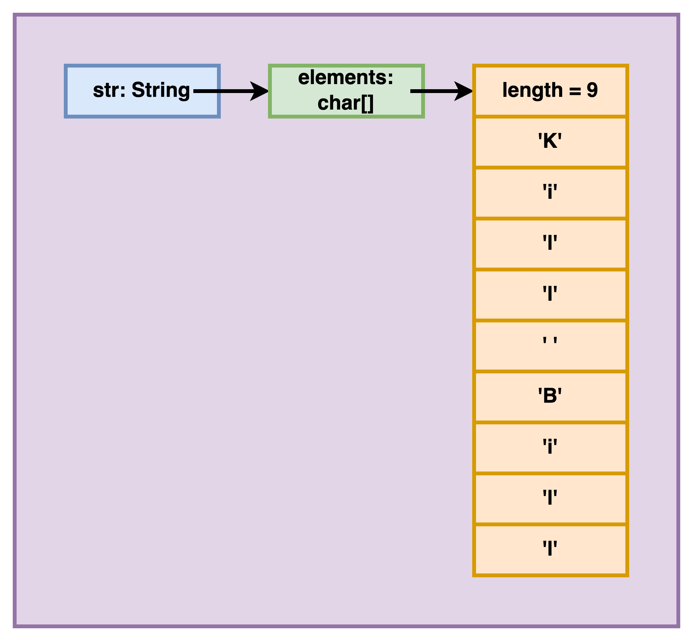

<details class="prereq" markdown="1"><summary>Assumed Knowledge</summary>

  * <a href="compound_data">Compound Data</a>
</details>

<details class="outcomes" markdown="1"><summary>Learning Outcomes</summary>

  * Understand how to operate on String data type
</details>

# Author: Gaurav Gupta

# Strings

Strings are nothing but a character array (`char[]`) inside a parcel known as *class*. It has built-in functions operating **on** *variables* (actually *objects*) of the String type (actually *class*).

# Practice problems

The problems at codingbat are very helpful in understanding and applying the concepts as you go!

- [https://codingbat.com/home/gaurav.gupta@mq.edu.au/strings](https://codingbat.com/home/gaurav.gupta@mq.edu.au/strings)
- [https://codingbat.com/java/String-1](https://codingbat.com/java/String-1)
- [https://codingbat.com/java/String-2](https://codingbat.com/java/String-2)

So, keep those open in a second tab and solve them as you go through the following.

### Declaration and initialization

```java 
String str;
println(str); // COMPILATION ERROR - The local variable "str" may not have been initialized

str = "Kill Bill"; 
println(str); // displays Kill Bill

String second = "Super Nintendo Chalmers"; // declaring and initializing in one statement
```

The memory diagram for the first object is provided below. The variable str is a `String` reference to the `String` instance that holds a `char[]` reference (named `elements`) which refers to a `char[]` instance holding the actual items (and the `length` attribute).

<p align="center">
	
</p>

## Length of a String

Length (number of characters) of a String `str` is given by `str.length()`.

**!!! Note the brackets at the end of `length`, unlike array length !!!**

(And yes, we all hate Java for that!)

## Characters in a String

- First character is at index 0 and accessed using `str.charAt(0)`.
- Last character is at index `str.length()-1` and accessed using `str.charAt(str.length()-1)`.
- In general, character at index `i` is accessed using `str.charAt(i)`. 
	- where `i` can be from 0 to `str.length()-1`.

## Looping through a String

We loop through any given String `str` as:

```java
for(int i=0; i < str.length(); i++) {
	// current character at str.charAt(i)
}
```

## Adding a String to ANYTHING

When a String is added to any other primitive data type variable, the `+` acts as concatenation.

```java
String str = "Wow";
String a = str + 5; //a becomes "Wow5"
String b = true + str; //b becomes "trueWow"
String c = 3.14 + str + '!'; //c becomes "3.14Wow!"
```

## Checking if two Strings are identical

DO NOT check for equality of Strings using `==`. Because, just like arrays, Strings are references, and `==` checks if they are reference copies (referring to the same instance) and works in a rather eccentric manner in Java. Instead, use the function `equals` (or `equalsIgnoreCase` for case-insensitive equality check).

```java
String a = "mess";
boolean usingOperator1 = (a == "mess"); //true
boolean usingOperator2 = (a+"i" == "messi"); //false
boolean usingEquals = "messi".equals(a+"i"); //true
```

## substring

If we have to single out ONE function that is critical to operate on Strings, that would be `substring`. It has two variations.

### substring - single parameter

`substring(int)` when called on a String object, returns a String from that index to the end of the String.

For example,

```java
String str = "Fantastic!";
String a = str.substring(3); //a becomes "tastic!"
```

Note that the calling object is NOT modified!

```java
String str = "Fantastic!";
str.substring(3); //returned value ignored
//str is still "Fantastic!"
```

If the passed index is invalid, it will cause a run-time error (`StringIndexOutOfBoundsException`).

```java
String str = "Nice!";
String a = str.substring(-1); //nope :(
String b = str.substring(5); //equal nope :(
```

The passed index needs to be between 0 and `str.length()-1`.

### substring - two parameter

`substring(int, int)` when called on a String object, returns a String from the first index (inclusive) to the second index (**exclusive**).

For example,

```java
String str = "supercalifragilisticexpialidocious";
String a = str.substring(2, 8); //a becomes "percal"
String b = str.substring(1, 4); //a becomes "upe"
String c = str.substring(5,6); //a becomes "c" (not character 'c')
String d = str.substring(20, str.length() - 10); //d becomes "expi"
```

Same rules about index validity apply

```java
String str = "Nice!";
String a = str.substring(-1, 2); //nope :(
String b = str.substring(2, 6); //equal nope
String c = str.substring(5, 3); //nope because end < start
```

There is a special case when start and end index are the same. To truly understand it, you must understand how Java implements `substring(int, int)`.

- Say the two formal parameters are `start` and `end`.
- It calculates `n = end - start`.
- It returns a String containing `n` characters starting at index `start`.

Thus, `str.substring(1, 4)` reduces to a String containing (4-1) characters starting at index `1`.

Based on the same logic, `str.substring(4, 4)` reduces to a String containing (4-4) (or 0) characters starting at index `4`, which is an empty String.

## Some cute tricks

Some nice hacks are shown below,

```java
int taxi = 1729;
String s = taxi+""; //gets String version of int as "1729"
float f = 3.14159;
String t = f+""; //"3.14159"
boolean flag = 194275%10 == 0;
String v = flag+""; //"false"
```

## Examples

##### Example 1: Count the number of spaces

```java
int count = 0;
for(int i=0; i < str.length(); i++) {
	if(str.charAt(i) == ' ') {
		count++;
	}
}
```

##### Example 2: Count the number of digits

```java
int count = 0;
for(int i=0; i < str.length(); i++) {
	if(str.charAt(i) >= '0' && str.charAt(i) <= '9') {
		count++;
	}
}
```

##### Example 3: Check if in ascending order

```java
boolean ascending = true;
for(int i=0; i < str.length()-1 && ascending; i++) { //only till second-last index
	if(str.charAt(i) > str.charAt(i+1)) { //because accessing item at index i+1
		ascending = false;
	}
}
```

The `&& ascending` exits the loops as soon as `ascending` becomes `false`, which happens the first time it sees a character greater than the next character, violating the ascending order rule.

##### Example 4: Check if purely alphabetic

```java
boolean stillPossible = true;
for(int i=0; i < str.length() && stillPossible; i++) {
	boolean upper = false;
	boolean lower = false;
	if(str.charAt(i) >= 'A' && str.charAt(i) <= 'Z') {
		upper = true;
	}
	if(str.charAt(i) >= 'a' && str.charAt(i) <= 'z') {
		lower = true;
	}
	if(!upper && !lower) {
		stillPossible = false;
	}
}
boolean isAlpha = stillPossible;
```

We can make the above function much more efficient by checking the uppercase (or lowercase) version of our String to be alphabetic! **This is a very useful strategy for String operations!** Modified code:

```java
String upper = str.toUpperCase();
boolean isAlpha = true; //stores the final result
for(int i=0; i < upper.length() && isAlpha; i++) {
	if(str.charAt(i) < 'A' || str.charAt(i) > 'Z') {
		isAlpha = false;
	}
}
```

## Useful functions

Some useful functions, and examples are:

| Function                         | Comment                                                                              | Example                                                                                               | Outcome                                                                                        |
|----------------------------------|--------------------------------------------------------------------------------------|-------------------------------------------------------------------------------------------------------|------------------------------------------------------------------------------------------------|
| `charAt(int)`           | returns character at given index. Raises Exception if index invalid | 1. `"Super".charAt(3)` 2. `"Fine! I'll go!".charAt(30)`          | 1. `'e'` 2. Exception (invalid index)       |   
| `length()`           | returns number of characters in the String | 1. `"Super".length()` 2. `"".length()`          | 1. `5` 2. `0`       |   
| `indexOf(another String)`           | returns first index at which passed String is found, -1 if not found | 1. `"its a cool tool".indexOf("ool")` 2. `"its a cool tool".indexOf("OOL")`          | 1. `7` 2. `-1`       |      
| `indexOf(char)`           | returns first index at which char is found, -1 if not found | 1. `"tipper".indexOf('p')` 2. `"tipper".indexOf('c')`     | 1. `2` 2. `-1`                     |
| `substring(start)`               |                                                                                      | `"superman".substring(2)`                                                                               | `"perman"`                                                                                       |
| `substring(start, end)`          | end index is not included                                                            | `"superman".substring(2, 6)`                                                                            | `"perm"`                                                                                         |
| `toLowerCase()`                    | original String is NOT modified                                                        | `"Hello123!".toLowerCase()`                                                                             | `"hello123!"`                                                                                    |
| `toUpperCase()`                    | original String is NOT modified                                                        | `"Hello123!".toUpperCase()`                                                                             | `"HELLO123!"`                                                                                    |
| `Integer.parseInt(String)`         | 1. String is the parameter here 2. Raises exception if String not numeric            | `Integer.parseInt("-4096")`                                                                             | -4096                                                                                          |
| `equals(another String)`           | 1. You SHOULDN'T compare Strings using == as it checks if the two String objects being compared refer to the same instance 2. `equals` performs case-sensitive comparison | 1. `"done".equals("done")` 2. `"done".equals("Done")` 3. `"ab"==new String("ab")`                                                     | 1. `true` 2. `false` 3, `false`                                                                              |
| `equalsIgnoreCase(another String)` | `equalsIgnoreCase` performs case-**IN**sensitive comparison                          | 1. `"done".equals("done")` 2. `"done".equals("Done")` 3. `"done".equals("doe")`                             | 1. `true` 2. `true` 3. `false`                                                                       |
| `compareTo(another String)`        | performs lexicographic (as in dictionary) comparison                                 | 1. `"Hi".compareTo("hi")` 2. `"hi".compareTo("Hi")` 3. `"what".compareTo("why?")` 4. `"why".compareTo("why")` | 1. negative  (exact value  is irrelevant for now) 2. positive 3. negative (3rd character) 4. 0 |

## Extra resources

- CodingBat questions: https://codingbat.com/home/gaurav.gupta@mq.edu.au/strings
- YouTube videos:  
	- [https://www.youtube.com/watch?v=3xuJIaP3C4g](https://www.youtube.com/watch?v=3xuJIaP3C4g)
	- [https://www.youtube.com/watch?v=vbZ85D8Hvh0](https://www.youtube.com/watch?v=vbZ85D8Hvh0)
	- [https://www.youtube.com/watch?v=P9hEmbfdiuc](https://www.youtube.com/watch?v=P9hEmbfdiuc)
