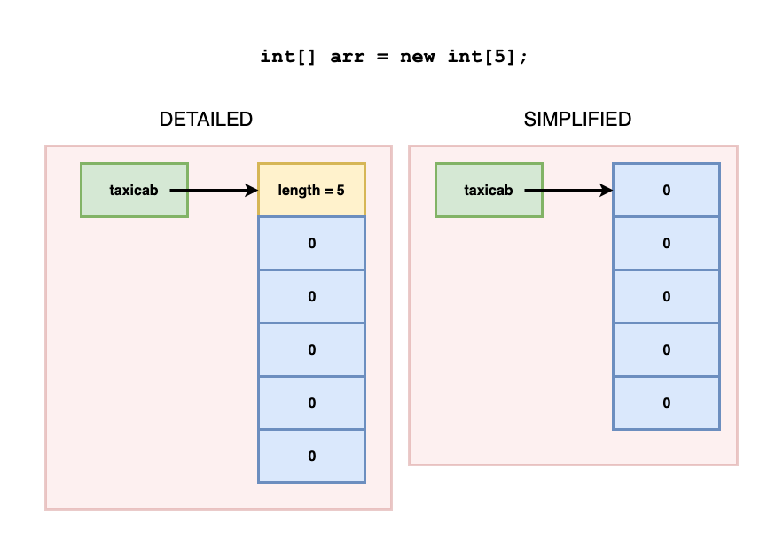
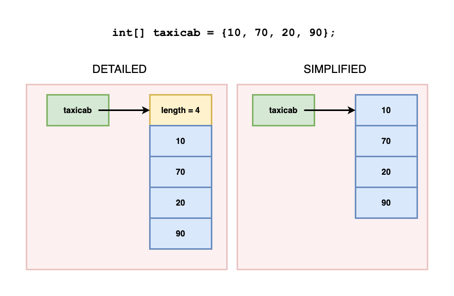
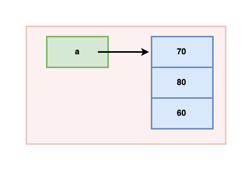
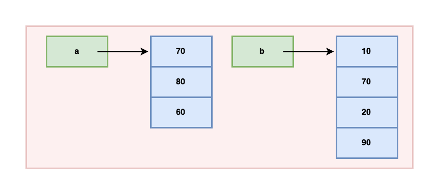
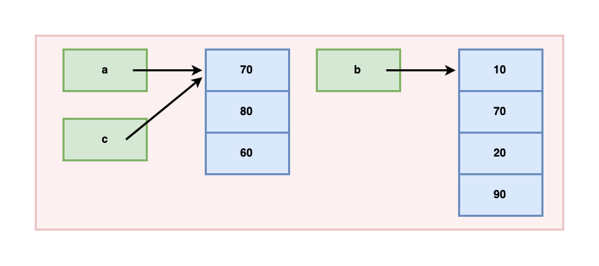
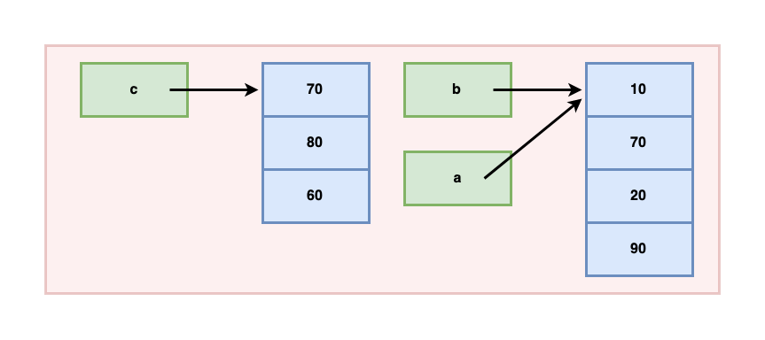
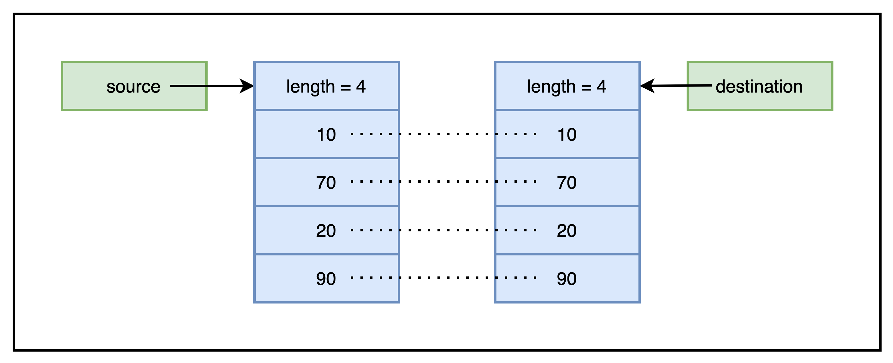
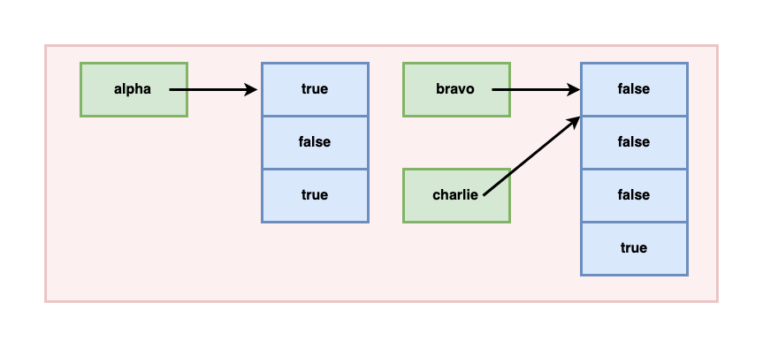
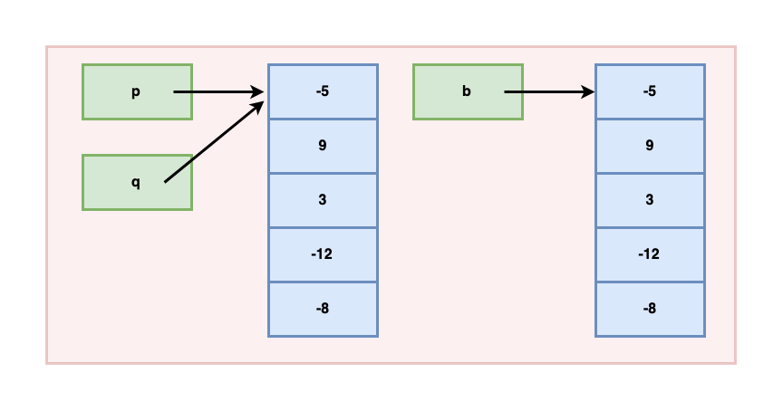

<details class="prereq" markdown="1"><summary>Assumed Knowledge</summary>

  * <a href="variables">Variables</a>
  * <a href="conditions">Conditions</a>
  * <a href="loops">Loops</a>
</details>

<details class="outcomes" markdown="1"><summary>Learning Outcomes</summary>

  * Understand how to create, populate and operate on arrays
  <!--* how larger chunks of data are stored in a program
  * Understand how to access these larger chunks of data
  * Understand the most common data chunks, arrays-->
</details>

<!--So far we have been working only with _atomic_ data.  That is data that is "just one thing" and can't be broken up.  This is getting unwieldy.  Every time we have something to draw, we need to have an x-position and a y-position and so we need two variables for something we probably think of as just one thing (the position on the screen).

Wouldn't it be nice to have just one variable for both?  Yes, yes it would.  

The facility we need for this is _composite data_.  We need a way to put two values (the x and the y positions) into a single variable.  What type would this be?  Not an `int` or a `float` or a `char`!  Processing _does_ have types we can use for this, but they act a little differently from the types we already know.

Let me introduce you to one of these types, `PVector`.  

Recall that processing has _values_ (like 1,c,4.5) that are grouped into _types_ (like `int`, `char`, `float`).  It is possible to have a value with two numbers in it, that value would be of the type `PVector`:

  * (1,1) is a `PVector` with two values in it, `1` and `1`
  * (10,4) is a `PVector` with two values in it, `10` and `4`.

So you can see that we have a whole new type and a whole new set of values that fit into that type.  Lets play with it.

[The Processing website has an example of using `PVectors`](https://processing.org/examples/bouncingball.html) for a bouncing ball program.  Study it carefully.

You will notice two interesting features that we will now discuss:

  * the use of "dot-notation" to get inside the compound data
  * the use of `new` for an extra step in the declare-and-initialise process.

## Compound Data in Memory

So, compound data is _bigger_, so much so, that it can't fit into a single memory slot.  _But_ variables can only point to single buckets, so what do we do?

For compound data, a variable will point to one memory location that then tells you _where the larger chunk of memory is_.
<aside markdown="1">
Note that the reasons for this way of doing things are myriad.  In the end, it is the right way but we don't need to know all the reasons, we only need to know that it is so and know how to work with it.  Atomic data (`int`, `float`, `char`) is stored directly in their memory slot but compound data reference is stored as a "reference" to another location where the compound data instance is stored.
</aside>

<div class="row">
<div class="col-xs-6" markdown="1">
~~~~~
int[] myArray;
myArray = new int[5];
~~~~
</div>
<div class="col-xs-6">
<svg xmlns="http://www.w3.org/2000/svg" height="400" width="480" version="1.1" viewBox="0 0 105.83333 52.916666">
 <defs>
  <marker id="marker8703" refY="0.0" refX="0.0" overflow="visible" orient="auto">
   <path stroke-linejoin="round" d="m8.719 4.034l-10.93-4.018 10.93-4.018c-1.746 2.372-1.736 5.618 0 8.036z" fill-rule="evenodd" transform="scale(.6) rotate(180) translate(0)" stroke="#000" stroke-width=".625"/>
  </marker>
  <marker id="marker9431" refY="0.0" refX="0.0" overflow="visible" orient="auto">
   <path stroke-linejoin="round" d="m8.719 4.034l-10.93-4.018 10.93-4.018c-1.746 2.372-1.736 5.618 0 8.036z" fill-rule="evenodd" transform="scale(.6) rotate(180) translate(0)" stroke="#000" stroke-width=".625"/>
  </marker>
 </defs>
 <g transform="translate(29.1 -243.1)">
  <rect height="37.04" width="35.72" stroke="#263738" y="249.4" x="3.969" stroke-width=".2495" fill="none"/>
  <g fill="none">
   <path marker-end="url(#marker9431)" d="m-7.938 250.7 10.96 0.3858" stroke="#000" stroke-width=".2761"/>
   <g stroke="#263738">
    <g stroke-width="0.26px">
     <path d="m7.937 249.4v37.04"/>
     <path d="m11.91 249.4v37.04"/>
     <path d="m15.88 249.4v37.04"/>
     <path d="m19.84 249.4v37.04"/>
     <path d="m23.81 249.4v37.04"/>
     <path d="m27.78 249.4v37.04"/>
     <path d="m31.75 249.4v37.04"/>
     <path d="m35.72 249.4v37.04"/>
    </g>
    <g stroke-width=".2646px">
     <path d="m3.969 253.3h35.72"/>
     <path d="m3.969 257.3h35.72"/>
     <path d="m3.969 262.6h35.72"/>
     <path d="m3.969 266.6h35.72"/>
     <path d="m3.969 270.5h35.72"/>
     <path d="m3.969 274.5h35.72"/>
     <path d="m3.969 278.5h35.72"/>
     <path d="m3.969 282.4h35.72"/>
    </g>
   </g>
   <path marker-end="url(#marker8703)" d="m5.292 250.7 14.55 19.8" stroke="#000" stroke-width=".2646px"/>
   <rect height="3.969" width="19.84" stroke="#263738" y="270.5" x="19.84" stroke-width=".7650"/>
  </g>
  <g font-size="3.836px" font-family="sans-serif">
   <text style="word-spacing:0px;letter-spacing:0px" xml:space="preserve" line-height="1.25" y="273.91467" x="20.823767"><tspan y="273.91467" x="20.823767" stroke-width=".0959">0</tspan></text>
   <text style="word-spacing:0px;letter-spacing:0px" xml:space="preserve" line-height="1.25" y="273.91467" x="24.589979"><tspan y="273.91467" x="24.589979" stroke-width=".0959">0</tspan></text>
   <text style="word-spacing:0px;letter-spacing:0px" xml:space="preserve" line-height="1.25" y="273.94202" x="28.586056"><tspan y="273.94202" x="28.586056" stroke-width=".0959">0</tspan></text>
   <text style="word-spacing:0px;letter-spacing:0px" xml:space="preserve" line-height="1.25" y="273.97897" x="32.463181"><tspan y="273.97897" x="32.463181" stroke-width=".0959">0</tspan></text>
   <text style="word-spacing:0px;letter-spacing:0px" xml:space="preserve" line-height="1.25" y="273.91467" x="36.174744"><tspan y="273.91467" x="36.174744" stroke-width=".0959">0</tspan></text>
   <text style="word-spacing:0px;letter-spacing:0px" xml:space="preserve" line-height="1.25" y="251.88321" x="-25.058374"><tspan y="251.88321" x="-25.058374" stroke-width=".0959">myArray</tspan></text>
  </g>
  <rect height="3.969" width="3.969" stroke="#263738" y="249.4" x="3.969" stroke-width=".7650" fill="none"/>
 </g>
</svg>
</div>
</div>

So, an extra step is required, making the memory box point to another, larger, chunk of memory.  This is what `new` does.  It finds some free space that is big enough, and sets aside that much space.  Lets call this step "memory allocation".

The other new step is to "follow the arrow" from the memory box to the bigger chunk and to pull out one part from there.  This is what the `.` does.  It follows the arrow and then uses the special name that comes after to get one of the values from the larger chunk.  Lets call this step "de-referencing".

Processing actually has two different forms of compound data - objects like `PVector` (and many others), and arrays.  We will focus on arrays from here but feel free to use objects whenenver you like.

Note:  objects are often taught with a related concept - classes - however, we will not address classes in any way at this point.

Note that the two different versions of compound data come with two different syntaxes for dereferences - for objects is it `.name` and for arrays it is `[number]`.  See below for details.

<iframe width="560" height="315" src="https://www.youtube.com/embed/XavYru3jotQ" frameborder="0" allow="accelerometer; autoplay; encrypted-media; gyroscope; picture-in-picture" allowfullscreen></iframe>
-->

# Arrays

<!--
To understand how to use compound data, we will look at the most common compound data type, arrays.

<iframe width="560" height="315" src="https://www.youtube.com/embed/NptnmWvkbTw" frameborder="0" allow="accelerometer; autoplay; encrypted-media; gyroscope; picture-in-picture" allowfullscreen></iframe>

<iframe width="560" height="315" src="https://www.youtube.com/embed/47JBVxCWXJA" frameborder="0" allow="accelerometer; autoplay; encrypted-media; gyroscope; picture-in-picture" allowfullscreen></iframe>
-->

An array is a fixed-sized collection of items, each item of the same type.

So you can have,

- an array of 5 integers
- an array of 20 booleans
- an array of 2000 characters
- an array of 50 Strings
- an array of 400 arrays
- and so on...

## <s>Perhaps</s> The most important concept to understand in arrays is the difference between a *reference* and an *instance*.

<br>


<br>

### ***Reference*** - the variable name by which you know the array

### ***Instance*** - the actual collection of items to which a reference refers.

## Syntax to create an array

There are a few ways to create an array.

### Creating array - Option 1

The most common way to create an array is by specifying the type and size of the array.

```java
type[] arrayName = new type[size];
```

**NOTE**: This only works when the array is first created (more on this later) 

#### Example - integer array

```java
int[] arr = new int[5]; //an array that holds 5 integers
```



**Reference**: `arr`

**Instance**: the block with 5 integer values

-----------------

#### Example - boolean array

```java
boolean[] flags = new boolean[4]; //an array that holds 4 booleans
```


**reference**: `flags` 

**instance**: the block with 4 boolean values

-----------------

### Creating array - Option 2

When you know the values that need to be stored in the array beforehand, you can create an array as,

```java
type[] arrayName = {item1, item2, ....};
```

#### Examples

```java
int[] taxicab = {10, 70, 20, 90};
```



**reference**: `taxicab`

**instance**: the block with the integer values `10, 70, 20, 90` 

-----------------

```java
int[] cutoffs = {50, 65, 75, 85};
char[] punctuations = {'.', '!', '?', ',', ';', ':'};
double[] significantNumbers = {3.141, 1.618, 2.718, 57.295, 1.202, 1.414};
boolean[] twentyTwo = {true, false, true, true, false};
```

# Size of an array

The number of items in an array `arr` is given by `arr.length`.

<div class="aside" markdown="1">
Note that, given what we said above this means `.length` should be read as "follow the reference and see how large the chunk of memory at the other end is".
</div>

For example,

```java
int[] data = new int[20];
println(data.length); //displays 20
```

# Accessing items of an array

- The first item of an array `arr` is at index 0.
- The second item of an array `arr` is at index 1.
- ...
- The last item of an array `arr` is at index `arr.length - 1`.

Thus you can traverse an array using a loop from `0` to `arr.length - 1` as,

```java
for(int i=0; i < arr.length; i++) {
	//do what you want with arr[i]
}
```

#### Example

Create an array that holds the outcome of 20 dice rolls.

Each dice roll is a random integer between 1 and 6.

```java
int[] outcomes = new int[20];
for(int i=0; i < outcomes.length; i++) {
	outcomes[i] = (int)random(1, 7); //remember 7 is not included
}
```

Then we can find out the average outcome as,

```java
int total  = 0;
for(int i=0; i < outcomes.length; i++) {
	total += outcomes[i];
}
double average = (total * 1.0)/outcomes.length;
//multiplication with 1.0 to convert int to double
```

# Re-referencing an array

Remember how we noted that the following only works when the array is FIRST created?
	
```java
int[] taxi = {10, 70, 20, 90};
```

If we split this statement, it would be:

```java
int[] taxi; //declaration - creates the reference

// following ATTEMPTS to link the reference to the instance. 
// BUT SYNTACTICALLY INVALID

taxi = {90, 20, 70, 10}; //INCORRECT
```

Once an array reference is created, to re-reference it to a new instance, you have to use the following syntax:

```java
arrayName = new Type[size];
```

or 

```java
arrayName = new Type[]{item1, item2, ...};
```

For example,

```java
taxicab = {90, 20, 70, 10}; 			//INCORRECT
taxicab = new int[]{90, 20, 70, 10}; 	//CORRECT
```

```java
boolean[] switches;

switches = {true, false, true}; 				//INCORRECT
switches = new boolean[]{true, false, true}; 	//CORRECT
```

You can also re-reference an array to another instance already created (and referenced by some other array). Here's how...

# Copying an array into another array

When an array, say `src`, is copied into another array, say `dest`, both references - `src` and `dest` - refer to the instance to which `src` was originally referring.


```java
int[] src = {10, 70, 20, 90};
int[] dest = src;
```


We call this a ***reference copy***.

**NOTE:** The type of arrays must be the same. You cannot copy an `int` array into a `float` array. The following will not work:

```java
int[] taxi = {10, 70, 20, 90};
float[] cab = taxi; //Compilation error!
```

### Another example

```java
int[] a = {70, 80, 60};
int[] b = {10, 70, 20, 90};
int[] c = a;
a = b;
```

- After the first line, there is one reference and one instance.



- After the second line, there are two references and two instances.



- After the third line, there are three references but still, only two instances. Currently, `a` and `c` refer to the same instance.



- After the fourth line, there are three references but still, only two instances. Now, `a` and `b` refer to the same instance.



# Instance copy of an array

When you want to *duplicate* or *clone* an array, you can create an array of the same size as the original array, and copy all items over. This is known as *instance copy*.

```java
int[] source = {10, 70, 20, 90};

//creating an instance copy of source into destination -

int[] destination = new int[source.length]; //same size as source
for(int i=0; i < source.length; i++) {
	destination[i] = source[i];
}
```



# Exercises

## Exercise 1

Create the following arrays:

1. An array `a` that has capacity for 2000 integers.
2. An array `b` that has capacity for 5000 characters.
3. An array `c` that has capacity for 666 booleans.
4. An array `d` that has capacity for 1 float.
5. An array `e` containing the values `5, 6, 7, 8`.
6. An array `f` containing the values `false, true, true`.
7. An array `g` containing the values `'M', 'e', 's', 's', 'i'`.
8. An array `h` containing the values `1.414, 7.2, -2.5, 9.81`.

## Exercise 2

1. Assume the existence of integer array `tom` and make a reference copy of `tom` into `jerry`.
1. Assume the existence of boolean array `aang` and make a reference copy of `aang` into `katara` as well as `toph`.

## Exercise 3

Draw the memory diagram for the following code,

```java
int[] data = new int[]{50, 90, 30, 20, 60};
```

## Exercise 4

Draw the memory diagram for the following code,

```java
int[] data = new int[6];
for(int i=0; i < data.length; i++) {
	if(i%2 == 0) {
		data[i] = 2*i+1;
	}
	else {
		data[i] = -3*i;
	}
}
```

## Exercise 6

List the references and instance created in the following code.

```java
int[] a = {10, 70, 20, 90};
int[] b = a;
char[] c = {'h', 'e', 'y', '!'};
char[] d = c;
boolean b = new boolean[10];
```

## Exercise 7

Explain why the following code will not compile.

```java
int[] a = {10, 70, 20, 90};
int[] b = new int[10];
b[2] = a;
```

## Exercise 8

Write a piece of code that creates the arrays represented in the following diagram.



## Exercise 9

Write a piece of code that creates the arrays represented in the following diagram.



## Exercise 10

Draw the memory diagram for the following code,

```java
int[] a = {4,8,15,16,23,42};
int[] b = a;
b[2] = 100;
b = new int[]{104,101,108,108,111};
```

## Exercise 11

Write a piece of code that creates an array with 100 integers, each between 1 and 20. Count the number of items that are divisible by the item after them.

For example, if the first few items of the array are `{20, 5, 8, 4, 4, ...}`, 20 is divisible by 5, 8 is divisible by 4, and 4 is divisible by 4, so we have 3 such items so far.

## Exercise 12

Consider the following piece of code.

```java
int[] items = new int[10];
items[0] = 1;
for(int i=1; i < items.length; i++) {
	items[i] = 2 * items[i-1];
}
```

What are the contents of the array `items`?

# Furthering your understanding

<iframe width="560" height="315" src="https://www.youtube.com/embed/liw7__I2kCs" frameborder="0" allow="accelerometer; autoplay; encrypted-media; gyroscope; picture-in-picture" allowfullscreen></iframe>

# Coding in the real life

<div class="task" markdown="1">
The ages of 20 people is stored in an array `ageList`. Write a piece of code that determines the range of the distribution. That is, the age difference between the oldest and the youngest person.

<details markdown="1"><summary>Solution</summary>
```java
//assuming ageList is a boolean array containing 20 items

int min = ageList[0];
for(int i=1; i < ageList.length; i++) {
	if(ageList[i] < min) {
		min = ageList[i];
	}
}

int max = ageList[0];
for(int i=1; i < ageList.length; i++) {
	if(ageList[i] > max) {
		max = ageList[i];
	}
}

int range = max - min;
```
</details>
</div>

<div class="task" markdown="1">
The state of 25 electrical switches is held in an array `smartSwitches`. The states can be "On" (true) or "Off" (false). Write a piece of code that toggles all switches. That is, all switches that are currently "On" should turn "Off", and all switches that are currently "Off" should turn "On".

<details markdown="1"><summary>Solution</summary>
```java
//assuming smartSwitches is a boolean array containing 25 items

for(int i=0; i < smartSwitches.length; i++) {
	smartSwitches[i] = !smartSwitches[i];
}
```
</details>
</div>


<div class="task" markdown="1">
Assume that we are encoding birthdays as integers where:

- 1st january is 0,
- 2nd january is 1,
- and so on till,
- 31st december is 365

(remember that 29th february will also be given an integer mapping).

The birthdays of 1000 people is stored in an array `bdays`. Write a piece of code that displays the most frequent date of birth. For the basic version, you may display an integer between 0 and 365. For the advanced version, display the actual data in `DD/MM` format.

<details markdown="1"><summary>Solution</summary>
```java
//assuming bdays is an array containing 1000 items
//such that each item is in range [0...365]

/*
frequencies holds number of birthdays on each of the 366 days.
if a birthday falls on 1st jan (coded as 0), frequencies[0] increases by 1
if a birthday falls on 2nd jan (coded as 1), frequencies[1] increases by 1
...
if a birthday falls on 32st dec (coded as 365), frequencies[365] increases by 1
*/
int[] frequencies = new int[366];

for(int i=0; i < bdays.length; i++) {
	/*
	int idx = bdays[i];
	frequencies[idx]++; //another birthday on that day
}

int mostFrequentBday = 0; //1st jan
for(int i=1; i < frequencies.length; i++) {
	if(frequencies[i] > frequencies[mostFrequentBday]) {
		mostFrequentBday = i;
	}
}
println(mostFreqBday);

//advanced:
int[] daysInMonths = {31,29,31,30,31,30,31,31,30,31,30,31};
int currentMonth = 0;
while(mostFreqBday < daysInMonths[currentMonth]) {
	mostFreqBday = mostFreqBday - daysInMonths[currentMonth];
}
int dayInMonth = mostFreqBday+1;
println(dayInMonth+"/"+currentMonth);
```
</details>
</div>

<div class="task" markdown="1">
I keep track of the time taken (in minutes) to run each kilometer over a 100km race (let me dream!). These times are stored in an array `lapTimes`. For example, if `lapTimes[0]` is 6.23, it means I ran the first kilometer in 6 minutes 13.8 seconds.

Write a piece of code that determines my fastest lap (for example, display "Kilometer 0-1" if the first kilometer was the fastest, and "Kilometer 63-64" if the 64th kilometer was the fastest.)

<details markdown="1"><summary>Solution</summary>
```java
//assuming lapTimes is a float array containing 100 items
int fastestLap = 0;
for(int i=1; i < lapTimes.length; i++) {
	if(lapTimes[i] < lapTimes[fastestLap]) {
		fastestLap = i;
	}
}
print("Kilometer "+fastestLap+"-"+(fastestLap+1));
```
</details>
</div>


<!--
better for arrays and functions
Create an array that holds the first 1000 prime numbers (a number is *prime* if it is more than or equal to 2 and is divisible by only 1 and itself).-->
