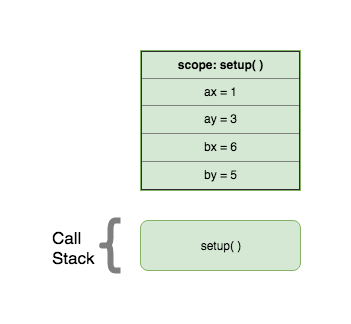
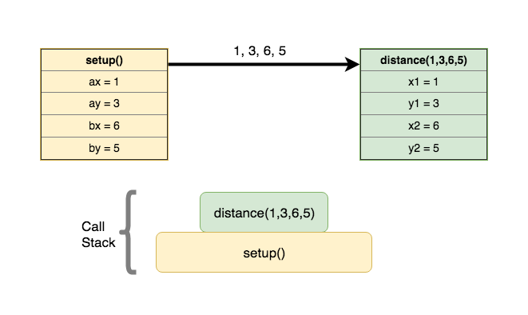
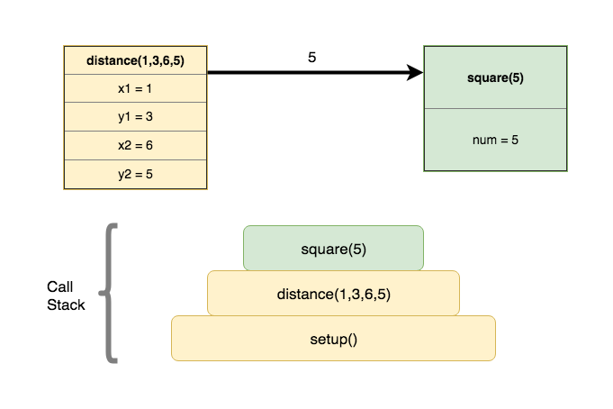
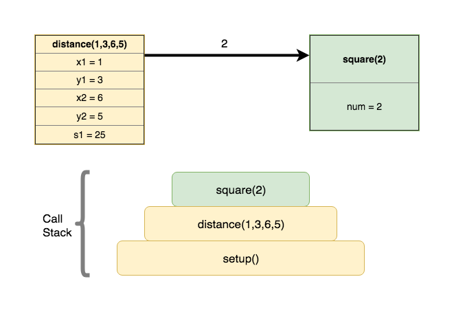
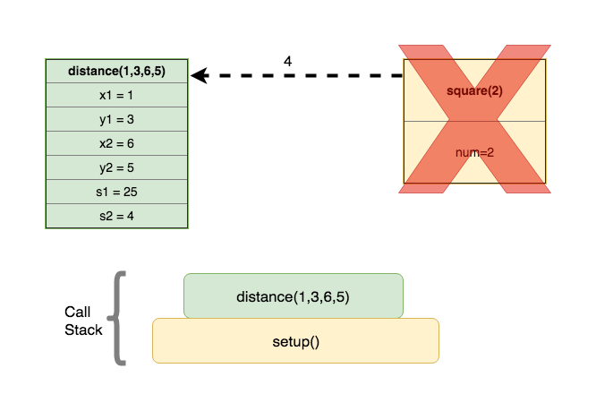
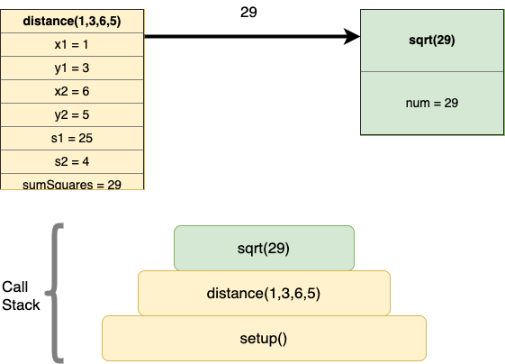
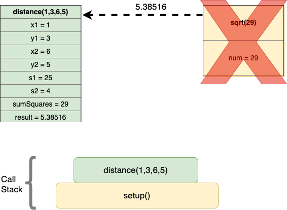
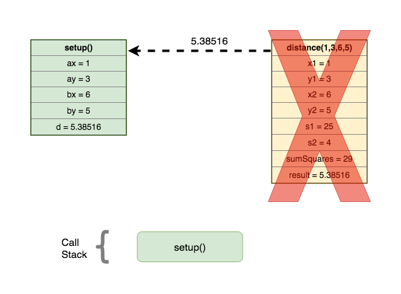

<details class="prereq" markdown="1"><summary>Assumed Knowledge:</summary>

  * [Functions](./functions)

</details>

<details class="outcomes" markdown="1"><summary>Learning Outcomes:</summary>

  * Better understand the concept of parameter passing.
  * Familiarize yourself with standard terminology - *formal paramters* vs. *actual parameters*.
  * Understand the control flow and memory transactions during a function call.
  * Understand the concept of *Call Stack*.

</details>

## Author: Gaurav Gupta

# Formal parameters vs. actual parameters

- *Formal parameter* is the name used for the variable in the function definition.
- *Actual parameter* is the value copied into the formal parameter during a function call.

Consider the following example:

```java
void setup() {
	int c = 10;
	int d = square(c);
	int e = square(6);
	int f = square(d/20 + e/9);
}

int square(int val) {
	int result = val * val;
	return result;
}
```

In the above example,

- Formal parameter in function `square` is `val`.
- Actual parameter in the function call `square(c)` is `c` (10).
- Actual parameter in the function call `square(6)` is 6.
- Actual parameter in the function call `square(d/20 + e/9)` is `d/4 + e/9` (100/20 + 36/9 = 9).

# What happens during a function call?

It's very helpful to understand what happens when a function is called. Consider the following example:

```java
void setup() {
 	int ax = 1, ay = 3;
	int bx = 6, by = 5;
	float d = distance(ax, ay, bx, by);
	println("Distance: "+d);
}

float distance(int x1, int y1, int x2, int y2) {
	int s1 = square(x2-x1);
	int s2 = square(y2-y1);
	int sumSquares = s1 + s2;
	float result = (float)Math.sqrt(sumSquares);
	return result;
}

int square(int num) {
	int answer = num * num;
	return answer;
}
```

### STEP 1: setup function is invoked by JVM (as far as we are concerned)



Function call is placed on the stack.

### STEP 2: setup calls `distance` with parameters 1, 3, 6 and 5.



Another entry is made for the call to `distance` and placed on the call stack.

### STEP 3: `distance` calls `square` with parameter `5`



A third entry is made for the call to `square` and placed on the stack.

### STEP 4: `square` returns 25 to `distance`


Entry for `square` is taken off the stack. `distance` becomes the active function.

### STEP 5: `distance` calls `square` with parameter `2`



A third entry is made for the call to `square` and placed on the stack.

### STEP 6: `square` returns 4 to `distance`



Entry for `square` is taken off the stack. `distance` becomes the active function.

### STEP 7: `distance` calls `Math.sqrt` with parameter `29`



A third entry is made for the call to `Math.sqrt` and placed on the stack.

### STEP 8: `Math.sqrt` returns 5.38516 to `distance`



Entry for `square` is taken off the stack. `distance` becomes the active function.

### STEP 9: `distance` returns 5.38516 to `setup`



Entry for `distance` is taken off the stack. `setup` becomes the active function.

### STEP 10: `setup` terminates

Entry for `setup` is taken off the stack. Call stack is now empty. Program has now finished execution.
