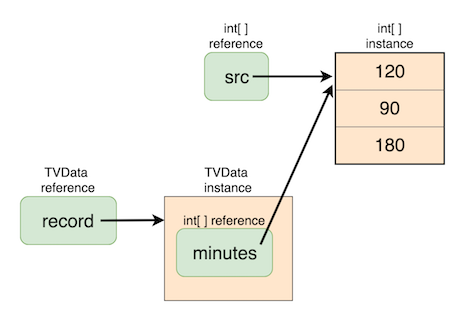
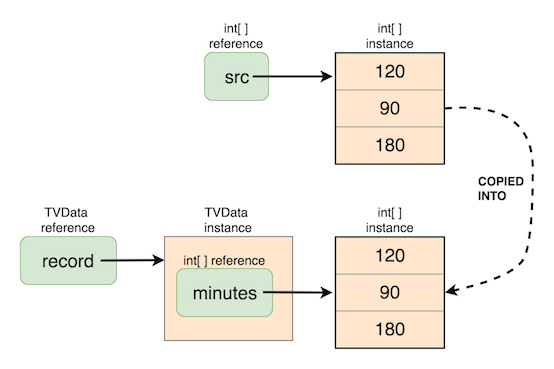
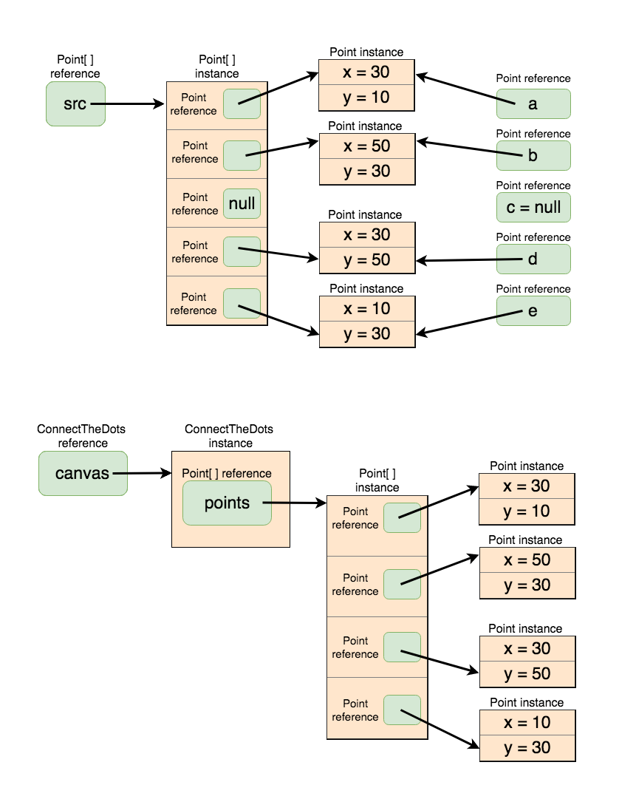

<details class="prereq" markdown="1"><summary>Assumed Knowledge:</summary>

  * [Classes as Types](./classes_types)
  * [Copying objects](./classes_copies)
  * [Instance methods](./classes_methods)
  * [Composition](./classes_composition)
  * [ArrayLists](./lists)
</details>

<details class="outcomes" markdown="1"><summary>Learning Outcomes:</summary>

  * Defining a class holding collections (arrays/arraylists/...).
  * Creating and populating objects of such classes.

</details>

## Author: Gaurav Gupta

# Class holding ArrayList(s)

Why ArrayLists over arrays? Because resizing an array is a massive pain in the backside :(

So we'll use ArrayLists, and add methods that add or remove items from the lists easily. Later, we'll see some examples with arrays too for deeper understanding.

## Example 1

```java
public class TVData {
  public ArrayList<Integer> minutes;

  public TVData(ArrayList<Integer> source) {
    //we are creating an instance copy to begin with
    minutes = new ArrayList<Integer>();
    for(int item: source) {
      minutes.add(item);
     } 
  }

  public void add(int min) { //say we forget to add an item during the construction
    minutes.add(min); //easy-as!
  }

  public void remove(int idx) { //removing value at an index? Easy!
    if(idx >= 0 && idx < minutes.size()) {
      minutes.remove(idx);
    }
  }

  public int totalViewingTime() {
    int result = 0;
    for(int i=0; i < minutes.size(); i++) {
      result+=minutes.get(i);
    }
    return result;
  }
}
```

## Example 2

We will be using this [Point](./assets/Point.java) class definition.

```java
public class ConnectTheDots {
  public ArrayList<Point> points;

  public ConnectTheDots(ArrayList<Point> source) {
    points = new ArrayList<Point>();
    if(source == null) {
      return;
    }
    for(Point p: source) {
      if(p != null) {
        points.add(new Point(p));
      }
    }
  }

  public void add(Point p) {
    points.add(p);
  }

  public void remove(int idx) {
    if(idx >= 0 && idx < points.size()) {
      points.remove(idx);
    }
  }
}
```

# Class holding array(s)

This part provides a "deep dive" and is highly advised if you would like to learn more (and then, automatically, achieve a higher grade). This includes a closer look at design and incremental implementations.

Say, we want to keep track of the total time spent daily watching television.

The dataset would be something like:

- **Day 1**: 120 minutes
- **Day 2**: 90 minutes
- **Day 3**: 180 minutes
- ...

If we hold this information in an array, it's rather primitive and lacks context. However, if we hold it in an array **inside** a class, we can create instance methods to operate and analyze the dataset, and also provide context and meaning to our objects.

```java
public class TVData {
  public int[] minutes;
}
```

Before we go on and add constructors and other methods, let's think about how we are going to access the information.

From inside a client (outside the class definition), assuming an object `record` of class `TVData`,

- the array holding the information is accessed using `record.minutesWatched`.
- the number of days for which we have the information is given by `record.minutes.length`.
- amount of time I spent watching TV on the first day is given by `record.minutes[0]`.
- amount of time I spent watching TV on the second day is given by `record.minutes[1]`.
- and so on ...

Next, we add a constructor with an array passed that will be **reference-copied** into the array `minutes`, and a method that determines total viewing time.

```java
public class TVData {
  public int[] minutes;

  public TVData(int[] source) {
    minutes = source; //reference copy made into array
  }

  public int totalViewingTime() {
    int result = 0;
    for(int i=0; i < minutes.length; i++) {
      result+=minutes[i];
    }
    return result;
  }
}
```

The following client gives an example of how the object will be created and used:

```java
public class GoodClient {
  public static void main(String[] args) {
    int[] src = {120, 90, 180};
    TVData record = new TVData(src); //populate with array src
    int total = record.totalViewingTime();
    System.out.println(total+" minutes viewed");
  }
}
```


The above client would give the expected outcome:

```
390 minutes viewed
```

## However ...

What happens when we change the contents of the source data AFTER populating our object with it?

```java
public class BadClient {
  public static void main(String[] args) {
    int[] src = {120, 90, 180};
    TVData record = new TVData(src); //populate with array src

    //so far, so good

    src[0] = -400; //nothing stops us from doing so

    int total = record.totalViewingTime();
    System.out.println(total+" minutes viewed");
  }
}
```

The above client would give the following outcome, which is, let's say, logically flawed:

```
-130 minutes viewed
```

We don't want the array held inside an object to be a reference copy of the source, but an instance copy.

Everything else remains the same, but we change the constructor as follows,

```java
public TVData(int[] source) {
  if(source == null) {
    minutes = new int[0]; //empty array
  }
  else {
    minutes = new int[source.length];
    for(int i=0; i < source.length; i++) {
      minutes[i] = Math.max(0, source[i]); //some more validation
    }
  }
}
```



Now, both `GoodClient` and `BadClient` will give the same, logically correct, output:

```
390 minutes viewed
```

# Class holding an array of objects

This section assumes you are familiar with [Composition](./classes_composition).

We will be using this [Point](./assets/Point.java) class definition.

Say we want to create a "connect-the-dots" game where multiple points are present on a canvas and adjacent points need to be connected to reveal the art.

### Iteration 1

```java
public class ConnectTheDots {
  public Point[] points;

  public ConnectTheDots(Point[] source) {
    if(source == null) {
      points = new Point[0];
    }
    else {
      points = new Point[source.length];
      for(int i=0; i < points.length; i++) {
        points[i] = source[i];
      }
    }
  }
}
```

There is one logical mistake in the above code.

<details>
  <summary>Click to reveal!</summary>
  Each item of the array is a reference copy of the corresponding item in `source`.
</details>

### Iteration 2

```java
public class ConnectTheDots {
  public Point[] points;

  public ConnectTheDots(Point[] source) {
    if(source == null) {
      points = new Point[0];
    }
    else {
      points = new Point[source.length];
      for(int i=0; i < points.length; i++) {
        points[i] = new Point(source[i]);
      }
    }
  }
}
```

Still one issue :(

<details>
  <summary>Click to reveal!</summary>
  If an item in `source` is `null`, the constructor call will raise `NullPointerException`.
</details>

### Iteration 3 (and the last one)

```java
public class ConnectTheDots {
  public Point[] points;

  public ConnectTheDots(Point[] source) {
    if(source == null) {
      points = new Point[0];
    }
    else {
      int nonNullPoints = 0;

      for(int i=0; i < source.length; i++) {
        if(source[i] != null) {
          nonNullPoints++;
        }
      }

      points = new Point[nonNullPoints];

      int k = 0; //destination index
      for(int i=0; i < source.length; i++) {
        if(source[i] != null) {
          points[k] = new Point(source[i]);
          k++;
        }
      }
    }
  }
}
```




Let's just write a client to finish this off!

```java
import java.util.Arrays;

public class ArtGallery {
  public static void main(String[] args) {
    Point a = new Point(30, 10);
    Point b = new Point(50, 30);
    Point c = null; //BOO!!!!!!!
    Point d = new Point(30, 50);
    Point e = new Point(10, 30);
    Point[] src = {a, b, c, d, e};
    ConnectTheDots canvas = new ConnectTheDots(src);
    System.out.println(Arrays.toString(canvas.points));
  }
}
```

We will get the following output (notice that the `null` object was dropped successfully):

```
[(30,10), (50,30), (30,50), (10,30)]
```

Complete code is provided in [ArtGallery.java](./codes/ArtGallery.java)

# Relevant MQ Video

<iframe width="560" height="315" src="https://www.youtube.com/embed/N7zaCnhB1E4" title="YouTube video player" frameborder="0" allow="accelerometer; autoplay; clipboard-write; encrypted-media; gyroscope; picture-in-picture; web-share" allowfullscreen></iframe>
