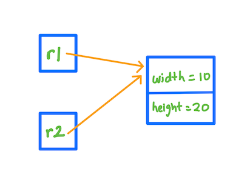
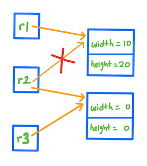

<details class="prereq" markdown="1"><summary>Assumed Knowledge:</summary>

  * [Reference Semantics](./reference_semantics)
  * [Classes as Types](./classes_types)

</details>

<details class="outcomes" markdown="1"><summary>Learning Outcomes:</summary>

  * Define reference and instance copy.
  * Identify a reference copy.
  * Differentiate an instance copy from a reference copy.
  * Be able to execute both types of object copying.

</details>

## Author: Gaurav Gupta

# Copying primitive variables

When we copy a variable of a primitive data type, into another variable, the **contents** of the variable on the right hand side of the assignment operator are copied over into the contents of the variable on the left hand side of the assignment operator.

```java
int x = 1729;
int y;
y = x; //contents of x copied into y
```

### Before:
[](https://mermaid-js.github.io/mermaid-live-editor/#/edit/eyJjb2RlIjoiZ3JhcGggVERcbiAgQVt4PTE3MjldXG4gIEJbeT0wXVxuIiwibWVybWFpZCI6eyJ0aGVtZSI6ImRlZmF1bHQifSwidXBkYXRlRWRpdG9yIjpmYWxzZX0)

### After:
[](https://mermaid-js.github.io/mermaid-live-editor/#/edit/eyJjb2RlIjoiZ3JhcGggVERcbiAgQVt4PTE3MjldXG4gIEJbeT0xNzI5XVxuIiwibWVybWFpZCI6eyJ0aGVtZSI6ImRlZmF1bHQifSwidXBkYXRlRWRpdG9yIjpmYWxzZX0)

# Class to be used

We will use the following class for the rest of this page,

```java
public class Rectangle {
	public int width, height;

	public Rectangle(int w, int h) {
		width = w;
		height = h;
	}
}
```

# Reference copy

Recall the interaction when we copy a variable into another variable. The exact same thing happens when we copy an object into another object, the only difference being that objects hold an address to the location where the instance variables are kept. Hence, it's this address that's copied.
In a separate client code, we call this method on an instance of class `Rectangle` as,

```java
public class Client {
	public static void main(String[] args) {
		Rectangle r1 = new Rectangle(10, 20);
		Rectangle r2 = r1;
	}
}
```

In the above example, the contents of `r1`, which is the address that `r1` holds is copied into the contents of `r2`. Thus, `r2` holds the same address that `r1` holds.



We say,

- `r1` and `r2` are `Rectangle` references.
- The collective memory holding instance variables is a `Rectangle` instance.
- Since there are two references holding the address to that `instance`, the *reference count* (RC) of that instance is 2.
- `r1` and `r2` are reference copies.


If you modify **the contents of** one of the reference copies, the contents of all other reference copies is also modified.

```java
public class Client {
	public static void main(String[] args) {
		Rectangle r1 = new Rectangle(10, 20);
		Rectangle r2 = r1;
		r1.width = 50;
		System.out.println(r2.width); //is also 50
		r2.height = 0;
		System.out.println(r1.height); //is also 0
	}
}
```

However, if you modify the reference copy itself, the other reference copies don't follow.

```java
public class Client {
	public static void main(String[] args) {
		Rectangle r1 = new Rectangle(10, 20);
		Rectangle r2 = r1;

		Rectangle r3 = new Rectangle(0, 0);
		r2 = r3; //now r2 is a reference copy of r3, NOT r1

		System.out.println(r1.width); //still 10
		System.out.println(r1.height); //still 20
	}
}
```




# Instance copy

Instead of creating reference copies, which creates dependencies, we can create a *duplicate* of an instance and refer to that instead. This is called an *instance copy*.

```java
public class Client {
	public static void main(String[] args) {
		Rectangle r1 = new Rectangle(10, 20);
		Rectangle r2 = new Rectangle(r1.width, r1.height);		
		r1.width = 50;

		System.out.println(r2.width); //still 10
	}
}
```


In the above example, we passed `r1.width` and `r1.height` (which are variables of primitive data type) as parameters to the constructor to create `r2`.

But one can see that the method above is inefficient, especially if there are numerous instance variables.

## Copy constructor

We can add a special kind of constructor, known as the *copy constructor* which is used to create instance copies from a source (passed as parameter).

```java
public class Rectangle {
	public int width, height;

	public Rectangle(int w, int h) {
		width = w;
		height = h;
	}

	public Rectangle(Rectangle source) {
		width = source.width;
		height = source.height;
	}
}
```

With the copy constructor, we can make instance copies easily by simply passing the source object as a parameter to the constructor.

```java
public class Client {
	public static void main(String[] args) {
		Rectangle r1 = new Rectangle(10, 20);
		Rectangle r2 = new Rectangle(r1); //invoke copy constructor		
		r1.width = 50;

		System.out.println(r2.width); //still 10
	}
}
```
