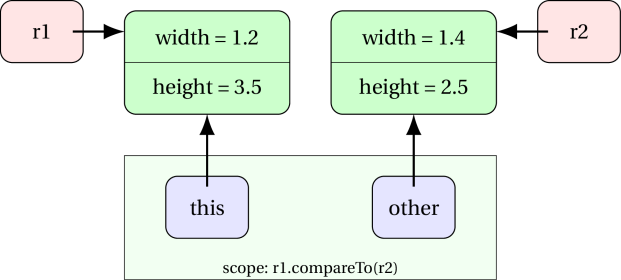
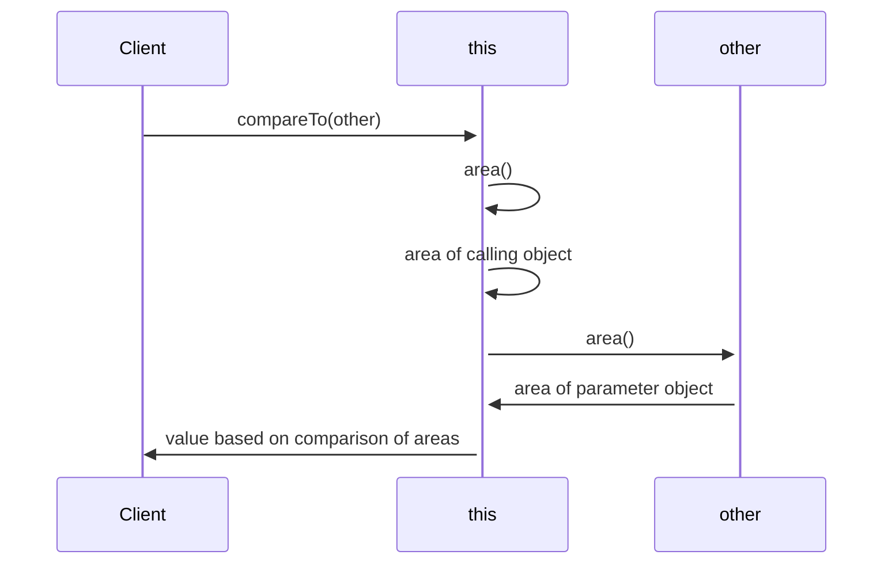

<details class="prereq" markdown="1"><summary>Assumed Knowledge:</summary>

  * [Classes as Types](./classes_types)
  * [Copying objects](./classes_copies)

</details>

<details class="outcomes" markdown="1"><summary>Learning Outcomes:</summary>

  * Recognise that objects have functions attached
  * Be able to use such functions
  * Be able to write such functions

</details>

## Author: Gaurav Gupta

Did you know an object can have a function "attached" to it.  In fact, any object can have lots of functions attached to it.  Even more exciting, all objects that are of the same type (i.e. were built from the same class) all have the _same_ functions attached to them.

# Methods

A function attached to an object is called an *instance method* and it has two differences from a normal function:

  * you call it via the object with dot-notation

```java
<object>.<instanceMethod>(<optional parameters>);
```

  * it can access the instance members (instance variables  and other instance methods) of the object it is attached to.

This lifts object from mere custom-compound-data to something more, something profound.... objects!  All right, we already called them objects, but things with lots of data fields and lots of functions all bundled up together are so incredibly useful they have become the basis of most programming in the 21st century.  We really don't do much with boring old 'int' or 'char' values, we are much more likely to use some object, after all - it has methods attached!

You will see striking uses of methods especially after we cover *Composition*.

# Using Methods

There were methods just waiting for us already, on the `String` objects we have been using:

- `charAt(int): char` (this means `charAt` accepts an `int` as a parameter and returns a `char`)
- `substring(int): String`
- `equals(String): boolean`

An example of how these methods are called on a `String` objected `str` is:

```java
String str = "Engorgio!";
int idx = str.indexOf('g');
char first = str.charAt(0);
char last = str.chatAt(str.length()-1);
char allButFirst = str.substring(1);
char allButLast = str.substring(0, str.length()-1);
```

In each of the above cases, we call the method **on** an object (in this case `str`). This object, on which an instance method is caled, is known as the *calling object*.

# Creating our own methods

When we want to operate on an instance of a class, we can put that behaviour inside the class as an *instance method*. An instance method has access to the variables of the instance on which it is called. In other words, an instance method has access to the instance variables of the calling object.

```java
public class Rectangle {
	public double width, height;

	public Rectangle(double w, double h) {
		width = w;
		height = h;
	}

	public double area() {
		double result = width * height;
		return result;
	}
}
```

In a separate client code, we call this method on an instance of class `Rectangle` as,

```java
public class Client {
	public static void main(String[] args) {
		Rectangle r1 = new Rectangle(10, 20);
		double area1 = r1.area();

		Rectangle r2 = new Rectangle(30, 40);
		double area2 = r2.area();
	}
}
```

We don't have to pass values of instance variables to instance methods.

## A special reference - *"this"*

When we call the instance method `area` on object `r1`, a reference copy of `r1` is made into `this` which is available while `r1.area` executes. When we access `width` (or `this.width`), it's the instance variable `width` of the calling object (`r1` in this case) that is accessed. Same goes for `height`.

However, if the instance method needs some parameters outside of the instance variables, those must be passed. For example, if you need to resize a Rectangle object, the factor by which it must be resized needs to be passed to the method.

```java
public class Rectangle {
	public double width, height;

	public Rectangle(double w, double h) {
		width = w;
		height = h;
	}

	public void resize(double factor) {
		width = width * factor;
		height = height * factor;
	}
}
```

The method call to shrink object `r1` used in the previous example by 50% in each direction would be `r1.resize(0.5);`.

# A method returning an object (typically of the same class)

Inside a method, one must (typically) not modify the calling object.

Hence, instead of the method `resize` that we wrote in the previous section, we should create a resized `Rectangle` object and return it instead.

```java
	public Rectangle getResized(double factor) {
		double w = width * factor;
		double h = height * factor;

		//create a new object with the fresh values
		Rectangle result = new Rectangle(w, h);

		return result;
	}
```

Another example:

```java
public class Fraction {
	public int num, den;

	public Fraction(int n, int d) { //assume d is not 0
		num = n;
		den = d;
	}

	public Fraction getInverse() {
		if(num == 0) {
			return null; //x/0 is undefined
		}

		return new Fraction(den, num); //switch numerator and denomenator
	}
}
```

# Special mention - compareTo

It is very common to have to compare objects. This is done through the `compareTo` method, that is called on an object (calling object) with another object of a comparable type (usually an object of the same class) being passed as a parameter (parameter object). It returns,

- 1, if calling object is "more than" parameter object
- -1, if calling object is "less than" parameter object
- 0, if calling object is "same as" parameter object

The definition of *more* or *less* or *same* is determined by domain-specific criterion/ criteria.

For example, two rectangles can be compared on the basis of area as,

```java
public class Rectangle {
	public double width, height;

	public Rectangle(double w, double h) {
		width = w;
		height = h;
	}

	public double area() {
		double result = width * height;
		return result;
	}

	public int compareTo(Rectangle other) {
		if(area() > other.area())
			return 1;

		if(area() < other.area())
			return -1;

		//in all other cases
		return 0;
	}
}
```

In the above example, `area()` calls the method `area` on the calling object, and `other.area()` calls the method `area` on the parameter object.

Let's see an example of how we call `compareTo` and what happens in the memory:

```java
public class Client {
	public static void main(String[] args) {
		Rectangle r1 = new Rectangle(1.2, 3.5);
		Rectangle r2 = new Rectangle(1.4, 2.5);
		int status = r1.compareTo(r2);
	}
}
```



1. A reference copy of the calling object (`r1` in this case) is made into `this`.
2. A reference copy of the passed object (`r2` in this case) is made into the formal parameter (`other` in this case).
3. Control is transferred to `compareTo`.
4. Following execution ensues:

[](https://mermaid-js.github.io/mermaid-live-editor/#/edit/eyJjb2RlIjoic2VxdWVuY2VEaWFncmFtXG5cdENsaWVudC0-Pit0aGlzOiBjb21wYXJlVG8ob3RoZXIpXG5cdHRoaXMtPj50aGlzOiBhcmVhKClcbiAgdGhpcy0tPj50aGlzOiBhcmVhIG9mIGNhbGxpbmcgb2JqZWN0XG5cdHRoaXMtPj4rb3RoZXI6IGFyZWEoKVxuICBvdGhlci0tPj50aGlzOiBhcmVhIG9mIHBhcmFtZXRlciBvYmplY3Rcblx0dGhpcy0tPj5DbGllbnQ6IHZhbHVlIGJhc2VkIG9uIGNvbXBhcmlzb24gb2YgYXJlYXNcblx0XHRcdFx0XHQiLCJtZXJtYWlkIjp7InRoZW1lIjoiZGVmYXVsdCJ9LCJ1cGRhdGVFZGl0b3IiOmZhbHNlfQ)

<!--

-->

# Special methods all objects have

Thanks to a feature of Java [we will learn later](../practice_of_programming/inheritance) there are some methods that "come for free" in every class (and thus are attached to every object).  A few of these are interesting to us:

  * `toString(): String`
  * `equals(Object): boolean`

# Distinction between static and non-static

Members (both variables and methods) in a class can be declared as,

1. static members or class members: these are properties of the collective class, not a specific instance, and can be invoked on the class directly, or an object of that class.
2. non-static members or instance members: these are properties of a specific instance and can only be invoked on instances.

The following example illustrates the differences:

```java
public class Foo {
	public int bar;
	public static int pog = 101;

	public int pac() {
	   return bar * bar;
	}

	public static int man() {
	   return (int)(Math.random()*pog);
	}

	public static void main(String[] args) {
		Foo rig = new Foo();
		//System.out.println(Foo.bar); //INVALID
		System.out.println(rig.bar); //0
		System.out.println(Foo.pog); //101
		System.out.println(rig.pog); //101
		//System.out.println(Foo.pac()); //INVALID
		System.out.println(rig.pac()); //0
		System.out.println(Foo.man()); //an integer value between 0 and pog-1
		System.out.println(rig.man()); //an integer value between 0 and pog-1
	}
}
```
