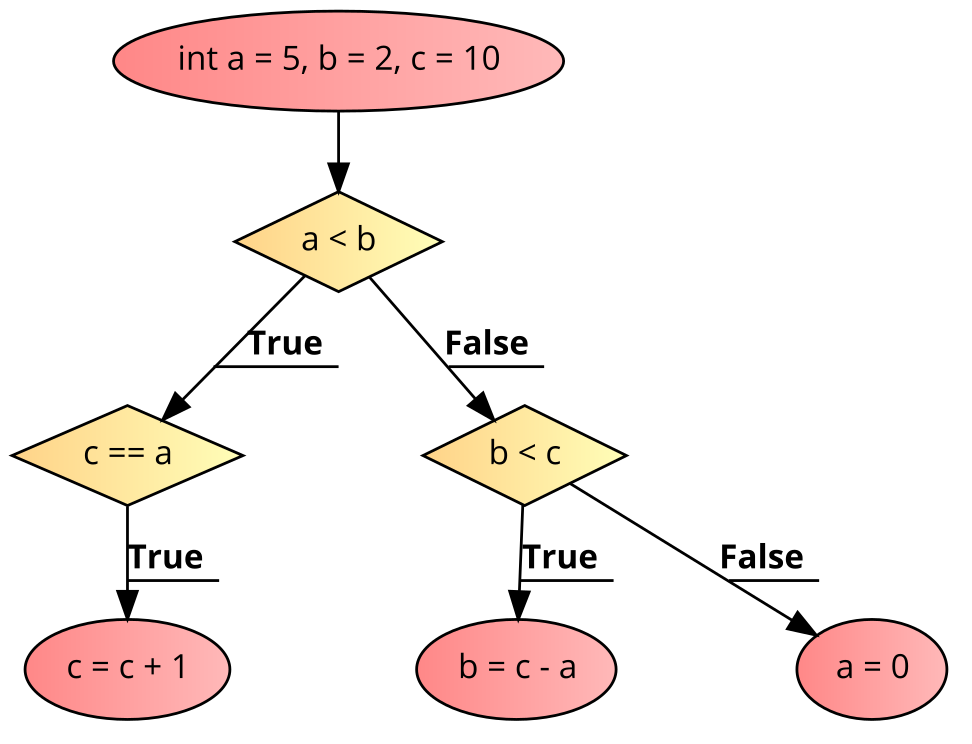

<details class="prereq" markdown="1"><summary>Assumed Knowledge</summary>

  * [Primitive Operations](primitive_operations)
  * [Variables](variables)
</details>

<details class="outcomes" markdown="1"><summary>Learning Outcomes</summary>

  * Understand what a boolean expression is
  * Understand how boolean expressions can effect the flow of control in a program
  * Write code that requires `if-then-else` statements
  * Understand simple logical operations.

</details>

{: .keypoint}
Conditions allow different code to run in different frames of the animation

{: .readings}
Chapter 5 of [Learning Processing](https://learningprocessing.com) by Danel Shiffman.

<iframe width="560" height="315" src="https://www.youtube.com/embed/wsI6N9hfW7E" frameborder="0" allow="accelerometer; autoplay; encrypted-media; gyroscope; picture-in-picture" allowfullscreen></iframe>

<iframe width="560" height="315" src="https://www.youtube.com/embed/mVq7Ms01RjA" frameborder="0" allow="accelerometer; autoplay; encrypted-media; gyroscope; picture-in-picture" allowfullscreen></iframe>

<iframe width="560" height="315" src="https://www.youtube.com/embed/9857701OsDE" frameborder="0" allow="accelerometer; autoplay; encrypted-media; gyroscope; picture-in-picture" allowfullscreen></iframe>

<iframe width="560" height="315" src="https://www.youtube.com/embed/_NJqfZUQ3i4" frameborder="0" allow="accelerometer; autoplay; encrypted-media; gyroscope; picture-in-picture" allowfullscreen></iframe>

<iframe width="560" height="315" src="https://www.youtube.com/embed/YIKRXl3wH8Y" frameborder="0" allow="accelerometer; autoplay; encrypted-media; gyroscope; picture-in-picture" allowfullscreen></iframe>

## Statement or Expression

A conditional is a statement.  It _does_ one of two things.  However, the boolean that determines which branch is an expression, _it evalates to true or false_.

<div class="task" markdown="1"><a name="one_way_animated_blue_circle"></a>
Write a program that draws a blue cirle that moves from the top to the bottom of the sketch and when reaching the bottom of the screen, will change direction and start moving up the screen.
<details class="solution" markdown="1"><summary>solution</summary>
The problem description does not directly relate to conditions, so we need to "re-interpret" it to put it into "code-speak".  Another way to consider the problem statement (as a Processing programmer) is "write a program where a blue circle is drawn on the screen and every time it is drawn it moves a little.  IF it has hit the bottom previously, it should move up, otherwiser it should move down".  This leads us more directly to some code.  We need a condition so that we can choose which code path will run on any individual frame (`if (hitBottom)`) and to make it work we need a boolean _recording_ if we have hit the bottom before.  Finally, we need an condition that checks everytime we draw the sketch if we just hit the bottom.

~~~~~
int ypos;
boolean hitBottom;

void setup(){
  ypos = 0;
  hitBottom = false;
}

void draw(){
  background(255);

  if (ypos == height){
    hitBottom = true;
  }

  noStroke();
  fill(92, 136, 218);
  circle(width/2, ypos, 20);
  if (hitBottom){
    ypos--;
  } else {
    ypos++;
  }

}
~~~~~
</details>
</div>

We will now go over the material presented in the above videos, but we will be more _precise_ about what is going on to deepen your understanding.

Conditions are based on *boolean expressions* and the program takes a specific course based on whether these expressions evaluate to `true` or `false`.

## An `if` condition
An `if` condition executes the conditional code only if the `expression` is evaluated to `true` and then the rest of the code. If the `expression` is evaluated to `false`, it executes the `rest of the code` irrespectively afterwards.

```java
if(boolean expression) {
	conditional code
}
rest of the code
```
<div>
<center></center>
</div>

Example:

```java
int x = 10;
int result = 5;
if(x > 8) {
	result = result + 1;
}
print(result);
```

<center></center>


The above code executes the conditional code, increasing `result` by 1 and displaying the value 6.

## An `if-else` condition
An `if-else` condition executes the `if` block if the `boolean expression` is evaluated to `true` and the `else` block if the `boolean expression` is evaluated to `false`. The `rest of the code` is executes afterwards irrespectively.

```java
if(boolean expression) {
	if-block statements
}
else {
	else-block statements
}
rest of the code
```

<center></center>

Example:

```java
int x = 13;
boolean isEven;
if(x % 2 == 0) {
  isEven = true;
}
else {
  isEven = false;
}
println(isEven);
```

<center></center>

The else-block is executed in the above code, `isEven` becomes `false`, and is displayed on the console.

## Statements not Expressions

An `if` is a _statement_ not an _expression_.  That means it has no intrinsic value, it exists only for what it can _do_.  For example, variables are _expressions_ because if  you put one in your code, it is the same as putting some value in that spot (the value stored in the variable).  However, an `if` may effect variables, or draw things on the screen, but the statement itself has no value, i.e. `if (1 < 2) {line(1,1,,1,);}` is not the same as putting some value in that spot.


<div class="task" markdown="1">
Draw a flowchart for the following code and determine the values of `a, b, c` after the code executes.

```java
int a = 5, b = 2, c = 10;
if(a < b) {
	if(c == a) {
		c = c + 1;
	}
}
else {
	if(b < c) {
		b = c - a;
	}
	else {
		a = 0;
	}
}
```
<details><summary>Solution</summary>
	<center></center>
</details>
</div>

<div class="task" markdown="1">
What is wrong with the following code? Draw a flowchart to illustrate the problem. Write the corrected code.

```java
int a = (int)random(6);
int b = (int)random(6);
int max;
if(a > b) {
	max = a;
}
if(b >= a) {
	max = b;
}
println(max);
```
<details markdown="1"><summary>Solution</summary>

Both assignment operators are conditional and it is possible, in terms of control flow, that neither of the assignment operators are executed (although mathematically it's not possible in this case). You will get a <strong>Variable max may not have been initialized</strong> error. Diagram of the buggy code:

<center></center>


Corrected code:


~~~~~
int a = (int)random(6);
int b = (int)random(6);
int max;
if(a > b) {
	max = a;
}
else {
	max = b;
}
println(max);
~~~~~

</details>
</div>

<div class="task" markdown="1"><a name="two_way_animated_blue_circle"></a>
Adjust [your animated blue circle](./conditions.html#one_way_animated_blue_circle) so it also bounces off the top of the screen, thus always going up and down forever, never disapearing.  Note that there are two approaches to solving this.
<details class="solution" markdown="1"><summary>solution 1</summary>
We can simply use the `hitBottom` boolean in a smarter way.  What if we think of is as "moving up" instead?  Then it will be `false` at the start, and change to `true` when we hit the bottom, then `false` again when we hit the top.

~~~~~
int ypos;
boolean movingUp;

void setup(){
  ypos = 0;
  movingUp = false;
}

void draw(){
  background(255);

  if (ypos == height){
    movingUp = true;
  }
  if (ypos == 0){
    movingUp = false;
  }
  noStroke();
  fill(92, 136, 218);
  circle(width/2, ypos, 20);
  if (movingUp){
    ypos--;
  } else {
    ypos++;
  }
}
~~~~~

Notice that we _can't_ use an `else` on the `ypos` check.  Many new programmers will try this.  Why won't that work?
</details>
<details class="solution" markdown="1"><summary>solution 2</summary>
Solution 1 is the simplest, but you will see many people suggest the following solution.  It works really well if _any more complex animation_ is required, so it is a good idea to understand it now.

In this solution we rephrase the task into the following "draw a blue circle that is moving each frame of the animation.  At first, it should move with a speed of +1 (i.e. down the screen) but when the circle hits the bottom of the screen its speed should reverse to -1 (i.e. up the screen).  Again it will reverse when it hit the top of the screen, etc."

Instead of keeping a boolean telling us what phase of the animation we are in, we are keeping a number telling us what speed the circle is moving, using the trick that a negative speed means we are moving up the screen instead of down.

~~~~~
int ypos;
int speed;

void setup(){
  ypos = 0;
  speed = 1;
}

void draw(){
  background(255);

  if (ypos == height){
    speed = -1;
  }
  if (ypos == 0){
    speed = 1;
  }
  noStroke();
  fill(92, 136, 218);
  circle(width/2, ypos, 20);
  ypos = ypos + speed;

}
~~~~~

Interestingly, this has saved us from one conditional!  It is perhaps a little harder to see at first, but the code is shorter.  The "variability" of the variable is doing the work of the condition.  Note also how we now have many more options, we can speed up the animation quite easily which we could not in solution 1.

</details>
</div>

## Coding in the real world

In real life, we need to convert written/spoken descriptions of a case into precise code and in this section, we'll take a look as such scenarios.

<div class="task" markdown="1">
A website offers discounts based on item categories and quantities. There are four categories - A, B, C, and D. For all categories except D, the following rules exist,

- Less than 2 items: no discount
- Between 2 and 5 items: 15% discount
- Between 6 and 10 items: 25% discount
- More than 10 items: 30% discount


For category D, there is a 1% discount for every item purchased, up to a maximum of 50 items (and hence a maximum of 50% discount).

Write a piece of code that outputs the percentage discount for a given category (stored in `char cateogry` that can be either 'A', 'B', 'C', or 'D') and quantity (stored in `int quantity`).

<details markdown="1"><summary>Solution</summary>

```java
int discountPercent = 0;

if(category == 'D') {
  if(quantity > 50) {
    discountPercent = 50;
  }
  else {
    discountPercent = quantity;
  }
}
else {
  if(quantity >= 2 && quantity <= 5) {
    discountPercent = 15;
  }
  if(quantity >= 6 && quantity <= 10) {
    discountPercent = 25;
  }
  if(quantity > 10) {
    discountPercent = 30;
  }
}
```
</details>
</div>

<div class="task" markdown="1">
The shopping mall charges for parking based on the following rules:

- under 3 hours: free
- 3 hours to 3 hours 29 minutes: $4
- 3 hours 30 minutes to 3 hours 59 minutes: $7
- 4 hours to 4 hours 29 minutes: $11
- 4 hours 30 minutes to 4 hours 59 minutes: $16
- 5 hours to 5 hours 29 minutes: $22
- 5 hours 30 minutes to 5 hours 59 minutes: $30
- 6 hours or over: $40

Given the number of hours and minutes in two variables, write a piece of code that stores the parking cost in a variable `parkingFee`.

<details markdown="1"><summary>Solution 1</summary>
We have two solutions, this one only uses simple boolean expressions, but that creates a complex, nested set of `if` statements.

```java
int parkingFee = 0;

if (minutes >= 180) {
  if (minutes < 210) {
    parkingFee = 4;
  }
  else {
    if (minutes < 240) {
      parkingFee = 7;
    }
    else {
      if (minutes < 270) {
        parkingFee = 11;
      }
      else {
        if (minutes < 300) {
          parkingFee = 16;
        }
        else {
          if (minutes < 330) {
            parkingFee = 22;
          }
          else {
            if (minutes < 360) {
              parkingFee = 30;
            }
            else {
              parkingFee = 40;
            }
          }
        }
      }
    }
  }
}
```
</details>

<details markdown="1"><summary>Solution 2</summary>
This second solution needs more complex boolean expressions, but that makes things simpler overall.

```java
int parkingFee = 0;

if (minutes >= 180 && minutes < 210) {
  parkingFee = 4;
}

if (minutes >= 210 && minutes < 240) {
  parkingFee = 7;
}

if (minutes >= 240 && minutes < 270) {
  parkingFee = 11;
}

if (minutes >= 270 && minutes < 300) {
  parkingFee = 16;
}

if (minutes >= 300 && minutes < 330) {
  parkingFee = 22;
}

if (minutes >= 330 && minutes < 360) {
  parkingFee = 30;
}

if (minutes >= 360) {
  parkingFee = 40;
}

```
</details>
</div>

<div class="task" markdown="1">

Write a piece of code to address the same problem as in scenario 3, but an additional rule. Weekend (Sat, Sun) parking incurs a flat rate of $4 per 30 minutes. That is,

- 0 to 29 minutes: $4
- 30 to 59 minutes: $8
- 60 to 89 minutes: $12
- and so on...

An additional variable `dayOfWeek` is available and is 0 for Monday, 1 for Tuesday and so on.

<details markdown="1"><summary>Solution</summary>

```java
int parkingFee = 0;

if (dayOfWeek < 5) { //NOT the weekend
  if (minutes >= 180 && minutes < 210) {
    parkingFee = 4;
  }

  if (minutes >= 210 && minutes < 240) {
    parkingFee = 7;
  }

  if (minutes >= 240 && minutes < 270) {
    parkingFee = 11;
  }

  if (minutes >= 270 && minutes < 300) {
    parkingFee = 16;
  }

  if (minutes >= 300 && minutes < 330) {
    parkingFee = 22;
  }

  if (minutes >= 330 && minutes < 360) {
    parkingFee = 30;
  }

  if (minutes >= 360) {
    parkingFee = 40;
  }
  println("Weekday parking fee for "+minutes/60+" hours and "+minutes%60+" minutes: $"+parkingFee);
} else { //weekend
  parkingFee = 4 + 4 * (minutes/30);
  println("Weekend parking fee for "+minutes/60+" hours and "+minutes%60+" minutes: $"+parkingFee);
}
```
</details>
</div>

<h3>Furthering Your Understanding</h3>
<iframe width="560" height="315" src="https://www.youtube.com/embed/wUPc__xuCc0" frameborder="0" allow="accelerometer; autoplay; encrypted-media; gyroscope; picture-in-picture" allowfullscreen></iframe>
