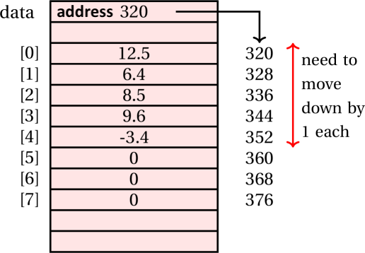
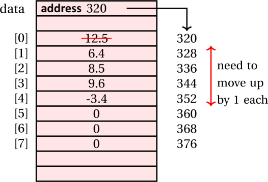

<details class="prereq" markdown="1"><summary>Assumed Knowledge</summary>

  * <a href="lists">Lists</a>
  * <a href="loops">Loops</a>
</details>

<details class="outcomes" markdown="1"><summary>Learning Outcomes</summary>

  * Be able to build a custom list class
  * Understand the time costs of various list operations
</details>

## Author: Gaurav Gupta

# Custom-built arraylist

In this chapter, we'll see how an arraylist holds items and how to implement it.

<span style="color:red">**NOTE!**</span> The built-in class for ArrayList in Java holds a collection of objects, not primitive data type, but in our example, we'll create a collection of `double` items, for simplicity.

## What an ArrayList class looks like

The ArrayList class has an instance variable array that holds the items. If, at the time of triying to add an item, the array is full, then:

1. a bigger array is created,
2. items from the instance variable array are copied over
3. instance variable array is re-referenced to refer to the new, bigger array

Let's create one such class holding an array of doubles

```java
public class MyArrayList {
	private double[] data;
	private int nItems;

	public MyArrayList() {
		data = new double[5];
		nItems = 0; //no item added yet
	}

	public void add(double itemToAdd) { //THERE IS A PROBLEM HERE
		data[nItems] = itemToAdd;
		nItems++;
	}
}
```

The client can create an object of class `MyArrayList` as:

```java
MyArrayList list = new MyArrayList();
list.add(10);
list.add(70);
list.add(20);
list.add(90);
list.add(30);
```

Five items were added to the list, which is ok. But as soon as you try to add a sixth item using,

```java
list.add(80);
```

The method `add` will cause,

```java
data[5] = 80; //ArrayIndexOutOfBoundsException
```

Therefore, we must first check if the internal array is full.

```java
//inside class MyArrayList
public boolean isFull() {
	if(nItems == data.length) {
		return true;
	}
	else {
		return false;
	}
}
```

The method `add` should be modified as,

```java
//inside class MyArrayList
public void add(double itemToAdd) {
	if(isFull()) {
		???
	}
	data[nItems] = itemToAdd;
	nItems++;
}
```

If the internal array is full,

1. a bigger array is created,
2. items from the instance variable array are copied over
3. instance variable array is re-referenced to refer to the new, bigger array

These steps are performed in a method `grow()`.

```java
public void grow() {
	double[] temp = new double[data.length + 5]; //5 extra items

	for(int i=0; i < data.length; i++) { //copy all items over
		temp[i] = data[i];
	}

	data = temp; //make instance variable array refer to the bigger array
}
```

## Updated class definition

```java
public class MyArrayList {
	private double[] data;
	private int nItems;

	public MyArrayList() {
		data = new double[5];
		nItems = 0; //no item added yet
	}

	public boolean isFull() {
		if(nItems == data.length)
			return true;
		else
			return false;
	}

	private void grow() { //should not be called by outside code
		double[] temp = new double[data.length + 5]; //5 extra items

		for(int i=0; i < data.length; i++) { //copy all items over
			temp[i] = data[i];
		}

		data = temp; //make instance variable array refer to the bigger array
	}

	public void add(double itemToAdd) {
		if(isFull()) {
			grow();
		}
		data[nItems] = itemToAdd;
		nItems++;
	}
}
```

## Method to add an item at an arbitrary index

Say, the list contains items [12.5, 6.4, 8.5, 9.6, -3.4] and we want to add an item 16.42 at index 0. All items in the array need to move forward by 1.

<p></p>
&nbsp;
<p></p>


<p></p>
&nbsp;
<p></p>

```java
public boolean add(int idx, double itemToAdd) {
	if(idx < 0 || idx > nItems) {
		return false; //to indicate failure
	}

	if(isFull()) {
		grow();
	}
	for(int i=nItems - 1; i >= idx; i--) {
		data[i+1] = data[i];
	}

	data[idx] = itemToAdd;
	nItems++;

	return true; //to indicate success
}
```

## Method to remove an item from an arbitrary index

Say, the list contains items [12.5, 6.4, 8.5, 9.6, -3.4] and we want to remove the item at index 0. All items in the array need to move backward by 1.


<p></p>
&nbsp;
<p></p>


<p></p>
&nbsp;
<p></p>


The method should return the item removed.

If we keep the return type as `double`, what do we return if the index is invalid and therefore no item exists at that index?

Hence, we keep the return type `Double` since we can return `null` as error code.

```java
public Double remove(int idx) {
	if(idx < 0 || idx >= nItems) {
		return null; //error code
	}

	double itemRemoved = data[idx];

	for(int i= idx; i < nItems - 1; i++) {
		data[i] = data[i+1];
	}
	nItems--;

	return itemRemoved; //can return double variable as Double
}
```		

# Complete class and client (including homework)

- [MyArrayList.java](./MyArrayList.java) (contains several incomplete methods for practice)
- [MyArrayListClient.java](./MyArrayListClient.java)

# Homework tasks

### 1. Percentage used

Add an instance method `percentageUsed` that returns the percentage of the instance array being used. For example, if `data.length = 15` and `nItems = 12`,  method returns the value `80.0`.

### 2. indexOf

Add an instance method `indexOf` that when passed a `double`, returns the index of the first occurrence of the item. Return -1 if item doesn't exist. Method header is:

```java
public int indexOf(double target)
```

### 3. lastIndexOf

Add an instance method `lastIndexOf` that when passed a `double`, returns the index of the last occurrence of the item. Return -1 if item doesn't exist. Method header is:

```java
public int lastIndexOf(double target)
```

### 4. isValidIndex

Add an instance method `isValidIndex` that when passed an `int` (index), returns `true` if the index is valid, and `false` otherwise. Method header is:

```java
public boolean isValidIndex(int index)
```

For example, if `nItems = 7`, indices from 0 to 6 (inclusive on both sides) are valid, and all other indices are invalid.

### 5. set

Add an instance method `set` that when passed an `int` (index) and a  `double` (updated value), sets the item at given index (if within range) to the updated value and returns `true`. If the index is invalid, return `false`. Method header is:

```java
public boolean set(int index, double updated)
```

### 6. Modified growth

Modify the method `grow` such that the array grows only if full. If the array is not full, it should not grow. Original method (that grows the array irresepective of being full or not) provided below:

```java
public void grow() {
	double[] temp = new double[data.length + 5]; //5 extra items

	for(int i=0; i < data.length; i++) { //copy all items over
		temp[i] = data[i];
	}

	data = temp; //make instance variable array refer to the bigger array
}
```

### 7. Remove an item

Add an instance method `remove` that when passed a `double`, removes the first occurrence of the item from the list (if any).  The method should return `true` if there was an instance of the item that was removed, and `false` if there was no instance of the item in the list. Method header is:

```java
public boolean remove(double itemToRemove)
```

### 8. Remove all

Add an instance method `removeAll` that when passed a `double`, removes all occurrences of the item from the list. You **can** use the method `remove` already implemented. The method should return `true` if there was an instance of the item that was removed, and `false` if there was no instance of the item in the list. Method header is:

```java
public boolean removeAll(double itemToRemove)
```

# Array-based lists operation analysis

At the end of the day, an array-based list is an array. In this section, we'll take a look at the three core operations on arrays:

1. accessing at item at a given index
2. adding an item at a given index
3. removing an item from a given index

## Accessing an item at a given index

We need to understand how an array is stored to understand how array items are accessed.

An array is stored as a contiguous block of memory. So, if you have 100 items, you need a block of 400 bytes (given each integer is 4 bytes).

As an example, consider the following array containing 6 integers.

```java
int[] data = {20, 50, 10, 90, 70, 30};
```

24 bytes are reserved for this instance, 4 bytes per integer. The first item is stored in the first four bytes, the second item in the next four bytes and so on.


<p></p>
&nbsp;
<p></p>


<p></p>
&nbsp;
<p></p>

Thus,

- The address of the first item (at index 0) is the base address of the array (in this example, 600).
- The address of the second item (at index 1) is the base address of the array + 4 bytes.
- The address of the third item (at index 2) is the base address of the array + 2 * 4 bytes.
- ...  
- The address of the last item (at index 5) is:

	`base address of the array` + `5` * `4` bytes.

With a little tweak we can see:

- Address(`data[0]`) = `baseAddress` + *0 \* 4*
- Address(`data[1]`) = `baseAddress` + *1 \* 4*
- Address(`data[2]`) = `baseAddress` + *2 \* 4*
- ...
- Address(`data[data.length - 1]`) = `baseAddress` + *(data.length - 1) \* 4*


Putting it all together,


`(address of item at index idx)` = `(base address of array)` +
                                 `(size of each item)` * `(idx)`;

This means, irrespective of the index accessed, it takes the same time to return an item. A sample table illustrating time taken against index is provided below. In this, `x` is the amount of time taken and could be any value more than 0.

| index | time taken   |
|-------|--------------|
|    0   | x milliseconds |
|    10   | (around) x milliseconds |
|    800   | (around) x milliseconds |
|    60000   | (around) x milliseconds |

If you plot a chart with index on x-axis and time taken on y-axis, you'll get a (near) flat-line. We can this **O(1)** operation in terms of time complexity (but don't stress, we will teach the formal terminology in subsequent units).

### Example: Accessing an item

Let's say we want to access `data[3]` in the following statement:

```java
int item = data[3];
```

We start off with the reference held by `data` and getting the base address (600).

To that, we add 3 * 4 = 12 (3 being the index and 4 being size of each item), giving us the starting address of the item 612.

We grab 4 bytes starting at that address (so bytes 612 to 615) and present it packed as an integer: 90.

## Growing the array

The `grow` method is as follows:

```java
private void grow() {
	double[] temp = new double[data.length + 5];
	for(int i=0; i < data.length; i++) {
		temp[i] = data[i];
	}

	data = temp; 	
}
```

The key operation in this method is the loop that iterates `data.length` number of times. The following table summarizes the time behaviour of the loop.

| current size | time taken   |
|-------|--------------|
|    5   | x milliseconds |
|    10   | (around) 2 times x milliseconds |
|    500   | (around) 100 times x milliseconds |
|    10000   | (around) 2000 times x milliseconds |

A chart plotted for this with current size on x-axis and time taken on y-axis would yield a **straight** (rising) line. We call this **O(n)** operation in terms of time complexity.

## Inserting an item at a given index

There are four cases for inserting an item:

1. Array is not full and you are inserting an item at the end of the array: None of items need to be moved, array doesn't need to be grown. This requires a fixed number of operations, irrespective of the current state of the array and hence **O(1)** operation.

2. Array is full and you are inserting an item at the end of the array: None of items need to be moved but array needs to be grown. Growing the array is **O(n)**. Therefore, this is an **O(n)** scenario.

3. Array is not full but you are inserting an item somewhere (not at the end): Some items need to be moved but array doesn't need to be grown. The worst case is when you are adding an item at index 0, in which case all items need to move, which is **O(n)**. Therefore, this is also an **O(n)** scenario.

	For example, if there are 5 items currently being used in an array of size 8, and we try to insert an item 5.6 at index 0, all 5 items need to be moved forward.

<p></p>
&nbsp;
<p></p>



<p></p>
&nbsp;
<p></p>

These shifts are illustrated in the following diagram:

<p></p>
&nbsp;
<p></p>


<p></p>
&nbsp;
<p></p>

4. Array is full and you are inserting an item somewhere (not at the end): Double whammy, but  **O(n)** + **O(n)** is still **O(n)**, just the straight line is steeper.

## Removing at item at a given index

There are two relevant cases for removing an item:

1. **Best case**: removing the last item: No items need to be moved. **O(1)**.
2. **Worst case**: Removing the first item: All the items need to be moved. **O(n)** because of the loop that needs to iterate over each item.

	For example, if there are 5 items currently being used in an array of size 8, and we try to remove the first item, all 5 items need to be moved backward by one.

<p></p>
&nbsp;
<p></p>



<p></p>
&nbsp;
<p></p>

These shifts are illustrated in the following diagram:

<p></p>
&nbsp;
<p></p>


<p></p>
&nbsp;
<p></p>

## Homework exercises

1. Explain the calculations performed during calculating the address of `data[6]` if the base address is 4000 and the array is of type `double[]`. Each `double` variable needs 8 bytes of memory.

2. Explain the calculations performed during calculating the address of `data[40]` if the base address is 3000 and the array is of type `char[]`. Each `char` variable needs 2 bytes of memory.

3. Consider an array `data = {10, 70, 20, 90, 30, 80, 60}`. Explain, with the help of a diagram, the shifts involved while removing the item 70.

4. Consider an array `data = {10, 70, 20, 90, 30, 80, 60}`. Explain, with the help of a diagram, the shifts involved during the process of adding the item 30 at index 1.
