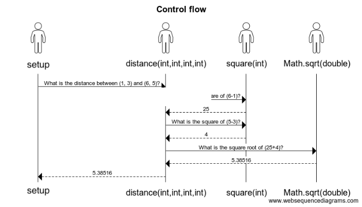

<details class="prereq" markdown="1"><summary>Assumed Knowledge:</summary>

  * [Functions](./functions)

</details>

<details class="outcomes" markdown="1"><summary>Learning Outcomes:</summary>

  * Better understand the concept of parameter passing.
  * Familiarize yourself with standard terminology - *formal paramters* vs. *actual parameters*.
  * Understand the control flow and memory transactions during a function call.
  * Understand the concept of *Call Stack*.

</details>

## Author: Gaurav Gupta

# Formal parameters vs. actual parameters

- *Formal parameter* is the name used for the variable in the function definition.
- *Actual parameter* is the value copied into the formal parameter during a function call.

Consider the following example:

```java
int square(int n) { //n is the "formal parameter"
	int result = n * n;
	return result;
}

void setup() {
	int a = 5;
	int b = square(a); //whatever is inside the brackets is the "actual parameter"
}
```

In the above example,

- Formal parameter in function `square` is `n`.
- Actual parameter in the function call `square(a)` is `a` (5).
- If the function call was `square(d/20 + e/9)`, the actual parameter would be `d/20 + e/9` (100/20 + 36/9 = 9).

# What happens during a function call?

Before we can truly conquer recursion, it's critical to understand what happens when a function is called. Consider the following example:

```java
void setup() {
	int ax = 1, ay = 3;
	int bx = 6, by = 5;
	float d = distance(ax, ay, bx, by);
	println("Distance: "+d);
}

float distance(int x1, int y1, int x2, int y2) {
	int s1 = square(x2-x1);
	int s2 = square(y2-y1);
	int sumSquares = s1 + s2;
	float result = sqrt(sumSquares);
	return result;
}

int square(int num) {
	int answer = num * num;
	return answer;
}
```

### STEP 1: setup function is invoked by JVM


function call is placed on the stack. Note that parameter is `null` because we typically do not pass any arguments to setup, at least in this unit.

### STEP 2: setup function calls `distance` with parameters 1, 3, 6 and 5.


Another entry is made for the call to `distance` and placed on the call stack.

### STEP 3: `distance` calls `square` with parameter `5`


A third entry is made for the call to `square` and placed on the stack.

### STEP 4: `square` returns 25 to `distance`


Entry for `square` is taken off the stack. `distance` becomes the active function.

### STEP 5: `distance` calls `square` with parameter `2`


A third entry is made for the call to `square` and placed on the stack.

### STEP 6: `square` returns 4 to `distance`


Entry for `square` is taken off the stack. `distance` becomes the active function.

### STEP 7: `distance` calls `sqrt` with parameter `29`


A third entry is made for the call to `sqrt` and placed on the stack.

### STEP 8: `sqrt` returns 5.38516 to `distance`


Entry for `square` is taken off the stack. `distance` becomes the active function.

### STEP 9: `distance` returns 5.38516 to `setup`


Entry for `distance` is taken off the stack. `setup` becomes the active function.

### STEP 10: `setup` terminates

Entry for `setup` is taken off the stack. Call stack is now empty. Program has now finished execution.

## Summary of control flow


<!--<iframe src="https://giphy.com/embed/Az1CJ2MEjmsp2" width="480" height="221" frameBorder="0" class="giphy-embed" allowFullScreen></iframe><p><a href="https://giphy.com/gifs/bare-barren-Az1CJ2MEjmsp2">via GIPHY</a></p>-->

# Another example

```processing
void setup() {
	size(600, 400);
	background(255);
	print(foo(1729));
}

int foo(int n) {
	return bar(n%10)/2;
}

int bar(int n) {
	return n+1;
}
```

The function `foo` is called with actual parameter 1729.
This is copied into the formal parameter `n` for function call `foo(1729)`. This function in turns call the function `bar` with the actual parameter 9, that is copied into the actual parameter `n` for function call `bar(9)`. `bar(9)` returns 10 to `foo(1729)`. `foo(1729)` divides it by 2, and returns 5 to `setup`.

Notice that `n` for `foo(1729)` and `n` for `bar(9)` are local variables for the respective function calls. Draw the call stack and it will really help you out!

# One last example

Consider the following code:

```processing
int x = 0;

void init() {
	x = width;
}

void update() {
	x--;
}

void draw() {
	background(255);
	line(x, 0, x, height);
	update();
}

void setup() {
	size(600, 400);
	background(255);
	init();
}
```

The sequence of functions called is:

1. `setup`
2. `size`
3. `background`
4. `init`
5. `draw`
6. `background`
7. `line`
8. `update`
9. `draw`
10. `background`
11. `line`
12. `update`
13. `draw`
14. `background`
15. `line`
16. `update`
17. (and the four - `draw`, `background`, `line`, `update` repeat)
