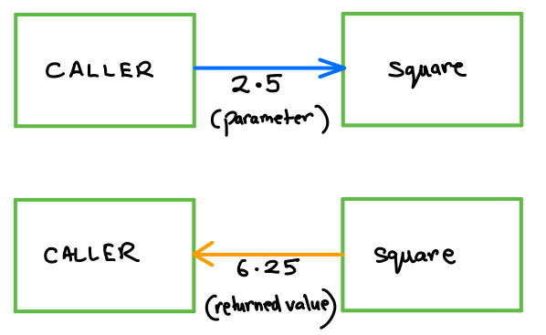

<details class="prereq" markdown="1"><summary>Assumed Knowledge</summary>

  * [Primitive Operations](primitive_operations)
  * [Variables](variables)
  * [Conditions](conditions)
</details>

<details class="outcomes" markdown="1"><summary>Learning Outcomes</summary>

  * Know the syntax of functions
  * Understand how functions relate to algorithms
  * Be able to pass values into a function
  * Be able to get values back from a function
  * Be able to write your own functions
  * Be able to reason about the flow of a program that uses functions

</details>

{: .keypoint}
A function is a named piece of code that can be supplied with some inputs (known as parameters) and may return a value back to the caller.

{: .readings}
Chapter 7 of [Learning Processing](https://learningprocessing.com) by Danel Shiffman.


<iframe width="560" height="315" src="https://www.youtube.com/embed/zBo2D3Myo6Q" frameborder="0" allow="accelerometer; autoplay; encrypted-media; gyroscope; picture-in-picture" allowfullscreen></iframe>

<iframe width="560" height="315" src="https://www.youtube.com/embed/j_XyeWg_3EE" frameborder="0" allow="accelerometer; autoplay; encrypted-media; gyroscope; picture-in-picture" allowfullscreen></iframe>

<iframe width="560" height="315" src="https://www.youtube.com/embed/b9AYvekwKIg" frameborder="0" allow="accelerometer; autoplay; encrypted-media; gyroscope; picture-in-picture" allowfullscreen></iframe>

# Details

Let's be precise about functions.

<center></center>

For example, we may have a function that determines the higher of two integers. We can call it by passing it two integers. If we pass the values 2 and 5, it should return 5.

<center></center>

However, if we pass only one value, it cannot be executed, as it expects two integers.

<center></center>

Similarly, you cannot pass it more than 2 values.

<center></center>

Even if you pass two values, you must ensure they are of the right type. For example, we cannot pass a `boolean` instead of an integer.

<center></center>

## Defining a function

All functions have _just one_ function definition - the place that the function itself is described.  Syntax of a function _definition_ is:

```java
returnType function(<parameters>) {
    <some code>
    <if>
    	<return statement>
    <endif>
    <some code>
    <return statement>
}
```

Once this exists, you can have _many_ function calls - the place that the code asks the function to run.  Syntax of a function _call_ is:

```java
functionName (<parameters>);
```

For example, the following function _definition_

```java
int foo(int a, int b){
    return a + b;
}
```

can be run by any of these function _calls_
```java
int t = foo(1,3);
int y = foo(12, 13);
int z = foo(foo(1,3), 8)
```

Note the feature in the above example, anywhere an `int` is expected, you can put a calls to `foo` because it returns an `int`.

## Formal and Actual parameters

Since we have both function definitions and function calls, and parameters appear in each, it is useful to be able to distinguish the two uses.
  * Parameters appearing in the top line (signature) of a function definition are called _formal parameters_ and are defined in the same way as any other variable declaration
  * Parameters appearing in a function call are called _actual paramters_ and work like any other value in Processing.

When the function is executed, the actual paramters are copied into the formal paramter slots and the function is run.


<div class="task" markdown="1">
Suppose we have a function that accepts a real number (`double`) and returns its square.

Draw a block diagram for the interaction when a caller calls the function with the value 2.5. Assume the name of the formal parameter is `val`, and the value returned by the function is copied into a variable `sqr`.

<details markdown="1"><summary>Solution</summary>
  
</details>
</div>

<div class="task" markdown="1">
Consider the following function definition,

```java
int roundOff(float a) {
	return (int)(a+0.5);
}
```

Write a statement that calls the function `roundOff` with the parameter 6.8 and stores the value returned in a variable `result`.
<details markdown="1"><summary>Solution</summary>

```java
int result;
result = roundOff(6.8);
```
</details>
</div>

<div class="task" markdown="1">
Which of the following are valid calls to function `roundOff`?

1. `int a = roundOff(4.5);`
2. `int b = roundOff(8);`
3. `roundOff(2.6);`
4. `float c = roundOff(-1.53);`
5. `int d = roundOff(3.2, 4.8);`
6. `int e = roundOff();`
7. `int e = roundOff(true);`

<details markdown="1"><summary>Solution</summary>

1. Yes
2. Yes, the integer is treated like a float when it arrives in the formal parameter.  It is identical to writing `float a = 8`
3. Yes, the return value is thrown away, but that is allowed
4. Yes, the return value is treated like a float when it arrives in `c`
5. No, too many actual parameters
6. No, not enough acutal parameters
7. No, actual parameter type does not match formal parameter type.
</details>
</div>

<div class="task" markdown="1">

Define a function that when passed two integers, returns their average. Remember that 15/2 is 7 while 15/2.0 is 7.5.

<details markdown="1"><summary>Solution</summary>

```java
float average(int a, int b){
    return (a + b)/2.0;
}
```
</details>
</div>

## Statements or Expressions?

  * function declarations are statements.
  * function calls are statements if the function returns `void`.
  * function calls are statements _and_ expressions if they return a value.
  * formal parameters are statements.
  * actual parameters are expressions.

The fact that a function call in processing can _do_ something and also _evaluate to a value_ makes them special.  In fact, this double-life is a bit of a point of friction in language design.  Some languages insist that functions must be statements and others insist they must be expressions, but those are rare.  The situation we have here, while strange, is quite common.

# Furthering your Understanding

<iframe width="560" height="315" src="https://www.youtube.com/embed/VU284tKC_HY" frameborder="0" allow="accelerometer; autoplay; encrypted-media; gyroscope; picture-in-picture" allowfullscreen></iframe>


<div class="task" markdown="1">

Define a function that when passed an integer, returns the number of digits in the integer.

<details markdown="1"><summary>Solution</summary>

```java
int digits(int input){
    int totalSoFar = 0;
    while (input > 0) {
        totalSoFar++;
        intput = input / 10;
    }
    return totalSoFar;
}
```
</details>
</div>


<div class="task" markdown="1">

Given two integers (store in formal parameters `a, b`), define a function that determines if either of them is divisible by the other. Some input-output mappings are:

  * `a = 14, b = 6` --> return `false`
  * `a = 14, b = 7` --> return `true`
  * `a = 9, b = 30` --> return `false`
  * `a = 9, b = 36` --> return `true`
  * `a = 12, b = 0` --> return `true` (0 is divisible by 12)

<details markdown="1"><summary>Solution</summary>

```java
boolean isDivisible(int a, int b){
    return (a % b) == 0;
}
```
</details>
</div>

<div class="task" markdown="1">
An year is leap if it satisfies one of the two conditions,

1. it's divisible by 400, or,
2. it's divisible by 4 but **NOT** by 100.

Define a function that determines if an year passed (store in formal parameter `year`) is `leap`. Return `true` if it's a leap year, and `false` otherwise. Some input-output mappings are:

  * `year = 2016` --> return `true`
  * `year = 1800` --> return `false`
  * `year = 2018` --> return `false`
  * `year = 1600` --> return `true`

<details markdown="1"><summary>Solution</summary>

```java
boolean isLeapYear(int year){
    return (isDivisible(year, 400) || (isDivisible(year, 4) && !isDivisible(year 100)));
}
```
</details>
</div>

<div class="task" markdown="1">

I would like to count the number of non-trivial (apart from 1 and itself) divisors of a given integer. Some input-output mappings are:

  * `n = 18` --> return `4` (as there are 4 non-trivial divisors: 2, 3, 6, 9)
  * `n = 31` --> return `0` (as there is no non-trivial divisor of 31)
  * `n = 77` --> return `2` (as there are 2 non-trivial divisors: 7, 11)

<details markdown="1"><summary>Solution</summary>

```java
int divisors(int input){
    found = 0;
    for(int i = 2; i < input; i++){
        if (isDivisible(input, i){
            found++;
        }
    }
    return found;
}
```
</details>
</div>
