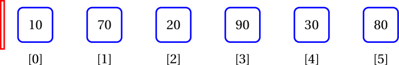
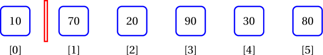
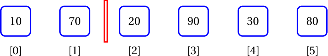
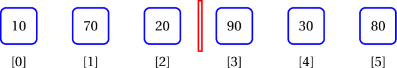
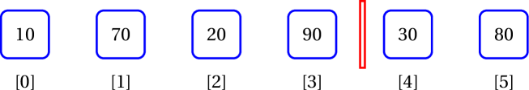
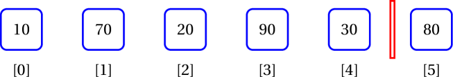
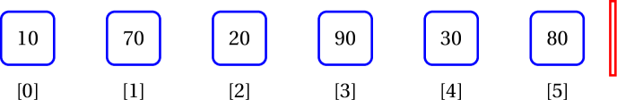

<details class="prereq" markdown="1"><summary>Assumed Knowledge</summary>

  * <a href="./lists">Lists</a>
  * <a href="./loops">Loops</a>
</details>

<details class="outcomes" markdown="1"><summary>Learning Outcomes</summary>

  * Be able to iterate over built in lists
</details>

## Author: Gaurav Gupta

# User-defined class used

```java
class Rectangle {
	public int width, height;
	public Rectangle(int w, int h) {
		width = w;
		height = h;
	}

	public String toString() {
		return width + " by " + height;
	}
}
```

# Enhanced for loop

Until now, we've use the classic counter-based loop to traverse through arrays and lists (`for int i=0; ...`).

But when you don't really need the index and just want to use a construct where it says,

> *"For every item (current) in the collection, use current for something"*

This kind of traversal is provided by the *enhanced for loop*.

### Syntax

```java
for(type current: array/list) {
	use current
}
```

### Example with built-in class

```java
ArrayList<Integer> list = new ArrayList<Integer>();
list.add(10);
list.add(70);
list.add(20);
list.add(90);

int total = 0;
for(Integer item: list) {
	total = total + item;
}
```

In this example, a reference copy of the current item is made into `item`, which is then used.

### Example with user-defined class

```java
ArrayList<Rectangle> list = new ArrayList<Rectangle>();
list.add(new Rectangle(1, 3));
list.add(new Rectangle(7, 4));
list.add(new Rectangle(2, 8));
list.add(new Rectangle(9, 6));

for(Rectangle r: list) {
	System.out.println(r);
}
```

In this example, a reference copy of the current item is made into `r`, which is then used.

## When should one use the enhanced for loop?

Enhanced for loops are used when you don't need the index for anything besides accessing the item at that index.

### Examples of when enhanced for loop should be used

- Finding the sum of all items in array/list
- Finding the sum of all items (that optionally satisfy some condition(s)) in array/list
- Finding the highest/smallest item in an array/list

### Examples when it's better (IMO) to use a counter-based loop

- Checking if array/list is sorted (because you need to compare an item with the item after it, so you need to access items at index `i` and `i+1`).
- Finding the location of the highest/smallest item in an array/list.
- Finding if an array/list contains any duplicates.
- Sorting an array/list.
- Performing binary search over a sorted array/list.

## Problem with enhanced for loop

You can update the instance variables of items of a list in an enhance for loop but not re-reference them. Similarly, you cannot add or remove items in a list in an enhanced for loop.

For example, assuming the the same `Rectangle` class definition, we can increase the `width` of all items in an `ArrayList` named `rectangles` of `Rectangle` objects, using:

```java
for(Rectangle r: rectangles) {
	r.width++;
}
```

However, we cannot re-reference the items of the list as,

```java
//Compiles, but DOES NOT achieve desired result
for(Rectangle r: rectangles) {
	r = new Rectangle(10, 20);
}
```

This is because `r` is a reference copy of the current item and what we are re-referencing is that reference copy, and not the reference that is in the list.

Also, we cannot add or remove items.

#### Trying to add items:

```java
//throws ConcurrentModificationException
for(Rectangle r: rectangles) {
	if(r.height < 20) {
		int idx =	rectangles.indexOf(r);
		rectangles.add(idx, new Rectangle(2, 5));
	}
}
```

#### Trying to remove items:

```java
//throws ConcurrentModificationException
for(Rectangle r: rectangles) {
	if(r.width < 10) {
		rectangles.remove(r);
	}
}
```

Hence, we look at iterators.

# Iterator

There is a powerful and consistent way to traverse almost all data structures in Java - [Iterator](https://docs.oracle.com/en/java/javase/14/docs/api/java.base/java/util/Iterator.html), and the class that implements the `Iterator` interface for lists is [ListIterator](https://docs.oracle.com/en/java/javase/14/docs/api/java.base/java/util/ListIterator.html).


A class that implements `Iterator` interface can add other methods too. [ListIterator](https://docs.oracle.com/javase/7/docs/api/java/util/ListIterator.html) is one such class.

Following are the instance methods in `ListIterator` class:

| Type    | Method          | Description                                                                                                 |   |   |
|---------|-----------------|-------------------------------------------------------------------------------------------------------------|---|---|
| boolean | hasNext()       | Returns true if this list iterator has more elements when traversing the list in the forward direction.     |   |   |
| E       | next()          | Returns the next element in the list and advances the cursor position.                                      |   |   |
| boolean | hasPrevious()   | Returns true if this list iterator has more elements when traversing the list in the reverse direction.     |   |   |
| E       | previous()      | Returns the previous element in the list and moves the cursor position backwards.                           |   |   |
| int     | nextIndex()     | Returns the index of the element that would be returned by a subsequent call to next().                     |   |   |
| int     | previousIndex() | Returns the index of the element that would be returned by a subsequent call to previous().                 |   |   |
| void    | add(E e)        | Inserts the specified element into the list (optional operation).                                           |   |   |
| void    | remove()        | Removes from the list the last element that was returned by next() or previous() (optional operation).      |   |   |
| void    | set(E e)        | Replaces the last element returned by next() or previous() with the specified element (optional operation). |   |   |

The advantages of using an iterator are,

1. It's consistent across any class that implements the `Iterator` interface.
2. It's intuitive as in *"while the collection has another item, access it"*.
3. Ability to modify the contents of the list while traversing it (unlike an enhanced for loop).
	4. Provision for `forEachRemaining` (not covered in this unit).

### Creating and using a ListIterator on a List object

A ListIterator `iter` is created on a List object `list` as:

```java
ListIterator<Integer> iter = list.listIterator();
```

Assuming the list is [10, 70, 20, 90, 30, 80], the initial state of `iter` is represented by the red block.




You can check if there is an item in front of the current position of the iterator as:

```java
boolean itemExists = iter.hasNext();
```

Once you check an item exists, you can access it as:

```java
Object item = iter.next();
```

This (accessing an item) results in the iterator moving forward by one.

### Complete example

```java
ArrayList<Integer> list = new ArrayList<Integer>(Arrays.asList(10, 70, 20, 90, 30, 80));
ListIterator<Integer> iter = list.listIterator();
while(iter.hasNext()) {
  System.out.print(iter.next()+" ");
}
//displays 10 70 20 90 30 80
```

> ### Initial state
>
> 

> ### After first iteration
>
> 

> ### After second iteration
>
> 

> ### After third iteration
>
> 

> ### After fourth iteration
>
> 

> ### After fifth iteration
>
> 

> ### After sixth iteration
>
> 

### Starting from a specific index

You can pass the index of the item **BEFORE** which you want the iterator to be placed.

Assuming ArrayList `list` holds the values [10, 70, 20, 90, 30, 80], the following code will display `30 80`.

```java
ListIterator<Integer> iter = list.listIterator(4);
while(iter.hasNext()) {
	System.out.print(iter.next()+" ");
}
```

> ### Initial state
>
> 

> ### After first iteration
>
> 

> ### After second iteration
>
> 

### Back to front iteration

Just like `hasNext()` and `next()`, the methods `hasPrevious()` and `previous()` also exist.

You can traverse a list from back to front as:

```java
ListIterator<Integer> iter = list.listIterator(list.size());
while(iter.hasPrevious()) {
	System.out.print(iter.previous()+" ");
}
```

Assuming ArrayList `list` holds the values [10, 70, 20, 90, 30, 80], the following code will display `80, 30, 90, 20, 70, 10`.

> ### Initial state
>
> 

> ### After first iteration
>
> 

> ### After second iteration
>
> 

> ### After third iteration
>
> 

> ### After fourth iteration
>
> 

> ### After fifth iteration
>
> 

> ### After sixth iteration
>
> 

```java
ListIterator<Integer> iter = list.listIterator(list.size());
while(iter.hasPrevious()) {
	System.out.print(iter.previous()+" ");
}
```

## Adding items using iterator

After `add` is executed, the cursor is after the added item.

### Front to back example

```java
ArrayList<Integer> list = new ArrayList<Integer>(Arrays.asList(10, 70, 20, 90, 30, 80));
ListIterator<Integer> iter = list.listIterator();
while(iter.hasNext()) {
  iter.add(0);
  iter.next();
}
//list is now 0, 10, 0, 70, 0, 20, 0, 90, 0, 80, 0, 30
```

One must be careful while using `add` during reverse traversal since the cursor is after the added item.

### Back to front example - BUGGY

```java
ArrayList<Integer> list = new ArrayList<Integer>(Arrays.asList(10, 70, 20, 90, 30, 80));
ListIterator<Integer> iter = list.listIterator(list.size());
while(iter.hasPrevious()) {
  iter.add(0);
  iter.previous();
}
//INFINITE LOOP
```

### Back to front example - CORRECT

```java
ArrayList<Integer> list = new ArrayList<Integer>(Arrays.asList(10, 70, 20, 90, 30, 80));
ListIterator<Integer> iter = list.listIterator(list.size());
while(iter.hasPrevious()) {
  iter.add(0);
  iter.previous(); //go left before the added 0
  iter.previous(); //go another left before the item already present
}
//list is now 10, 0, 70, 0, 20, 0, 90, 0, 30, 0, 80, 0
```

## Removing items using iterator

The `remove` method removes from the list, the item most recently accessed using `next()` or `previous()`. Cursor remains unchanged after calling `remove`.

Note: a call to `remove` can only be made once per call to `next` or `previous`. It can be made only if `add` has not been called after the last call to `next` or `previous`.

### Front to back example

```java
ArrayList<Integer> list = new ArrayList<Integer>(Arrays.asList(10, 70, 20, 90, 30, 80));
ListIterator<Integer> iter = list.listIterator();
while(iter.hasNext()) {
  if(iter.next() > 30) {
  		iter.remove();
  }
}
//list is now 10, 20, 30
```

### Back to front example

```java
ArrayList<Integer> list = new ArrayList<Integer>(Arrays.asList(10, 70, 20, 90, 30, 80));
ListIterator<Integer> iter = list.listIterator(list.size());
while(iter.hasPrevious()) {
  if(iter.previous() > 30) {
  		iter.remove();
  }
}
//list is now 10, 20, 30
```

## Updating items using iterator

The `set` method updates the item most recently accessed using `next()` or `previous()`. Cursor remains unchanged after calling `set`.

### Front to back example
```java
ArrayList<Integer> list = new ArrayList<Integer>(Arrays.asList(10, 70, -20, 90, -30, -80));
ListIterator<Integer> iter = list.listIterator();
while(iter.hasNext()) {
  if(iter.next() < 0) {
  		iter.set(0);
  }
}
//list is now 10, 70, 0, 90, 0, 0
```

### Back to front example

```java
ArrayList<Integer> list = new ArrayList<Integer>(Arrays.asList(10, 70, -20, 90, -30, -80));
ListIterator<Integer> iter = list.listIterator(list.size());
while(iter.hasPrevious()) {
  if(iter.previous() > 0) {
  		iter.set(0);
  }
}
//list is now 0, 0, -20, 0, -30, -80
```

<!--# Some practical examples

For all examples, the contents of `list` are assumed to be `[10, -70, 20, 0, 0, -90, -30, 80, 0, 20]`, and unless specified a `ListIterator iter` exists whose cursor is before the first item in `list` (10).-->
