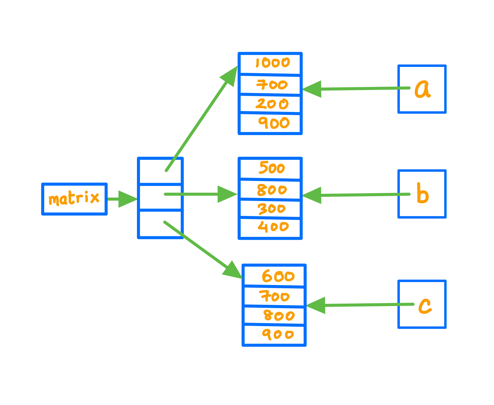
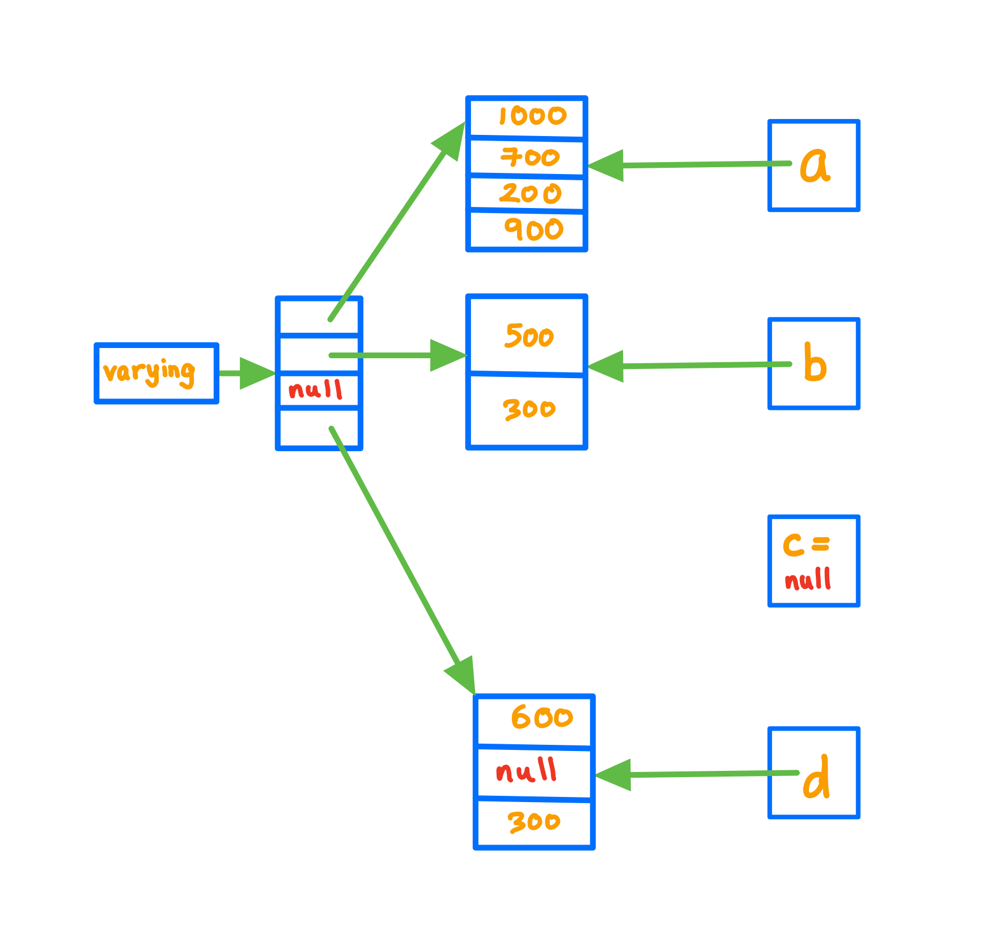

<details class="prereq" markdown="1"><summary>Assumed Knowledge</summary>

* <a href="./lists">Lists</a>
* <a href="./iteration">Iterators</a>
</details>

<details class="outcomes" markdown="1"><summary>Learning Outcomes</summary>

  * Understand creation and operations on a list of lists.
</details>

## Author: Gaurav Gupta

# What are lists... again?

1. Lists are collections of objects
2. Lists themselves are objects

Together, 1. and 2. imply that we can have a collection of Lists in another List.

## Creating a list of lists

```java
ArrayList<Integer> a = new ArrayList<Integer>(Arrays.asList(1000,700,200,900));
ArrayList<Integer> b = new ArrayList<Integer>(Arrays.asList(500,800,300,400));
ArrayList<Integer> c = new ArrayList<Integer>(Arrays.asList(600,700,800,900));

ArrayList<ArrayList<Integer>> matrix = new ArrayList<ArrayList<Integer>>();
matrix.add(a); //matrix = [[1000,700,200,900]]
matrix.add(b); //matrix = [[1000,700,200,900], [500,800,300,400]]
matrix.add(c); //matrix = [[1000,700,200,900], [500,800,300,400], [600,700,800,900]]

System.out.println(matrix); //[[1000, 700, 200, 900]]
System.out.println(matrix.get(0)); //[1000, 700, 200, 900]
System.out.println(matrix.get(1)); //[500, 800, 300, 400]
System.out.println(matrix.get(2)); //[600, 700, 800, 900]
```

Note that when items are added to an ArrayList, it's a reference copy of the added object that is created and added to the list. Here,

- `matrix.get(0)` is a reference copy of `a`
- `matrix.get(1)` is a reference copy of `b`
- `matrix.get(2)` is a reference copy of `c`


```java
a.set(0, -100);
System.out.println(matrix.get(0)); //[-100, 700, 200, 900]
System.out.println(b == matrix.get(1)); //reference copy check: true
```


## Traversing a list of lists

You can see that we can display each sub-list, one at a time, using,

```java
System.out.println(matrix.get(0)); //[1000, 700, 200, 900]
System.out.println(matrix.get(1)); //[500, 800, 300, 400]
System.out.println(matrix.get(2)); //[600, 700, 800, 900]
```

Basic abstraction taught in COMP1000 tells us that the only varying aspect is the counter, which in this case goes from 0 to 2, or 0 to less than 3. Here, 3 is the size of the list `matrix`.

```java
for(int i=0; i < matrix.size(); i++) {
	System.out.println(matrix.get(i));
}
/*
output:
[1000,700,200,900]
[500,800,300,400]
[600,700,800,900]
*/
```

Now, if we copy `matrix.get(i)` in a local `ArrayList` object, we can traverse each item of that list one at a time as well:

```java
for(int i=0; i < matrix.size(); i++) {
	ArrayList<Integer> current = matrix.get(i);
	for(int k=0; k < current.size(); k++) {
		System.out.println(current.get(k));
	}
	System.out.println("----");
}
/*
output:
1000
700
200
900
----
500
800
300
400
----
600
700
800
900
----
*/
```

Back-substituting `matrix.get(i)` in place of `current` gives us:

```java
for(int i=0; i < matrix.size(); i++) {
	for(int k=0; k < matrix.get(i).size(); k++) {
		System.out.println(matrix.get(i).get(k));
	}
	System.out.println("----");
}
/*
output:
1000
700
200
900
----
500
800
300
400
----
600
700
800
900
----
*/
```

**Assuming that the size of each sub-list is the same**, we can also access the first item of each sub-list, followed by the second item of each sub-list, and so on.

```java
for(int i=0; i < matrix.get(0).size(); i++) {
	for(int k=0; k < matrix.size(); k++) {
		System.out.println(matrix.get(k).get(i));
	}
	System.out.println("----");
}
/*
output:
1000
500
600
----
700
800
700
----
200
300
800
----
900
400
900
----
*/
```

## Not all lists are born equal

The above code will, however fail, if the list `varying` is created as:

```java
ArrayList<Integer> a = new ArrayList<Integer>(Arrays.asList(1000, 700, 200, 900));
ArrayList<Integer> b = new ArrayList<Integer>(Arrays.asList(500, 300));
ArrayList<Integer> c = null;
ArrayList<Integer> d = new ArrayList<Integer>(Arrays.asList(600, null, 300));
ArrayList<ArrayList<Integer>> varying =
				new ArrayList<ArrayList<Integer>>(Arrays.asList(a, b, c, d));

//varying = [[1000, 700, 200, 900], [500, 300], null, [600, null, 300]]
```



This is because some sub-lists are of different size, and one is even null.

## Traversing list containing sub-lists with different sizes

### Traversing each sub-list one by one

To traverse a list *safely*, we must perform null-checks on all objects before accessing them.


```java
//assuming:
//varying = [[1000, 700, 200, 900], [500, 300], null, [600, null, 300]]
if(varying!=null) {
	for(int i=0; i < varying.size(); i++) {
		if(varying.get(i)!=null) {
			for(int k=0; k < varying.get(i).size(); k++) {
				if(varying.get(i).get(k)!=null) {
					System.out.println(varying.get(i).get(k));
				}
			}
			System.out.println("----");
		}
	}
}
/*
OUTPUT:
1000
700
200
900
----
----
500
800
400
----
----
600
900
----
*/
```

As you can see, null-objects, whether it's a sub-list or an item in one of the sub-lists are ignored.


### Traversing first item of each sub-list followed by second item...


```java
//assuming:
//varying = [[1000, 700, 200, 900], [500, 300], null, [600, null, 300]]
if(varying!=null) {
	int maxItems = 0;
	for(int i=0; i < varying.size(); i++) {
		if(varying!=null) {
			maxItems = Math.max(maxItems, varying.get(i).size());
		}
	}

	for(int i=0; i < maxItems; i++) {
		for(int k=0; k < varying.size(); k++) {
			if(varying.get(k)!=null) {
				if(varying.get(k).size() > i) {
					System.out.println(varying.get(i).get(k));
				}
				else {
					System.out.println("out of bounds");
				}
			}
			else {
				System.out.println("list is null");
			}
		}
		System.out.println("----");
	}
}
/*
OUTPUT:
1000
500
list is null
600
----
700
300
list is null
null
----
200
out of bounds
list is null
300
----
900
out of bounds
list is null
out of bounds
----
*/
```

Working code in [ListOfListsComprehensive.java](./nuggets/ListOfListsComprehensive/ListOfListsComprehensive.java)
