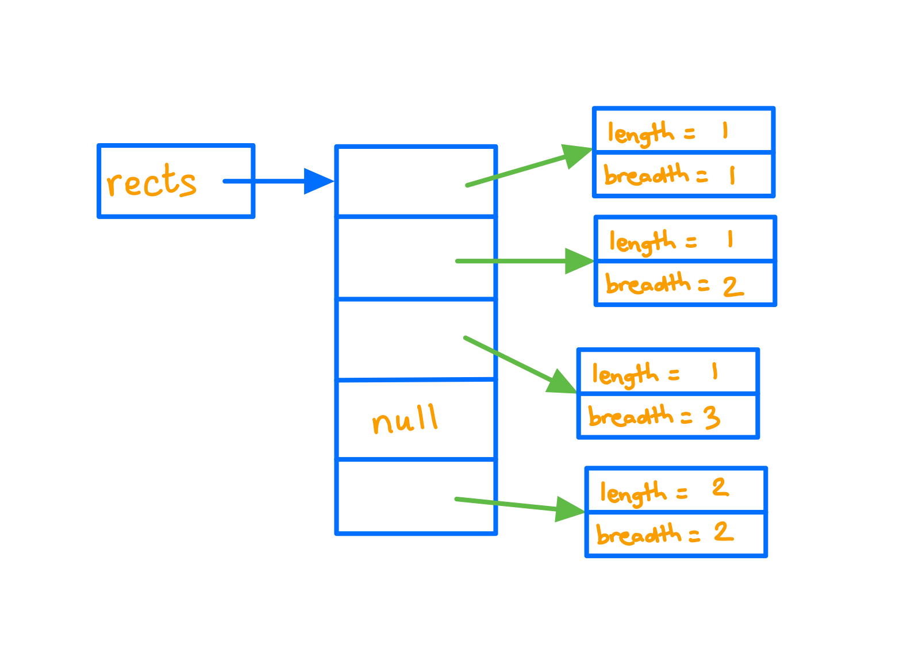

<details class="prereq" markdown="1"><summary>Assumed Knowledge</summary>

  * <a href="./compound_data">Composite Data</a>
  * <a href="./recursion">Recursion</a>
</details>

<details class="outcomes" markdown="1"><summary>Learning Outcomes</summary>

  * Understand the underlying features of lists and how they differ from arrays.
  * Be able to use built-in Java lists
  * Be able to build a custom list class
  * Understand the time costs of various list operations
</details>

## Author: Gaurav Gupta

# What are lists?

Lists are data structures, much like arrays. The differences being,

### 2. Lists grow as required

The size of array needs to be specified at the time of creating an array. The size of a list need not be specified. You can add as many items as you want to a list (permitting system memory).

### 3. Lists have a range of instance methods

With arrays (assuming array name is `arr`), the only operators you have to work with are `arr.length` and `arr[i]`. Anything and everything you need to do must be done using these two operators. Several life-saving methods are applicable on list objects, such as:

- `get(int)` //similar to arr[i]
- `size()` //similar to arr.length
- `add(Object)`	//add item at the end of the list

# Why use ArrayList instead of arrays?

Two reasons:

1. Dynamic (grows as you insert items, resizes when you remove).
2. Plenty of helpful methods (functions) for common tasks.

Comparison of solution with arrays with ArrayLists (Just to illustrate ArrayLists make life easier)

## With arrays

```java
public static boolean occursExactlyOnce(int[] data, int key) {
   int count = 0;
   boolean found = false;
   for(int i=0; i < data.length; i++) {
      if(data[i] == key) { //if found
         if(found) { //if found before
            return false; //this is the second time
         }
         else { //if not found before 
            found = true; //now it's found
         }
      }
   }
   return found == true; //ensure found once
}
```

## With ArrayLists 

IMPORTANT - Right now, you don't need to understand the following code, just appreciate how much easier, compared to arrays, it is

```java
public static boolean occursExactlyOnce(ArrayList<Integer> list, int key) {
   if(list.indexOf(key) >= 0)) { //if found
      if(list.indexOf(key) == list.lastIndexOf(key) { //if first and last occurrence is the same
	return true;
      }
   }
   return false; //in ALL other cases
}
```

<!--
# Why are arrays not good enough?

## Example - copying over a subset

Consider an array `src` holding 100 integers. Some negative, some positive.
We need to copy all negative items over to a new array `dest`.

As an example, if

`src` is `{10, 20, 50, 0, -40, 30, 90, 60, -10, -50, 80}`

`dest` should be `{-40, -10, -50}`

To do this, we need to,

1. Count the number of required (negative) values in the array `src`
2. Create an array `dest` of that size
3. Copy items over to `dest`.

### Step 1

```java
int count = 0;
for(int i=0; i < src.length; i++) {
	if(src[i] < 0) {
		count++;
	}
}
```

### Step 2

```java
int[] dest = new int[count];
```


### Step 3

We are copying,

`src[4]` into `dest[0]`

`src[8]` into `dest[1]`

`src[9]` into `dest[2]`

So, in addition to the current index of `src`, we also need to keep track of the current index of `dest` into which the item must be copied.

```java
int idx = 0; //index where item must be copied
for(int i=0; i < src.length; i++) {
	if(src[i] < 0) {
		dest[idx] = src[i]; //another item copied
		idx++; //move destination index forward
	}
}
```

### Final solution

```java
int count = 0;
for(int i=0; i < src.length; i++) {
	if(src[i] < 0) {
		count++;
	}
}

int[] dest = new int[count];

int idx = 0; //index where item must be copied

for(int i=0; i < src.length; i++) {
	if(src[i] < 0) {
		dest[idx] = src[i]; //another item copied
		idx++; //move destination index forward
	}
}
```

### Solution using List (just focus on how easy and intuitive it is)

A solution to the same problem when `src` and `dest` are lists instead of arrays is,

```java
//"Integer" is just a wrapper for "int" - we'll see more about this soon
ArrayList<Integer> dest = new ArrayList<Integer>();
for(int item: src) {
	if(item < 0) {
		dest.add(item);
	}
}
```
-->

<!--## Example 2 - reading student names outcomes from a file

Consider a file that holds student names in the format `FIRST_NAME LAST_NAME`.
A sample file looks something like:

```
Cedric Diggory
Alvaro Morata
Rose Granger-Weasley
Albus Potter
Luna Lovegood
Lionel Messi
```

To store the names in an array, we need to do one of two things,

1. Create a String array so big that it will definitely be big enough to hold all items from the file.
2. Traverse the file once to count the number of names, then create an array of that size, and then traverse the file again, adding the items in the array.
-->

# Creating an ArrayList object

The syntax to create an ArrayList object is:

```java
ArrayList<E> name = new ArrayList<E>();

//or

ArrayList<E> name = new ArrayList<>();
```

Here, `E` refers to the type of items it can store. Just one thing (until we cover Classes and Objects), this (`E`) cannot be a primitive data type, and needs to be a *class* (more on that when we cover `Classes and Objects`). 

- Instead of `int`, we use `Integer`.
- Instead of `double`, we use `Double`.
- Instead of `char`, we use `Character`.
- Instead of `boolean`, we use `Boolean`.
- We can use `String` as it's already a *class*.

Some examples:

```java
ArrayList<Integer> list1 = new ArrayList<Integer>(); //list of Integer objects (int values)
ArrayList<String> list2 = new ArrayList<>(); //list of String objects
ArrayList<Character> list3 = new ArrayList<>(); //list of Character objects (char values)
ArrayList<Boolean> list4 = new ArrayList<>(); //list of Boolean objects (boolean values)
```

# List of selected methods in ArrayList class

| **Method** | **Description** |
| --- | --- |
| int size() &nbsp; &nbsp; &nbsp; &nbsp; &nbsp; &nbsp; &nbsp; &nbsp; &nbsp; &nbsp; &nbsp; &nbsp; &nbsp; &nbsp; &nbsp; &nbsp; | It is used to return the number of elements present in the list. |
| --- | --- |
| E get(int index) | It is used to fetch the element from the particular position of the list. |
| --- | --- |
| boolean add(E e) | It is used to append the specified element at the end of a list. |
| --- | --- |
| void add(int index, E element) | It is used to insert the specified element at the specified position in a list. |
| --- | --- |
| void clear() | It is used to remove all of the elements from this list. |
| --- | --- |
| boolean isEmpty() | It returns true if the list is empty, otherwise false. |
| --- | --- |
| int indexOf(Object o) | It is used to return the index in this list of the first occurrence of the specified element, or -1 if the List does not contain this element. |
| --- | --- |
| int lastIndexOf(Object o) | It is used to return the index in this list of the last occurrence of the specified element, or -1 if the list does not contain this element. |
| --- | --- |
| boolean contains(Object o) | It returns true if the list contains the specified element |
| --- | --- |
| E remove(int index) | It is used to remove the element present at the specified position in the list. |
| --- | --- |
| boolean remove(Object o) | It is used to remove the first occurrence of the specified element. |
| --- | --- |
| E set(int index, E element) | It is used to replace the specified element in the list, present at the specified position. |
| --- | --- |

## Use of methods in examples

Each example builds on top of the previous example.

### Example 1 - size() and add(Object)

```java
ArrayList<Integer> data = new ArrayList<Integer>();
int a = data.size(); //a will be 0 since data doesn't contain any items
data.add(10); //data becomes [10]
data.add(70); //data becomes [10, 70]
data.add(20); //data becomes [10, 70, 20]
data.add(90); //data becomes [10, 70, 20, 90]
int b = data.size(); //b will be 4
```

### Example 2 - add(int, Object)
```java
//note data = [10, 70, 20, 90] already
data.add(0, 50); //data becomes [50, 10, 70, 20, 90]
data.add(data.size(), 40); //data becomes [50, 10, 70, 20, 90, 40]
data.add(-1, 100); //INVALID - throws IndexOutOfBoundsException
data.add(data.size()+1, 100); //INVALID - throws IndexOutOfBoundsException
```

### Example 3 - set(int, Object)

```java
//note data = [50, 10, 70, 20, 90, 40] already
data.set(0, 60); //data becomes [60, 10, 70, 20, 90, 40]
data.set(data.size()-1, 60); //data becomes [60, 10, 70, 20, 90, 60]
data.set(-1, 100); //INVALID - throws IndexOutOfBoundsException
data.set(data.size(), 100); //INVALID - throws IndexOutOfBoundsException
```

### Example 4 - contains(Object), indexOf(Object), lastIndexOf(Object)
```java
//note data = [60, 10, 70, 20, 90, 60] already
data.
boolean status = data.contains(70); //status is true
boolean status = data.contains(50); //flag is false
int a = data.indexOf(60); //a is 0
int b = data.lastIndexOf(60); //b is 5
int c = data.indexOf(70); //c is 2
int d = data.lastIndexOf(70); //d is 2
int e = data.indexOf(80); //e is -1 (80 not found)
int f = data.lastIndexOf(80); //e is -1 (80 not found)
```

### Example 5 - remove(int), remove(Object)

```java
//assumption: data = [60, 10, 70, 20, 90, 60] already
data.remove(0); 		//data = [10, 70, 20, 90, 60]
data.remove(data.size()-1); 	//data = [10, 70, 20, 90]
data.remove(2); 		//data = [10, 70, 90]
```

```java
//assumption: data = [60, 10, 70, 20, 90, 60] already
data.remove(10);
//IndexOutOfBoundsException since 10 is treated as int, 
//and hence remove(int) is called
```

```java
//assumption: data = [60, 10, 70, 20, 90, 60] already
data.remove((Integer)10); //data = [60, 70, 20, 90, 60]
data.remove((Integer)60); //data = [70, 20, 90, 60]
data.remove((Integer)60); //data = [70, 20, 90]
```

```java
//removing all occurrences of a specific item -
//assumption: data = [70, 20, 90, 80, 80, 80, 80, 80]
while(data.contains(80)) {
	data.remove((Integer)80); 
	//remember, data.remove(80) will 
	//try to remove item at index 80
}
//data = [70, 20, 90]
```

### Example 6 - isEmpty(), clear()

```java
//note data = [70, 20, 90[ already
boolean g = data.isEmpty(); //g is false
data.clear(); //data = [] now
boolean h = data.isEmpty(); //h is true
```

# Passing ArrayList to functions

ArrayLists are objects and a reference copy of the actual parameter is made into the formal parameter when they are passed to functions.

```java
import java.util.ArrayList;

public class ListToFunctionClient {
	public static void main(String[] args) {
		ArrayList<Integer> data = new ArrayList<Integer>();
		data.add(10);
		data.add(70);
		data.add(20);
		data.add(90);
		System.out.println(sum(data)); //190
		increment(data); //data becomes [11, 71, 21, 91]
		System.out.println(sum(data)); //194
	}

	public static int sum(ArrayList<Integer> list) {
		int result = 0;
		for(int i=0; i < list.size(); i++) {
			result+=list.get(i);
		}
		return result;
	}

	public static void increment(ArrayList<Integer> list) {
		for(int i=0; i < list.size(); i++) {
			list.set(i, list.get(i)+1);
		}
	}
}
```

# For-each loop

The for-each loop helps simplify list (or array) traversal where the index is not required besides accessing the item. Syntax:

```java
for(Object obj: ArrayList) {
	//use obj
}
```

Example:

```java
ArrayList<Integer> data = new ArrayList<Integer>();
data.add(10);
data.add(70);
data.add(20);
data.add(90);
int total = 0;
for(Integer item: data) {
	total+=item;
}
//total = 190
```

In the above example, `item` becomes a reference copy of,

- First item (10) in the first iteration of the loop
- Second item (70) in the second iteration of the loop
- Third item (20) in the third iteration of the loop
- Fourth item (90) in the fourth iteration of the loop


Since java handles casting between `Integer` and `int`, you can also write:

```java
for(int item: data) {
	total+=item;
}
```

Here, the value of the Integer object is copied into `item` during each iteration.

## Creating and using lists of user-defined classes

IMPORTANT: If ArrayLists are covered before Classes and Objects, this part will be covered during the second or third lecture on Classes and Objects.

So, the idea is to cover:

1. ArrayLists of built-in classes like `Integer`, `Boolean`, ...
2. Cover design and implementation of classes (user-defined classes).
3. Revisit ArrayLists to now create lists of user-defined classes.

These examples assume the existence of the following `Rectangle` class:

```java
class Rectangle {
	public int length, breadth;
	public Rectangle(int len, int bre) {
		length = len;
		breadth = bre;
	}

	public String toString() {
		return length + " by " + breadth;
	}

	public int area() {
		return length * breadth;
	}

	public boolean isSquare() {
		return length == breadth;
	}
}
```

Take the following example -

```java
ArrayList<Rectangle> rects = new ArrayList<Rectangle>();
for(int i=0; i < 5; i++) {
	if(i!=3) {
		Rectangle temp = new Rectangle(1+i/3, 1+i%3);
		rects.add(temp);
	}
	else {
		rects.add(null);
	}
}
System.out.println(rects);
```

At the end of the execution of the above code, the output will be:

```
[1 by 1, 1 by 2, 1 by 3, null, 2 by 2]
```

The memory diagram is provided below:


