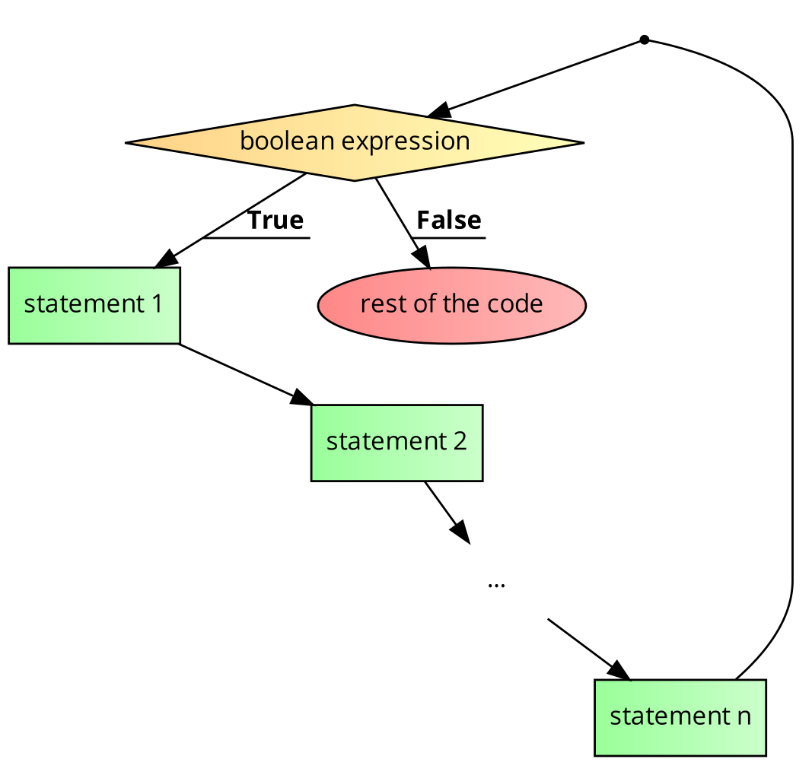
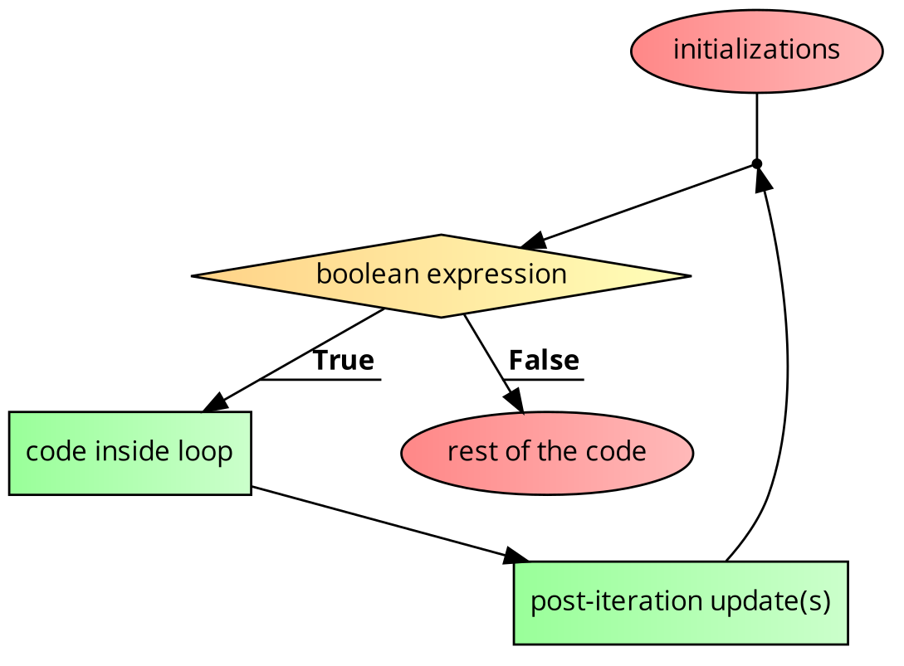

<details class="prereq" markdown="1"><summary>Assumed Knowledge</summary>

  * [Primitive Operations](./primitive_operations)
  * [Variables](./variables)
  * [Conditions](./conditions)
</details>

<details class="outcomes" markdown="1"><summary>Learning Outcomes</summary>

  * Know the two types of loops
  * Understand how to use loops to draw multiple things in one frame
  * Understand syntax and semantics of loops
  * Be able to trace loops with tables

</details>

# Loops

Loops are similar to conditions except that after every iteration of the loop, the expression is checked again.

{: .readings}
Chapter 6 of [Learning Processing](https://learningprocessing.com) by Danel Shiffman.

<iframe width="560" height="315" src="https://www.youtube.com/embed/RtAPBvz6k0Y" frameborder="0" allow="accelerometer; autoplay; encrypted-media; gyroscope; picture-in-picture" allowfullscreen></iframe>

<iframe width="560" height="315" src="https://www.youtube.com/embed/esKLU3dJo70" frameborder="0" allow="accelerometer; autoplay; encrypted-media; gyroscope; picture-in-picture" allowfullscreen></iframe>

<iframe width="560" height="315" src="https://www.youtube.com/embed/h4ApLHe8tbk" frameborder="0" allow="accelerometer; autoplay; encrypted-media; gyroscope; picture-in-picture" allowfullscreen></iframe>

## Statement or Expression

Firstly, loops are _statements_ not expressions, for the same reasons as `if` statements.  That means they don't have an equivalent _value_.  Instead, they are useful because of what they _do_.

Both loops and `if` statements are called "control-flow" statements because they change the flow of the program from top-to-bottom to somethings more complex.  We will see another control flow statement when we see functions.

## Motivation

First of all, are we really missing out on anything given what we already know (variables, operators and conditions)? Let's see...

We know that `draw()` executes repeatedly so the following program will display a row of circles ... but, ONE AT A TIME.

```processing
float x = 25;

void setup() {
	size(400, 200);
	background(255);
}

void draw() {
	fill(255, 0, 0);
	noStroke();
	circle(x, height/2, dia);
}
```

If we want all the circles to be displayed, at the same time, they all need to be drawn together, in the same iteration of draw.

Note, we don't need `x` at all... well, right now.

```processing
void setup() {
	size(400, 200);
	background(255);
}

void draw() {
	fill(255, 0, 0);
	noStroke();
	
	circle(25, height/2, 50);
	circle(75, height/2, 50);
	circle(125, height/2, 50);
	circle(175, height/2, 50);
	circle(225, height/2, 50);
	circle(275, height/2, 50);
	circle(325, height/2, 50);
	circle(375, height/2, 50);
}
```

Great! However...

### Problem 1 

This solution works for a display window with `width` of 400 or less. If the width is 800 pixels, the circles only span the left half. 

### Problem 2

If we decide to change the diameter, we have to change each of the 8 statements.

## In comes abstraction

We will tweak the code so that the changing values (25, 75, ...) have a pattern.

```processing
void setup() {
	size(400, 200);
	background(255);
}

void draw() {
	fill(255, 0, 0);
	noStroke();
	
	float dia = 50;
	float x = dia/2;
	
	circle(x, height/2, dia);
	x=x+dia;
	
	circle(x, height/2, dia);
	x=x+dia;
	
	circle(x, height/2, dia);
	x=x+dia;
	
	circle(x, height/2, dia);
	x=x+dia;
	
	circle(x, height/2, dia);
	x=x+dia;
	
	circle(x, height/2, dia);
	x=x+dia;
	
	circle(x, height/2, dia);
	x=x+dia;
	
	circle(x, height/2, dia);
	x=x+dia;	
}
```

Now, after initializing the value of `x`, we have the following two statements executing repeatedly:

```processing
	circle(x, height/2, dia);
	x=x+dia;
```

This solves the second problem, and now we don't need to change each statement if diameter changes.

It's just the number of times the two statements should execute that we have to control. If we want the circles to span all the way to the right, this should happen as long as `x < width`.

So, our pseudo-code is:

```processing
NOTE THAT THIS IS A PSEUDO-CODE, NOT COMPILABLE CODE

void setup() {
	size(CAN BE ANY VALID VALUE, 200);
	background(255);
}

void draw() {
	fill(255, 0, 0);
	noStroke();
	
	float dia = 50;
	float x = dia/2;
	
	REPEAT THE FOLLOWING TWO STATEMENTS, AS LONG AS x < width
		circle(x, height/2, dia);
		x=x+dia;
	END REPEAT
}
```


## A `while` loop

```processing
while(boolean expression) {
	statement 1
	statement 2
	...
	statement n
}
rest of the code
```

<center></center>

Example:

```processing
int a = 6;
int result = 1;
while(a > 0) {
	result = result * a;
	a = a - 1;
}
println(result);
```

<center></center>

The above code executes the loop 6 times (for `a` = 6,5,4,3,2,1 but not for 0) each time multiplying the current value of `a` into `result` and the final value of `result` is 6\*5\*4\*3\*2\*1 = 720.

There is an even better way of tracing loops known as logic table construction. The logic table for the above example is given below.

{: .table}
| a 	| a > 0 	| result      	|
|---	|-------	|-------------	|
| 6 	| true  	| 1\*6 = 6     	|
| 5 	| true  	| 6\*5 = 30    	|
| 4 	| true  	| 30\*4 = 120  	|
| 3 	| true  	| 120\*3 = 360 	|
| 2 	| true  	| 360\*2 = 720 	|
| 1 	| true  	| 720\*1 = 720 	|
| 0 	| false 	|             	|

<iframe width="560" height="315" src="https://www.youtube.com/embed/VbGDp1FaDzc" frameborder="0" allow="accelerometer; autoplay; encrypted-media; gyroscope; picture-in-picture" allowfullscreen></iframe>

<iframe width="560" height="315" src="https://www.youtube.com/embed/cBRE7XEYz_A" title="YouTube video player" frameborder="0" allow="accelerometer; autoplay; clipboard-write; encrypted-media; gyroscope; picture-in-picture; web-share" allowfullscreen></iframe>

## Guidelines for constructing a logic table

While constructing a logic table, one is strongly encouraged to follow the following steps:

1. Identify all variables involved in the boolean expression in the loop header.
2. Create columns for each of the variables identified in step 1.
3. Create a column for the loop expression. Create multiple columns to simplify reaching the expression if complex. For example, if expression is `x==y && !z`, the variables involved are `x`, `y`, and `z` and the sub-expressions are `x==y` and `!z`.
4. Create columns for each variable (**unless column for the variable already present**) modified in the loop (in the order they are modified).

### Example for constructing a logic table

```processing
int a = 10, b = 2, c = 100;
int result = 0;
while(a > b && c > a) {
	result = result + 1;
	a = a - 1;
	c = c / 2;
}
```

{: .table}
| a  	| b 	| c   	| a > b 	| c > a 	| a > b && c > a 	| result  	|
|----	|---	|-----	|-------	|-------	|----------------	|---------	|
| 10 	| 2 	| 100 	| true  	| true  	| true           	| 0+1 = 1 	|
| 9  	| 2 	| 50  	| true  	| true  	| true           	| 1+1 = 2 	|
| 8  	| 2 	| 25  	| true  	| true  	| true           	| 2+1 = 3 	|
| 7  	| 2 	| 12  	| true  	| true  	| true           	| 3+1 = 4 	|
| 6  	| 2 	| 6   	| true  	| false 	| false          	|         	|

Note that we don't have columns for `a` and `c` again even though they are modified inside the loop because columns for those variables are already present in the table by virtue of step 2.

<details markdown="1">
<summary>An alternative table</summary>

Such a table is not a formal document, it is _an aid to understanding_ and this means it is only valuable if it works _for you_.  To this end, here is another table for the same problem.  It is just as good as the other one, but might work better for you.  Further, you should experiment with your own style rather than stick rigidly to these examples.

{: .table}
| a  	| b 	| c   	| result  	| a > b 	  | && |  c > a        |
|----	|---	|-----	| --------	|-------	  | -- | -------       |
| 10 	| 2 	| 100 	| 0 	    | `10>2` = T | && |  `100>10` = T        |
|       |       |       |           | T       | && | T                 |
|       |       |       |           |         | T |                  |
| 9  	| 2 	| 50  	| 1 	    | `9>2` = T  | && |	  `50>9` = T   |
|       |       |       |           | T       | && | T                 |
|       |       |       |           |         | T |                  |
| 8  	| 2 	| 25  	| 2 	    | `8>2` = T  | && |	  `25>8` = T   |
|       |       |       |           | T       | && | T                 |
|       |       |       |           |         | T |                  |
| 7  	| 2 	| 12  	| 3     	| `7>2` = T  | && |	  `12>7` = T   |
|       |       |       |           | T       | && | T                 |
|       |       |       |           |         | T |                  |
| 6  	| 2 	| 6   	|         	| `6>2` = T  | && |	  `6>6` = F    |
|       |       |       |           | T       | && | F                 |
|       |       |       |           |         | F |                  |

</details>

## for-loop

A for-loop is more compact than the while loop and more common in real-life applications, especially once we cover arrays, that, in turn, form basis for lists and maps. 

```processing
for(initializations; boolean expression; post-iteration update(s)) {
  code inside loop;
}
rest of the code;
```

<center></center>

Example:

```processing
int result = 0;
for(int i=1; i <= 16; i*=2) {
  result = result + i;
}
println(result);
```

Trace (logic table):

{: .table}
| i  	| i<=16 	| result     	|
|----	|-------	|------------	|
| 1  	| true  	| 0+1 = 1    	|
| 2  	| true  	| 1+2 = 3    	|
| 4  	| true  	| 3+4 = 7    	|
| 8  	| true  	| 7+8 = 15   	|
| 16 	| true  	| 15+16 = 31 	|
| 32 	| false 	|            	|


<div class="task" markdown="1">
[Modify your animated blue circle](./conditions.html#two_way_animated_blue_circle) so that it is an animated blue [bullseye](https://www.google.com/search?q=bullseye) instead. Hint:  You can get a thin circle using `noFill` and a larger `strokeWeight` value;

<details class="solution" markdown="1"><summary>solution</summary>
Instead of drawing a simple circle, we draw three circles, each 10 pixels larger than the last.  Each has a 2 pixel border, making a bulleye shape.  Nothing else needs to change, the center of the bullsye animates in exactly the same way as the circle did.

~~~~~
int yPos;
int speed;

void setup(){
  yPos = 0;
  speed = 1;
}

void draw(){
  background(255);

  if (yPos == height){
    speed = -1;
  }
  if (yPos == 0){
    speed = 1;
  }
  noFill();
  stroke(92, 136, 218);
  strokeWeight(2);
  for(int i = 0; i < 40; i = i + 10){
    circle(width/2, yPos, i);
  }
  yPos = yPos + speed;

}
~~~~~

</details>
</div>

# Looking at loops _without_ the draw loop

<iframe width="560" height="315" src="https://www.youtube.com/embed/Z8s-7beNP1c" frameborder="0" allow="accelerometer; autoplay; encrypted-media; gyroscope; picture-in-picture" allowfullscreen></iframe>

As discussed in the above video, the fact that processing is always in a "draw loop" can confuse things somewhat.  It is possible to see all the operation of loops free of this constraint if we work only on _the console_.  [The console is the black area below your program](./debugging) and it is available even when you do a "static" processing program (one that has no `setup` or `draw`).

<div class="task" markdown="1">
Using loops, draw five `^` (hat) characters to the console
<details class="solution" markdown="1"><summary>solution</summary>
~~~~~
for(int i = 0; i < 5; i++){
	print('^');
}
~~~~~

Notice that this program has no `setup` and no `draw` functions, it is a special type of non-animated Processing program.
</details>
</div>

# break and continue statements

IMPORTANT: Anything you can do with `break` and `continue`, you can do without them (typically using boolean variables and expressions)

## break

The `break` statements exits the **innermost** loop (to the statement immediately after it). It is useful when you don't explicitly know the terminating value (as in example 1 below).

### Example 1

```processing
for(int i=40; i<=100; i++) {
	int r = (int)sqrt(i);
	int back = r*r;
	if(i == back) {
		break;
	}
	print(i+" ");
}
```

The above code computes the integer part of the square root, and multiplies it by itself to see if the original number is reached or not (which it does for perfect squares). Thus, the output would be:

```
40 41 42 43 44 45 46 47 48
```

Without using `break`:

```processing
boolean foundPerfectSquare = false;
for(int i=40; i<=100 && !foundPerfectSquare; i++) {
	int r = (int)sqrt(i);
	int back = r*r;
	if(i == back) {
		foundPerfectSquare = true;
	}
	else {
		print(i+" ");
	}
}
```

### Example 2

```processing
for(int i=1; i<=4; i++) {
	for(int k=1; k<=4; k++) {
		if(k > i) {
			break;
		}
		print(k+" ");
	}
	println();
}
```

The above code would exit the inner loop for,

- `k=2` when `i=1`
- `k=3` when `i=2`
- `k=4` when `i=3`

The output would be:

```
1
1 2
1 2 3
1 2 3 4
```

Without using `break`:

```processing
for(int i=1; i<=4; i++) {
	for(int k=1; k<=i; k++) {
		print(k+" ");
	}
	println();
}
```

## continue

The `continue` statement skips the rest of the iteration of the innermost loop and goes back to the loop header.

### Example

```processing
for(int i=10; i<=30; i++) {
	if(i%3!=0 && i%8!=0) {
		continue;
	}
	print(i+" ");
}
```

Whenever you reach the continue statement in the above code, it skips the rest of the loop (the `print` statement) and instead, goes straight to `post-execution update` (`i++`). The output contains only numbers those that are multiples of 3 or 8 (or both).

```
12 15 16 18 21 24 27 30
```

Without using `continue`:

```processing
for(int i=10; i<=30; i++) {
	if(i%3==0 || i%8==0) {
		print(i+" ");
	}
}
```

## Exercises based on loops

Here are some exercises, hopefully in increasing order of difficulty, to help you progress through your understanding of loops.

1. Write a loop that displays the following pattern: 
	```
	1 2 3 4 5 6 7 8 9 10 11 12 13 14 15
	```
	
2. Write a loop that displays the following pattern: 
	```
	12 11 10 9 8 7 6 5 4 3 2 1 0 -1 -2
	```

3. Write a loop that displays the following pattern: 
	```
	300 150 75 37 18 9 4 2 1
	```

4. Write a loop that displays the following pattern: 
	```
	1 10 100 1000 10000 100000 1000000
	```

5. Write a loop that adds the first 10000 positive integers (1 to 10000) and stores the result in a variable `total`.

6. Write a loop that multiplies the first 12 positive integers (1 to 12) and stores the result in a variable `total`.


## Nesting of control structures

Control structures are literally like lego blocks, you can arrange them as you want, depending on the situation. So you can put loops/conditions inside other loops/conditions (and then more loops/conditions inside that and so on).

<iframe width="560" height="315" src="https://www.youtube.com/embed/H7frvcAHXps" frameborder="0" allow="accelerometer; autoplay; encrypted-media; gyroscope; picture-in-picture" allowfullscreen></iframe>

<iframe width="560" height="315" src="https://www.youtube.com/embed/hk0nYHGma8M" frameborder="0" allow="accelerometer; autoplay; encrypted-media; gyroscope; picture-in-picture" allowfullscreen></iframe>

Let's take some examples of a situation where such nesting is required.

### Nesting Scenario 1

(Thanks to Filip Zurawski for most of this explanation)

Let's say this is the pattern we want to display in the console.

```
1 2 3 4 5
2 3 4 5 6
3 4 5 6 7
4 5 6 7 8
5 6 7 8 9
```

As we can see, the horizontal change (within the line) is 1 at every step. 

Now look at the first column. The change in starting values is 1 between rows. 

The outer loop handles changes in starting values of rows (change from one line to another).

The inner loop handles horizontal change (change within a line).

We can start with a blank nested loop.

```processing
for (int i = ...; expression; post-execution update) {
	for(int k = ...; expression; post-execution update) {
		print(k+" "); //display the value but don't change line
	}
	println(); //to change the line
}
```

We know that our vertical change is 1 and we would like to go from 1 to 5 inclusive. Therefore, 

```processing
for (int i = 1; i <= 5; i++) { //i++ is the same as i=i+1 or i+=1 
	for(int k = ...; expression; post-execution update) {
		print(k+" ");
	}
	println();
}
```

Let's look at our horizontal change (change within a line) now - we know it changes by 1, therefore it's `k++`.

We also know our starting value in each row, which is `i`.

What remains is our expression. We are starting at `i` and would like to take care of the next 4 numbers excluding `i` itself. Using the power of mathematics, we can abstract it to `k <= i + 4`. 

Now plug it into the template,

```
for (int i = 1; i <= 5; i++) { //i++ is the same as i=i+1 or i+=1 
	for(int k = i; k <= i + 4; k++) {
		print(k+" ");
	}
	println();
}
```

### Nesting Scenario 2


Let's say this is the pattern we want to display in the console.

```
5 4 3 2 1 0 -1
10 8 6 4 2 0 -2
15 12 9 6 3 0 -3
20 16 12 8 4 0 -4
```

We know that our vertical change is 5 and we would like to go from 5 to 20 (inclusive on both sides). Therefore, 

```processing
for (int i = 5; i <= 20; i+=5) {
	for(int k = ...; expression; post-execution update) {
		print(k+" ");
	}
	println();
}
```

Let's look at our horizontal change (change within a line) now - we know it changes by -1, therefore it's `k--`.

We also know our starting value in each row, which is `i`.

The change is -1 for the first line, -2 for the second line, and so on. We can have a second variable for that, `dec`. 

The inner loop runs 7 times and we start from 0 to make our calculations easier. 

Now plug it into the template,

```processing
for (int i = 5, dec=1; i <= 20; i+=5, dec++) {
	for(int k = 0; k < 7; k++) {
		print((i - k*dec)+" ");
	}
	println();
}
```

### Nesting Scenario 3

We would like to generate a pattern based on the input integer `N > 0`


`N=4`

```
^
^ ^
^ ^ ^
^ ^ ^ ^
```

<p>&nbsp;</p>

`N=6`

```
^
^ ^
^ ^ ^
^ ^ ^ ^
^ ^ ^ ^ ^
^ ^ ^ ^ ^ ^
```

**STEP 1:** There are `N` lines.

Outer loop -

```processing
for(int i=1; i<=N; i++) {
	display current line
	change line using println();
}
```

**STEP 2:** Line corresponding to a given value of `i` has `i` caps

(when `i = 1`, there is 1 cap, when `i = 2` there are 2 caps, and so on ...).

Inner loop -

```processing
for(int k=1; k<=i; k++) {
	print("^");
}
```

**COMPLETE SOLUTION**

```processing
for(int i=1; i<=N; i++) {
	for(int k=1; k<=i; k++) {
		print("^");
	}
	println();
}
```

<div class="task" markdown="1">
Change the code so that the symbols alternate between a cap (^) and a dash (-) between lines.

`N=6`

```
^
- -
^ ^ ^
- - - -
^ ^ ^ ^ ^
- - - - - -
```

The difference from scenario 1 is that if outer loop counter `i` is an odd number, it's a cap (`^`) while if the outer loop counter `i` is an even number, it's a dash (`-`).

So the earlier display statement

```
print("^");
```

will change to,

```
if(i%2 == 1) { //odd counter: cap
	print("^");
}
else { //even counter: dash
	print("-");
}
```

<details markdown="1"><summary>Solution</summary>

```processing
for(int i=1; i<=N; i++) {
	for(int k=1; k<=i; k++) {
		if(i%2 == 1) { //odd counter: cap
			print("^");
		}
		else { //even counter: dash
			print("-");
		}
	}
	println();
}
```
</details>
</div>


<div class="task" markdown="1">
Change the code so that the symbols alternate between ^ and - within a line.

`N=6`

```
^
^ -
^ - ^
^ - ^ -
^ - ^ - ^
^ - ^ - ^ -
```
<details markdown="1"><summary>Solution</summary>
The only change required is to use `k` instead of `i` to decide what symbol to print

```
int N = 6;

for(int i=1; i<=N; i++) {
  for(int k=1; k<=i; k++) {
    if (k % 2 == 1)
      print("^");
    else
      print("-");
  }
  println();
}
```
</details>
</div>

<div class="task" markdown="1">

Change the code so that the symbols alternate between ^ and - within a line and also the first symbol on each line is different from the first symbol on the previous line

`N=6`

```
^
- ^
^ - ^
- ^ - ^
^ - ^ - ^
- ^ - ^ - ^
```
<details markdown="1"><summary>Solution</summary>
This seems like a curly problem until we realise that _adding_ `k` and `i` will give the pattern required because `i` goes up by one each line, swapping the "oddness" of each slot in that row.

```
int N = 6;

for(int i=1; i<=N; i++) {
  for(int k=1; k<=i; k++) {
    if ((k+i) % 2 == 0)
      print("^");
    else
      print("-");
  }
  println();
}
```
</details>
</div>


## Exercises based on loops

Here are some exercises, hopefully in increasing order of difficulty, to help you progress through your understanding of nested loops.

1. Display the following pattern in the console using nested loops.

	```
	100 90 80 70 60 50 40 30 20 10
	95 85 75 65 55 45 35 25 15 5
	90 80 70 60 50 40 30 20 10 0
	85 75 65 55 45 35 25 15 5 -5
	```

2. Display the following pattern in the console using nested loops.

	```
	10 9 8 7 6 5 4 3 2 1 0
	9 8 7 6 5 4 3 2 1 0
	8 7 6 5 4 3 2 1 0
	7 6 5 4 3 2 1 0
	6 5 4 3 2 1 0
	5 4 3 2 1 0
	4 3 2 1 0
	3 2 1 0
	2 1 0
	```


2. Display the following pattern in the console using nested loops.

	```
	1 2 4
	8 4 2 1
	1 2 4 8 16
	32 16 8 4 2 1
	1 2 4 8 16 32 64
	128 64 32 16 8 4 2 1
	1 2 4 8 16 32 64 128 256
	512 256 128 64 32 16 8 4 2 1
	```
	
# Coding in the real world

Just like in conditions, lets see some real-world scenarios where we need to use loops.

But there is a problem. Loops usually iterate over a *collection* (an array, list, hashmap, etc). Since we can't assume knowledge of the same in this document, we're in a bit of a pickle, aren't we?

So, instead we'll iterate over numbers generated via a random-number generator.


### Assumption for scenarios

For scenarios 1 to 3, you may assume that `n` is generated using the following statement:

```processing
int x = 1 + (int)random(100); //x can be any integer from 1 to 100
int n = 10*x; //n can be one of the values from [10, 20, ..., 1000]
```

<div class="task" markdown="1">

## Scenario 1

Write a piece of code that determines the number of times we get a 6 when a normal 6-faced die is rolled `n` times.
<details markdown="1"><summary>Solution</summary>

```
int x = 1 + (int)random(100); //x can be any integer from 1 to 100
int n = 10*x; //n can be one of the values from [10, 20, ..., 1000]

int total = 0;
for(int i = 0; i < n; i++){
  int thisRoll = (int)random(1,7);
  if (thisRoll == 6){
    total++;
  }
}
println(total);
```
</details>
</div>

<div class="task" markdown="1">

## Scenario 2

Write a piece of code that determines the average outcome when a normal 6-faced dice is rolled `n` times.
<details markdown="1"><summary>Solution</summary>
You should expect to get 3 just about every time right?

```
int x = 1 + (int)random(100); //x can be any integer from 1 to 100
int n = 10*x; //n can be one of the values from [10, 20, ..., 1000]

int total = 0;
for(int i = 0; i < n; i++){
  int thisRoll = (int)random(1,7);
  total = total+thisRoll;
}
println(total/n);
```
</details>
</div>

<div class="task" markdown="1">

## Scenario 3

For this scenario, you should assume that `n` is generated using the following statement:

```processing
int n = (int)random(101); //n can be any integer from 0 to 100
```

Consider a party where there are 4 people. Call them Alice, Bob, Charles and Diane. Assuming they are all friendly and logical people, the following handshakes will take place:

- Alice with
	1. Bob
	2. Charles
	3. Diane
- Bob (already shook hands with Alice) with
	1. Charles
	2. Diane
- Charles (already shook hands with Alice and Bob) with
	1. Diane
- Diane (already shook hands with everyone)

Thus, there are 3+2+1 = 6 handshakes for 4 people.

If a fifth person (Eddie) joins the party, he shakes hands with all the others.

Thus, there are **`4`**+`3`+`2`+`1` = `10` handshakes for 5 people.

A table summarizing this pattern is given below,

{: .table}
| Number of people 	| Number of handshakes         	|
|------------------	|------------------------------	|
| 1                	| 0                            	|
| 2                	| 1                            	|
| 3                	| 2+1                          	|
| 4                	| 3+2+1                        	|
| 5                	| 4+3+2+1                      	|
| ...              	|                              	|
| n                	| (n-1) + (n-2) + .... + 2 + 1 	|

There is actually a very elegant formula to get this value, but for the purpose of our exercise, we'd like you to compute the number of handshakes in a party of `n` people using a loop.

<details markdown="1"><summary>Solution</summary>

```
int n = (int)random(101); //x can be any integer from 1 to 100


int handshakes = 0;

for(int i = n-1; i > 0; i--){
  handshakes = handshakes + i;
}

println(n + " people means");
println(handshakes + " handshakes");
```

</div>
