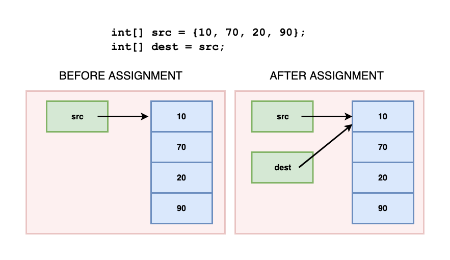
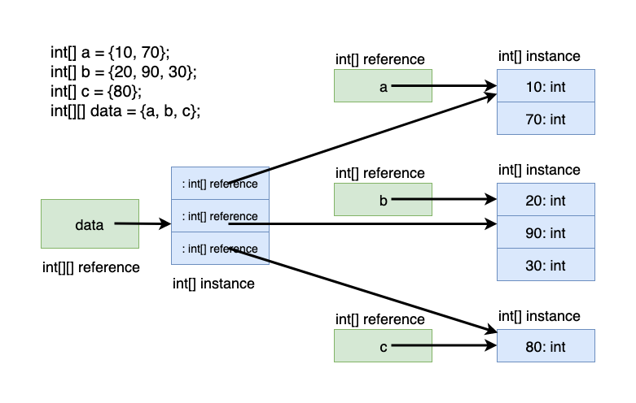
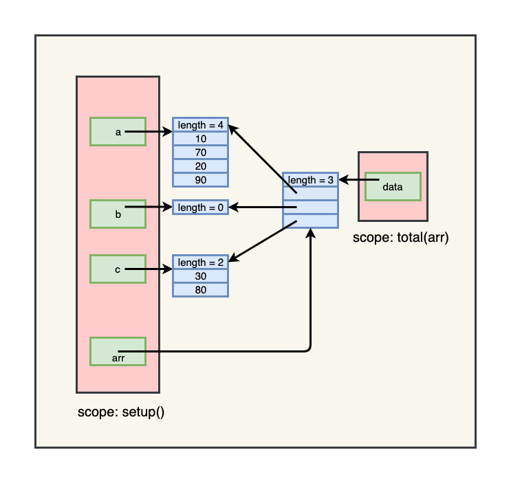
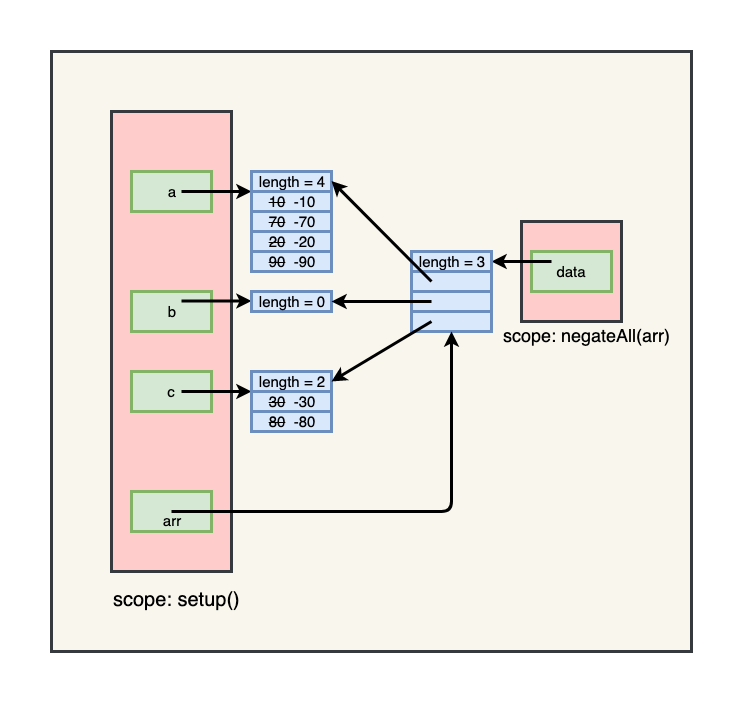

<details class="prereq" markdown="1"><summary>Assumed Knowledge</summary>

  * <a href="compound_data">Compound Data</a>
</details>

<details class="outcomes" markdown="1"><summary>Learning Outcomes</summary>

  * Understand how to create, and operate on, multi-dimensional arrays.
</details>

# Author: Gaurav Gupta

### The biggest mistake people make while studying 2-dimensional arrays is visualizing them as rows and columns. 

<p align="center">

</p>

Stay with me for a bit and see why should you let go of the *rows* and *columns* approach and instead use the *sets* approach.

Let us go through basic arrays and build up to 2-dimensional arrays.

1.  It’s critical to understand the concept of `reference` and `instance`. In the following code, `src` and `dest` are two references that refer to the same instance which is the collection of values 10, 70, 20, and 90 (and the length attribute is also tucked away somewhere).

	```java
	int[] src = {10, 70, 20, 90};
	int[] dest = src;
	```

	  
	
	In the following code, there are three references, each referring to its own instance.

	```java
	int[] a = {10, 70};
	int[] b = {20, 90, 30};
	int[] c = {80};
	```

2.  An array can have ANY VALID type. So, the most generic syntax of an array is:

	```java
	Type[] arrayName = new Type[size];

 	//or

 	Type[] arrayName = {item1, item2, ...}; //where each item is of type Type
	```

2.  An array is itself a data type.    
3.  So if `Type` is `int[]`, we have:
    
	
	```java
	int[][] data = {a, b, c}; //since a, b, c are each int[]
	```

	  


*   `data` has 3 items, each of type `int[]` inside it.
*   First item of data (`data[0]`) is of type `int[]` and has 2 items (10 and 70), each of type `int` inside it.
*   Second item of data (`data[1]`) is of type `int[]` and has 3 items (20, 90, and 30), each of type `int` inside it.
*   Third item of data (`data[2]`) is of type `int[]` and has 1 item (80), each of type `int` inside it.

Now, we can go through each item in `data` using:

```java
for(int i=0; i < data.length; i++) {
    //access to data[i] which is of type int[]
}
```

If it helps you understand better, you can copy the current array into a local variable.

```java
for(int i=0; i < data.length; i++) {
    int[] current = data[i]; //current is a reference copy of data[i]
}
```

Then we can go through each item of current as well!

```java
for(int i=0; i < data.length; i++) {
    int[] current = data[i]; //current is a reference copy of data[i]
    for(int k=0; k < current.length; k++) { //I (as in Gaurav, not int i) like to use k instead of j
        print(current[k]+" ");
    }
    println();
}
```

The above will output:

```
    10 70
    20 90 30
    80
```

Now, if we back substitute `current` with `data[i]`, we get,

```java
for(int i=0; i < data.length; i++) {
    for(int k=0; k < data[i].length; k++) { 
        print(data[i][k]+" ");
    }
    println();
}
```

*   If we need to find the total of all the items:

```java
int total = 0;
for(int i=0; i < data.length; i++) {
    for(int k=0; k < data[i].length; k++) { 
        total+=data[i][k];
    }
}
```

*   If we need to find the highest value:

```java
int highest = Integer.MIN_VALUE; //to override if and only if required
for(int i=0; i < data.length; i++) {
    for(int k=0; k < data[i].length; k++) { 
        if(data[i][k] > highest) {
	    highest = data[i][k];
        }
    }
}
```

Note, you can also create the same array as:

```java
int[][] data = { {10, 70}, {20, 90, 30}, {80}} ;
```

So… why did I say that you shouldn’t think of 2-d arrays in terms of rows and columns? Because, as you see, not each sub-array needs to have the same number of items. Even if you ignore that (which you shouldn’t), while the above is easy to visualize, the following is not:

```java
// assuming data is a two-dimensional array (int[][])
int[][][] mega = { data, { {50}, {30, 60} } };
```

If anyone still insists on thinking of 2-dimensional arrays as rows and columns, ask them to explain a 4-dimensional array to you, without both your heads exploding.

## Example of passing a multi-dimensional array to a function

```java
void setup() {
	int[] a = {10, 70, 20, 90};
	int[] b = {};
	int[] c = {30, 80};
	int[][] arr = {a, b, c};
	int sum = total(arr);
	println(sum);
}

int total(int[][] data) {
	int result = 0;
	for(int i=0; i < data.length; i++) {
		for(int k=0; k < data[i].length; k++) {
			result+=data[i][k];
		}
	}
	return result;
}
```




## Example of modiying contents of a multi-dimensional array in a function

```java
void setup() {
	int[] a = {10, 70, 20, 90};
	int[] b = {};
	int[] c = {30, 80};
	int[][] arr = {a, b, c};
	negateAll(arr);
	//arr becomes { {-10, -70, -20, -90}, {}, {-30, -80} }
}

void negateAll(int[][] data) {
	int result = 0;
	for(int i=0; i < data.length; i++) {
		for(int k=0; k < data[i].length; k++) {
			data[i][k]*=-1;
		}
	}
}
```




## Advanced question 1

What is the state of the array `arr` inside `setup()` after `reset1` is called?

```java
void setup() {
	int[] a = {10, 70, 20, 90};
	int[] b = {};
	int[] c = {30, 80};
	int[][] arr = {a, b, c};
	reset1(arr);
	//what are the contents of arr here?
}

void reset1(int[][] data) {
	int result = 0;
	for(int i=0; i < data.length; i++) {
		for(k=0; k < data[i].length; k++) {
			data[i][k] = 0;
		}
	}
}
```

## Advanced question 2

What is the state of the array `arr` inside `setup()` after `reset2` is called?

```java
void setup() {
	int[] a = {10, 70, 20, 90};
	int[] b = {};
	int[] c = {30, 80};
	int[][] arr = {a, b, c};
	reset2(arr);
	//what are the contents of arr here?
}

void reset2(int[][] data) {
	int result = 0;
	for(int i=0; i < data.length; i++) {
		data[i] = new int[3];
	}
}
```

## Advanced question 3

What is the state of the array `arr` inside `setup()` after `reset3` is called?

```java
void setup() {
	int[] a = {10, 70, 20, 90};
	int[] b = {};
	int[] c = {30, 80};
	int[][] arr = {a, b, c};
	reset3(arr);
	//what are the contents of arr here?
}

void reset3(int[][] data) {
	data = new int[][]{ {0, 0}, {0, 0} };
}
```
