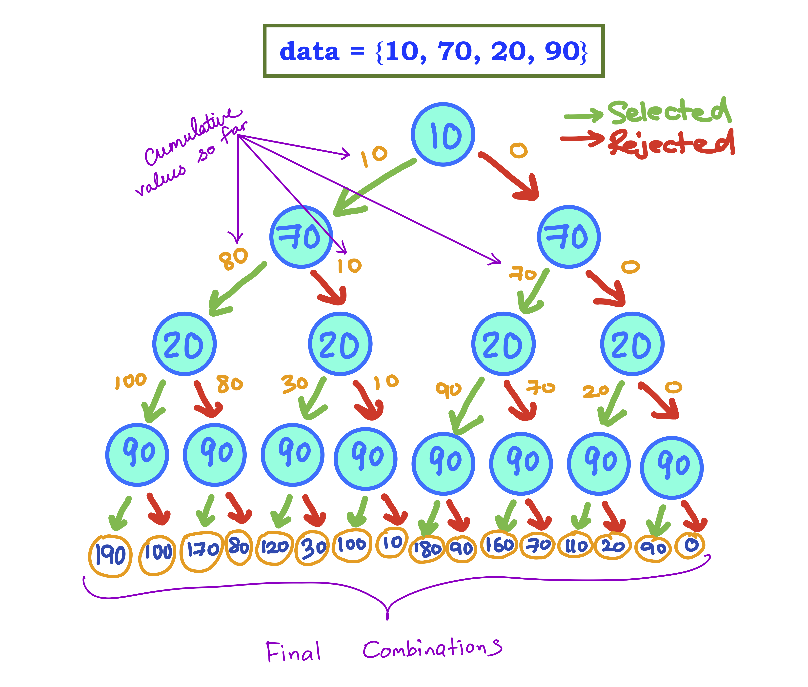

<details class="prereq" markdown="1"><summary>Assumed Knowledge:</summary>

  * [Functions](./functions)
  * [Classes as Types](./classes_types)
  * [Recursion](./recursion)

</details>

<details class="outcomes" markdown="1"><summary>Learning Outcomes:</summary>

  * Be able to trace recursive functions in the context of array inputs.
  * Be able to write recursive functions in the context of array inputs.

</details>

## Author: Gaurav Gupta

# Fundamental concept

The first thing you must realize is that recursion with arrays is typically extremely inefficient.This is because we are checking every single possible combination to get the combination we want.

For example, to check if zero or more items of the array `{10, 70, 20, 90}` (not necessarily in sequence) add up to 110, we will check all possible combinations, which are:


1. 10+70+20+90
2. 10+70+20
3. 10+70+90
4. 10+70
5. 10+20+90
6. 10+90
7. 10+20
8. 10
9. 70+20+90
10. 70+20
11. 70+90
12. 70
13. 20+90 (yup! adds to 110)
14. 20
15. 90
16. none (special case: adds up to 0)



For 4 items, there are 16 combinations, because each item has 2 states:

1. *Selected*
2. *Not selected*

For an array containing `n` items, we must check 2^`n` cases in the worst case scenarios.

### That's a lot!

For an array of just 31 items, we'll need to check over **2 billion** combinations.

### Order of combinations

You will further notice in the list of combinations that the combination with an item is always BEFORE the combination without the same item (the presence of other items being the same).

For example, `10+70+20+90` is before `70+20+90`. Similarly, `10+90` is before `90`, `70+20+90` is before `70+90`.

We will call this *lexicographic selection* and use it as a standard.

# Need for other parameters

In addition to the array, typically the index at which we need to start checking is required. Any problem-specific parameters are obviously needed as well.

# Example - checking if certain items of an array add up to a value

The parameters required are:

1. input array,
2. starting index (0 used to start at the beginning),
3. target to be *constructed*.


- `addUpTo(new int[]{10,70,20,90,30,80}, 0, 240)` returns `true` (70+90+80 = 240)

- `addUpTo(new int[]{10,70,20,90,30,80}, 0, 280)` returns `true` (10+70+90+30+80 = 280)

- `addUpTo(new int[]{50, 60, 70, 80}, 0,0)` returns `true` (empty set is still a subset of any set)

- `addUpTo(new int[]{50, 60, 70, 80}, 0, 100)` returns `false`

```java
public static boolean addsUpTo(int[] data, int start, int target) {
	if(data == null) {
	  return false;
	}

	if(target == 0) { //we did it!
	  return true;
	}

	if(start >= data.length) { //checked everything, still here :(
	  return false;
	}

	if(addsUpTo(data, start+1, target - data[start])) { //left (green path)
	  return true;
	}

	//reaches here if it cannot achieve target following the green path

	return addsUpTo(data, start+1, target); //right (red path) - whatever it returns
}
```
