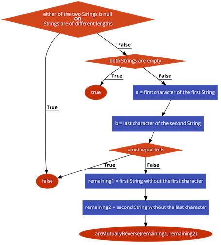
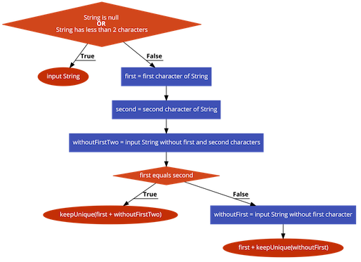

<details class="prereq" markdown="1"><summary>Assumed Knowledge:</summary>

  * [Functions](./functions)
  * [Classes as Types](./classes_types)
  * [Recursion](./recursion)

</details>

<details class="outcomes" markdown="1"><summary>Learning Outcomes:</summary>

  * Be able to trace recursive functions in the context of String data.
  * Be able to write recursive functions in the context of String data.

</details>

## Author: Gaurav Gupta

# Useful String methods

To use recursion on Strings, following methods are very useful:

1. `str.charAt(int)`: returns character at given index, raises `StringIndexOutOfBoundsException ` if index invalid. Note: first character is at index 0, last character at index `str.length()-1`.
2. `str.substring(int)`: returns String object starting at given index (inclusive) to the end of the String, raises `StringIndexOutOfBoundsException ` if index invalid.
3. `str.substring(int, int)`: returns String object starting at first index (inclusive) to the second index (exclusive), raises `StringIndexOutOfBoundsException ` if indices or range invalid.
4. `str.indexOf(char/String)`: returns the index of the first occurrence (if any) of the passed character or String, -1 if not found.
5. `str.indexOf(char/String, int)`: returns the index of the first occurrence (if any) of the passed character or String, **starting the search** at passed index (second parameter), -1 if not found.
6. `str.equals(String)`: returns `true` if the two Strings are identical (case sensitive).
6. `str.equalsIgnoreCase(String)`: returns `true` if the two Strings are identical (case insensitive).

Examples of these methods in action:

```java
String a = "Super Nintendo Chalmers is in?";
String b = "Me fail English!? That's unpossible!";

char ch1 = a.charAt(2); //'p'
char ch2 = b.charAt(2); //' ' (space)
char ch3 = a.charAt(-1); //INVALID - StringIndexOutOfBoundsException
char ch4 = b.charAt(1000); //INVALID - StringIndexOutOfBoundsException

int idx1 = a.indexOf('e'); //3
int idx2 = b.indexOf('e'); //1
int idx3 = a.indexOf('x'); //-1
int idx4 = b.indexOf('$'); //-1

int idx1 = a.indexOf('e'); //3
int idx2 = b.indexOf('e'); //1
int idx3 = a.indexOf('x'); //-1
int idx4 = b.indexOf('$'); //-1

int idx5 = a.indexOf("in"); //7
int idx6 = a.indexOf("in", 10); //27

String sub1 = a.substring(1); //"uper Nintendo Chalmers is in?"
String sub2 = b.substring(3,7); //"fail"
String sub3 = a.substring(5, 1); //INVALID RANGE - StringIndexOutOfBoundsException
String sub4 = b.substring(-5, 10); //INVALID STARTING INDEX - StringIndexOutOfBoundsException

```

# Basic strategy

When designing and implementing recursive solutions in the context of String data, the key strategy is to

1. *slice* a String,
2. operate on the immediate portion, and,
3. call the recursive method on the remaining String

## Example 1: count the number of vowels in a String

### PROCESS: countVowels(String)

1. If String is `null` or empty, return 0.
2. Extract the first character.
3. Store 1 into variable `contri` if first character is a vowel, 0 otherwise.
4. Extract the String without the first character (`remaining`).
5. Return `contri + countVowels(remaining)`


```java
public static int countVowels(String str) {
	if(str == null || str.isEmpty()) {
		return 0;
	}
	char first = str.charAt(0);
	String vowels = "aeiouAEIOU";
	int countFirstVowel = 0;
	if(vowels.indexOf(first) >= 0) {
		countFirstVowel = 1;
	}
	String remaining = str.substring(1);
	return countFirstVowel + countVowels(remaining);
}
```

### Sample call chain:

`countVowels("Aliens")` returns 1 + `countVowels("liens")`

`countVowels("liens")` returns 0 + `countVowels("iens")`

`countVowels("iens")` returns 1 + `countVowels("ens")`

`countVowels("ens")` returns 1 + `countVowels("ns")`

`countVowels("ns")` returns 0 + `countVowels("s")`

`countVowels("s")` returns 0 + `countVowels("")`

`countVowels("")` returns 0

`countVowels("s")` returns 0 + 0 = 0

`countVowels("ns")` returns 0 + 0 = 0

`countVowels("ens")` returns 1 + 0 = 1

`countVowels("iens")` returns 1 + 1 = 2

`countVowels("liens")` returns 0 + 2 = 2

`countVowels("Aliens")` returns 1 + 2 = 3


## Example 2: check two Strings are reverse of each other

### PROCESS: areMutuallyReverse(String, String)

1. If either of the two Strings is `null` or if Strings are of different lengths, return `false`.
2. If both Strings are empty, return `true`.
3. Extract the first character of the first String (`a`).
4. Extract the last character of the second String (`b`).
5. If `a != b`, return false.
6. Extract the first String without the first character (`remaining1`).
7. Extract the second String without the last character (`remaining2`).
8. Return `areMutuallyReverse(remaining1, remaining2)`

### Sample call chain 1:

`areMutuallyReverse("super", "reap")` returns `false` (as the two Strings are of different lengths)

### Sample call chain 1:

`areMutuallyReverse("super", "reap")` returns `false` (as the two Strings are of different lengths)

### Sample call chain 2:

`areMutuallyReverse("super", "reads")` returns `areMutuallyReverse("uper", "read")`

`areMutuallyReverse("uper", "rope")` returns `false`

`areMutuallyReverse("super", "reads")` returns `false`

### Sample call chain 3:

`areMutuallyReverse("pat", "tap")` returns `areMutuallyReverse("at", "ta")`

`areMutuallyReverse("at", "ta")` returns `areMutuallyReverse("t", "t")`

`areMutuallyReverse("t", "t")` returns `areMutuallyReverse("", "")`

`areMutuallyReverse("", "")` returns `true`

`areMutuallyReverse("t", "t")` returns `true`

`areMutuallyReverse("at", "ta")` returns `true`

`areMutuallyReverse("pat", "tap")` returns `true`



```java
public static boolean areMutuallyReverse(String str1, String str2) {
	if(str1 == null || str2 == null) {
		return false;
	}
	if(str1.length() != str2.length()) {
		return false;
	}
	char a = str1.charAt(0);
	char b = str2.charAt(str2.length()-1);
	if(a != b) {
		return false;
	}
	String remaining1 = str1.substring(1);
	String remaining2 = str2.substring(0, str2.length()-1);
	return areMutuallyReverse(remaining1, remaining2);
}
```

## Example 3: Remove consecutive occurrences of any character with a unique instance

Example: `keepUnique("aaaaaaabbbbbcccccddd")` returns `"abcd"`

### PROCESS: keepUnique(String)

1. If String is `null` or has less than 2 characters, return the String itself.
2. Extract the first character in a variable `first`.
3. Extract the second character in a variable `second`.
4. Extract the String without the first two characters (`withoutFirstTwo`).
5. If `first == second`, return `keepUnique(first + withoutFirstTwo)` (since it's still possible that first and third might are the same)
6. Extract the String without the first character (`withoutFirst`).
7. Return `first + keepUnique(withoutFirst)`



```java
public static String keepUnique(String str) {
	if(str == null || str.length() < 2) {
		return str;
	}
	char first = str.charAt(0);
	char second = str.charAt(1);
	String withoutFirstTwo = str.substring(2);
	if(first == second) {
		return keepUnique(first + withoutFirstTwo);
	}
	String withoutFirst = str.substring(1);
	return first + keepUnique(withoutFirst);
}
```
