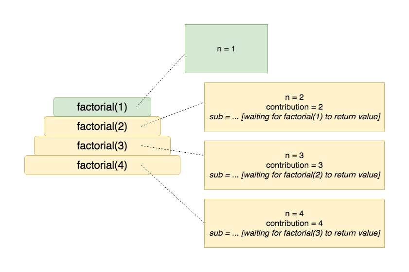
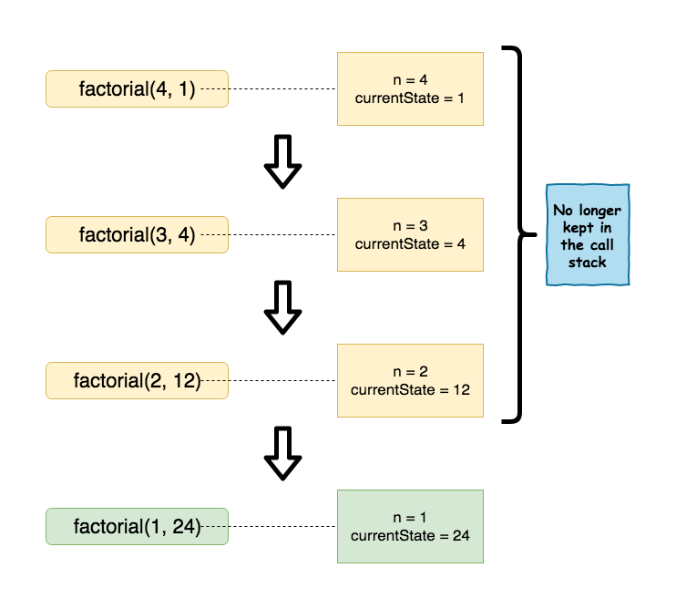

<details class="prereq" markdown="1"><summary>Assumed Knowledge:</summary>

* [Functions](./functions)
* [Recursion](./recursion)
* [Recursion with String data](./recursion-strings)

</details>

<details class="outcomes" markdown="1"><summary>Learning Outcomes:</summary>

* Have an understanding of *tail* recursion.
* Be able to *tail-optimize* a recursive function.

</details>

## Author: Gaurav Gupta

# The problem with recursion

Every call to a function requires keeping the formal parameters and other variables in the memory for as long as the function doesn't return control back to the caller.

These variables and the function's stack frame (the entry in the call stack) must be retained until it's no longer required.

For example, consider the following function definition:

```java
public static int factorial(int n) {
	if(n <= 1) {
		return 1;
	}
	int contribution = n;
	int sub = factorial(n-1);
	int result = contribution * sub;
	return result;
}
```

Each call to function `factorial` has to wait for the next call to return the value to it, before it can be terminated, and the frame stack removed.

Let's say the origin call is `factorial(4)` (which calls `factorial(3)`,  which calls `factorial(2)`, which calls the terminal case in `factorial(1)`). Green represents the stack frame on the top of the call stack (active function).

At the time `factorial(1)` executes, the call stack looks like the following:



## Eureka!

Instead of creating all these variables inside the function, if we can (and pay attention to the statement carefully), *pass the state of the stack so far as parameters*, we wouldn't need to maintain the previous stack frames. Oh my several Gods - that would be amazing!

**P.S.** Java still doesn't support tail optimization... 😞

### (Definition) Tail-optimized design is when every last possible statement (typically a return statement) in a function is a just the recursive call (or the end case value).

```java
public static int factorial(int n, int currentState) {
	if(n <= 1) {
		return currentState;
	}
	return factorial(n-1, currentState * n);
}
```

The value for `currentState` in the initial call should be 1. Sample client:

```java
public class Client {
	public static void main(String[] args) {
		int val = factorial(4, 1); //1 being the initial value of currentState
	}
}
```

Now, only the current stack frame needs to be kept in the memory and the previous stack frames for the recursive function can be discarded.

At the time `factorial(1, 24)` executes, the call stack looks like the following:



You can also create a second *proxy* function so that you don't have to pass the second parameter during the initial call, like,

```java
public static int factorial(int n) {
	return factorial(n, 1);
}
```

As long as the number (or order) of parameters is different, two functions can have the same name.

## Benefits

1. As already mentioned, stack frames of previous calls need not be kept on the stack.
2. Achieves natural speedup (see example 6 at the bottom of the page).

# Some more examples

### Example 1

#### Without tail optimization

```java
public static int sumDigits(int n) { //assuming n >= 0
	if(n == 0) {
		return 0;
	}
	return n%10 + sumDigits(n/10);
}
```

#### With tail optimization

```java
public static int sumDigits(int n, int currentState) {
	if(n == 0) {
		return currentState;
	}
	return sumDigits(n/10, currentState + n%10);
}
```

### Example 2 (small increment over example 1)

#### Without tail optimization

```java
public static int sumEvenDigits(int n) { //assuming n >= 0
	if(n == 0) {
		return 0;
	}
	if(n%2 == 0) {
		return n%10 + sumEvenDigits(n/10);
	}
	else {
		return sumEvenDigits(n/10);
	}
}
```

#### With tail optimization

```java
public static int sumEvenDigits(int n, int currentState) { //assuming n >= 0
	if(n == 0) {
		return currentState;
	}
	if(n%2 == 0) {
		return sumEvenDigits(n/10, currentState + n%10);
	}
	else {
		return sumEvenDigits(n/10, currentState);
	}
}
```

### Example 3

#### Without tail optimization

```java
public static boolean isPalindrome(String str) {
	if(str == null) {
		return false;
	}
	if(str.length() < 2) {
		return true;
	}
	if(str.charAt(0) != str.charAt(str.length()-1)) {
		return false;
	}
	return isPalindrome(str.substring(1, str.length()-1));
}
```

#### With tail optimization

No change needed, already tail-optimized as the last statement is the recursive call and nothing else.

### Example 4

#### Without tail optimization

```java
public static String reverse(String str) {
	if(str == null || str.length() < 2) {
		return str;
	}
	char first = str.charAt(0);
	char last = str.charAt(str.length()-1);
	String remaining = str.substring(1, str.length()-1);
	return last + reverse(remaining) + first;
}
```

The current version is not convenient for tail optimization, so we'll do a slight modification.

#### Without tail optimization - version 2

```java
public static String reverse(String str) {
	if(str == null || str.length() < 2) {
		return str;
	}
	char first = str.charAt(0);
	String remaining = str.substring(1);
	return reverse(remaining) + first;
}
```

Now, it's ready to tail optimize.

#### With tail optimization

```java
public static String reverse(String str, String constructed) {
	if(str == null) {
		return null;
	}
	if(str.isEmpty()) {
		return constructed;
	}
	return reverse(str.substring(1), str.charAt(0) + constructed);
}
```

### Example 5

#### Without tail optimization

```java
public static int gcd(int a, int b) { //assuming a, b >= 0
	if(b == 0) {
		return a;
	}
	return gcd(b, a%b);
}
```

#### With tail optimization

Already tail-optimized.

### Example 6

#### Without tail optimization

```java
public static int fib(int n) {
	if(n == 0 || n == 1) {
		return n;
	}
	return fib(n-1) + fib(n-2);
}
```

#### With tail optimization

*This is a tricky one. Please see [1](https://www.geeksforgeeks.org/tail-recursion-fibonacci/) and [2](https://medium.com/@frank.tan/fibonacci-tail-recursive-explained-876edf5e86fc) for some nice explanations.

```java
//initially called as fib(n, 0, 1)
public static int fib(int n, int a, int b) {
	if(n==0) {
		//it will only ever be called directly from client,
		//never from another fib call
		return a; //which WILL be 0
	}
	if(n==1) {
		return b;
	}
	return fib(n-1, b, a+b);
}
```
