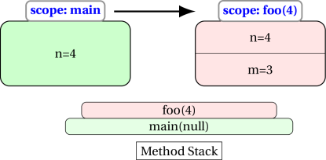
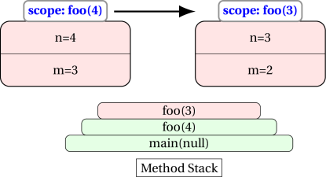

<details class="prereq" markdown="1"><summary>Assumed Knowledge:</summary>

  * [Functions](./functions)
  * [Recursion - What goes on during a function call](./recursion_function_call)

</details>

<details class="outcomes" markdown="1"><summary>Learning Outcomes:</summary>

  * Recognise difference between iterative and recursive code.
  * Be able to trace recursive functions.
  * Be able to write recursive functions.

</details>

## Author: Gaurav Gupta

# What is recursion?

There are two common approaches to solving algorthmic problems:

1. Iterative
2. Recursive

## Iterative solution

The distinctive property of *iterative* solutions is that they do not reduce a problem to a simpler form of itself.

### EXAMPLE

Add all integers between `low` and `high` (inclusive on both sides, and assuming `low` <= `high`), I can go through each integer and add it to an accumulating variable, say `total`.

```java
public static int sum(int low, int high) {
	int total = 0;
	for(int i=low; i<=high; i++) {
		total = total + i;
	}
	return total;
}
```

## Recursive solution

The distinctive property of *recursive* solutions is that they reduce a problem to a simpler form of itself.

### EXAMPLE

For the same problem statement used for iterative solutions, we can say that the sum of all integers from `low` to `high` is:

```
if low > high:
	return 0
else
	sub = sum of all integers from (low+1) to high
	return (low + sub)
```

Focus on the part,

>```
>sum of all integers from `low+1` to `high`
>```

It is the same problem as the original problem, except there is one less number to handle, and thus is *simpler*.

<iframe width="560"` height="315"` src="https://www.youtube.com/embed/KEEKn7Me-ms"` frameborder="0"` allow="autoplay; encrypted-media"` allowfullscreen></iframe>


## Equivalence

It has been proven that there is a recursive solution for every iterative solution and vice versa. We will soon look at some of the aspects to consider while deciding on which approach to take.


## Advantages

#### 1. Intuitiveness

Some solutions have an intuitive recursive design. Some examples (we assume n >= 0 for all examples):

1. x to the power of n:
	- `x`<sup>`n`</sup> = `x`<sup>`n-1`</sup> * `x` if n > 0
	- `x`<sup>`0`</sup> = 1
2. number of digits in an integer:
	- `nDigits(n)` = `nDigits(n/10) + 1` if n > 0
	- `nDigits(0)` = 0
3. sum of the first n positive integers (1 + 2 + ... + n):
	- `sum(n) = sum(n-1) + n` if n > 0
	- `sum(0)` = 0

#### 2. Complex problems

While trivial problems have fairly obvious recursive **and** iterative solutions, it's much easier to find a recursive solution to the more complex problems. For example, creating a random permutation of the word `"super".

> random permutation of the word `"super"`
> = random character from `"super"` (say `'u'`) + random permutation of the word `"sper"`

> random permutation of the word `"sper"`
> = random character from `"sper"` (say `'r'`) + random permutation of the word `"spe"`

> random permutation of the word `"spe"`
> = random character from `"spe"` (say `'s'`) + random permutation of the word `"pe"`

> random permutation of the word `"pe"`
> = random character from `"pe"` (say `'e'`) + random permutation of the word `"p"`

> random permutation of the word `"p"`
> = random character from `"p"` (has to be `'p'`) + random permutation of the word `""`

> random permutation of the word `""`
> = `""` (end case)

Plugging the values back:

> random permutation of the word `"p"`
> = `'p'` + `""`
> = `"p"`

> random permutation of the word `"pe"`
> = `'e'` + `"p"`
> = `"ep"`

> random permutation of the word `"spe"`
> = `'s'` + `"ep"`
> = `"sep"`

> random permutation of the word `"sper"`
> = `'r'` + `"sep"`
> = `"rsep"`

> random permutation of the word `"super"`
> = `'u'` + `"rsep"`
> = `"ursep"`

#### 3. Recursive data structures

Advanced data structures (such as linked lists, trees and graphs) are recursive in nature and it is logical to operate recursively on them.

# When should I NOT use recursion?

Recursion has it's own set of disadvantages. Each method call requires,

1. Variables associated with that call to be stored in the memory, thereby requiring more memory.
2. Caller to transfer the control to the method called (callee), and then the callee to execute and return control, possible with a value, back to the caller, thus adding to processing time. Hence, recursive solutions have overhead in terms of time.

We will see concrete examples of this once we talk about recursive implementation.

# Method calling itself

When a method calls itself, another entry is added to the top of the method stack.

Consider the following code:

```java
public static void foo() {
	foo();
}
```

This is the most basic recursive example, where the method `foo` calls itself, placing another instance on top of the stack.

Of course, since this process never terminates, the stack keeps growing infinitely. As you might imagine, there is a limit to the number of entries in the method stack and when this is reached, we get `StackOverflowError`.

Thus, our job is to ensure that methods don't call themselves infinitely.

Consider the following code:

```java
public static void main(String[] args) {
	int n = 4;
	foo(n);
}

public static void foo(int n) {
	System.out.println(n);
	int m = n-1;
	foo(m);
}
```

The output you will get before finally getting a `StackOverflowError` is:

```
4
3
2
1
0
-1
-2
-3
-4
and on and on and on ...
```

An illustration of memory transactions is given below

### STEP 1: main calls foo(4)



### STEP 2: foo(4) calls foo(3)



... and it repeats forever (ends with `StackOverflowError`)

# End-case or terminal case is CRITICAL

It is critical that we have an *end case* of a *terminal case*.

```java
public static void foo(int n) {
	if(n >= 1) {
		System.out.println(n);
		int m = n-1;
		foo(m);
	}
}
```

In the above modified method, we have enclosed the entire code in a conditional block. As soon as `n` drops below 1, it's effectively an empty method body and it returns the control back to the caller.

```
main(null) calls foo(4)
	foo(4) displays 4 and calls foo(3)
		foo(3) displays 3 and calls foo(2)
			foo(2) displays 2 and calls foo(1)
				foo(1) displays 1 and calls foo(0)
				foo(0) does nothing and returns control to foo(1)
			foo(1) returns control to foo(2)
		foo(2) returns control to foo(3)
	foo(3) returns control to foo(4)
foo(4) returns control to main(null)
```

The output you get is:

```
4
3
2
1
```

Following are two different ways of handling the terminal case:

```java
public static int sum(int n) {
	if(n >= 1) {
		return n + sum(n-1);
	}
	else {
		return 0;
	}
}
```


```java
public static int sum(int n) {
	if(n >= 1) {
		return n + sum(n-1);
	}
	return 0;
}
```

```java
public static int sum(int n) {
	if(n < 1) {
		return 0;
	}
	else {
		return n + sum(n-1);
	}
}
```

```java
public static int sum(int n) {
	if(n < 1) {
		return 0;
	}
	return n + sum(n-1);
}
```

# First look at a recursive solution

### PROBLEM STATEMENT

Define a method that when passed an integer, returns the sum of all integers from 1 to that integer.

Examples:

> Input = 4 -> return 1 + 2 + 3 + 4 (10)

> Input = 6 -> return 1 + 2 + 3 + 4 + 5 + 6 (21)

Let's call the method `sum` and the the formal parameter `n`

> sum(n) = 1 + 2 + ... + (n-1) + n

can be written as:

> sum(n) = [1 + 2 + ... + (n-1)] + n

But

> [1 + 2 + ... + (n-1)] is sum(3)

(by the problem statement)

Hence,

> sum(n) = sum(n-1) + n

### First attempt

```java
public static int sum(int n) {
	return sum(n-1) + n;
}
```

But this version will result in the method calling itself indefinitely, until JVM causes `StackOverflowError`.

We need to address the end case:

> sum(0) = 0

### Second attempt

```java
public static int sum(int n) {
	if(n == 0) {
		return 0;
	}
	//control reaches here only if n is not 0
	return sum(n-1) + n;
}
```

What happens if the client, maliciously, calls the method with parameter -3?

`sum(-3)` → `sum(-4)` → `sum(-5)` ...

Since the parameter is never equal to 0, the method, when initially called with a negative value, calls itself indefinitely.

Eventually JVM causes `StackOverflowError`.

### Third (and correct) version

```java
public static int sum(int n) {
	if(n <= 0) { //return 0 for anything less than 1
		return 0;
	}
	//control reaches here only if n is more than 0
	return sum(n-1) + n;
}
```

### Trace

```bash
client calls sum(4)
sum(4)	= sum(3) + 4
	sum(3)	= sum(2) + 3
		sum(2)	= sum(1) + 2
			sum(1) = sum(0) + 1
				sum(0)	returns 0 to sum(1) (terminal case)
			sum(1) returns 0 + 1 (1) to sum(2)
		sum(2) returns 1 + 2 (3) to sum(3)
	sum(3) returns 3 + 3 (6) to sum(4)
sum(4) returns 6 + 4 (10) to client
```

## Variations

Some variations of `sum` function are provided to help you understand recursion better:

1. `sumOdd(int)`: sum of positive ODD numbers up to, and including, the parameter

	```java
	public static int sumOdd(int n) {
		if(n <= 0) {
			return 0;
		}

		if(n%2 == 0) { //when initially called with an even parameter
			return sumOdd(n-1);
		}

		//guaranteed: n >= 1 AND n%2 != 0 => n is a positive, odd number

		return n + sumOdd(n-2);
		//add the current odd number to
		//the sum of all odd numbers up to, and including n-2
	}
	```

2. `sumSquares(int)`: sum of squares pf positive integers up to, and including, the parameter

	```java
	public static int sumSquares(int n) {
		if(n <= 0) {
			return 0;
		}

		return n*n + sumSquares(n-1);
		//add the square of the current number to
		//the sum of all square integers up to, and including n-1
	}
	```

3. `sumSquareOdds(int)`: sum of squares of positive ODD numbers up to, and including, the parameter

	```java
	public static int sumSquareOdds(int n) {
		if(n <= 0) {
			return 0;
		}

		if(n%2 == 0) {
			return sumSquareOdds(n-1);
		}

		//guaranteed: n >= 1 AND n%2 != 0 => n is a positive, odd number

		return n*n + sumSquares(n-2);
		//add the square of the current number to
		//the sum of all square integers up to, and including n-2
	}
	```

4. `sumDigits(int)`: sum of the digits of a number


	```java
	public static int sumDigits(int n) {
		if(n == 0) {
			return 0;
		}

		if(n < 0) { //just in case n is negative
			return sumDigits(-n);
		}

		int lastDigit = n%10;
		int remainingNumber = n/10;

		return lastDigit + sumDigits(remainingNumber);
	}
	```

5. `getReversed(String)`: get reverse of a String

	```java
	public static String getReversed(String str) {
		if(str == null || str.length() < 1) {
			return str;
		}

		char first = str.charAt(0);
		String remaining = str.substring(1);

		return getReversed(remaining) + first;
	}
	```

6. `isPalindrome(String)`: return `true` if String is same when reversed, `false` otherwise

	```java
	public static boolean isPalindrome(String str) {
		if(str == null) {
			return false;
		}
		if(str.length() < 1) {
			return true;
		}

		return str.equals(getReversed(str));
	}
	```

Note that this method uses `getReversed` as a *helper*, which, in turn, is recursive.
