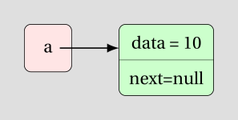
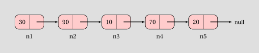
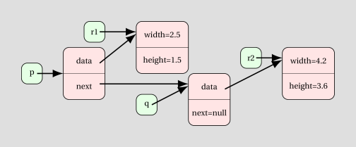
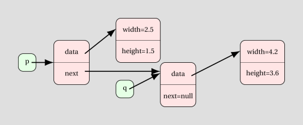

<details class="prereq" markdown="1"><summary>Assumed Knowledge</summary>

  * <a href="./recursion">Recursion</a>
  * <a href="./lists">Lists</a>
</details>

<details class="outcomes" markdown="1"><summary>Learning Outcomes</summary>

  * Be able to create and operate on a class holding one or more references of the same type

</details>

## Author: Gaurav Gupta

# The Node class

<!--<iframe width="560" height="315" src="https://www.youtube.com/embed/fDU7AtmQBjA" frameborder="0" allow="autoplay; encrypted-media" allowfullscreen></iframe>

<p>&nbsp;</p>
-->

Consider the following class:

```java
public class Node {
  public int data;
  public Node next;

  public Node(int d, Node n) {
  data = d;
  next = n;
  }
}
```

Every Node object holds a reference to another Node object.

> ```java
> Node a = new Node(10, null);
> ```
>
> 


> ```java
> Node b = new Node(20, a);
> ```
>
> 

> ```java
> Node head = new Node(20, new Node(10, null));
> ```
>
> 

Here, we created an *anonymous* `Node` object - `new Node(10, null)` - and passed it as a parameter to the constructor of `head`.


> ```java
> head.next.next = new Node(-50, null);
> ```
>
> 


## Linking nodes

<iframe width="560" height="315" src="https://www.youtube.com/embed/Jqu9IpulHvU" frameborder="0" allow="autoplay; encrypted-media" allowfullscreen></iframe>

<p>&nbsp;</p>

We can link any number of nodes as we want.

```java
Node n5 = new Node(20, null);
Node n4 = new Node(70, n5);
Node n3 = new Node(10, n4);
Node n2 = new Node(90, n3);
Node n1 = new Node(30, n2);
```


Simplified representaton:



We can get all the values just using `n1` :)

```java
System.out.println(n1.data); //30
System.out.println(n1.next.data); //90
System.out.println(n1.next.next.data); //10
System.out.println(n1.next.next.next.data); //70
System.out.println(n1.next.next.next.next.data); //20
```

If we create a `Node` reference `temp` initialized to `n1`, we can re-reference it to the `Node` after it using `temp = temp.next`. Thereby, repeating the operation over and over.

```java
Node temp = n1; //temp refers to same instance as n1
temp = temp.next; //temp refers to node after temp or n1 which is n2
temp = temp.next; //temp refers to node after temp or n2 which is n3
temp = temp.next; //temp refers to n4
temp = temp.next; //temp refers to n5
temp = temp.next; //temp is now null - STOP
```

Abstracting into a loop to add all the values:

```java
Node temp = n1;
int total = 0;
while(temp != null) {
  total = total + temp.data;
  temp = temp.next;
}
```


## Careful to not lose the reference to the starting node

What would happen if we write the following code?

```java
int total = 0;
while(n1 != null) {
  total = total + n1.data;
  n1 = n1.next;
}
```

`total` will hold the correct value but `n1` now becomes `null`.

Once, instances don't have any incoming references, they are deleted by Java.

So, if you try to do anything using `n1` again, well ... good luck!

Hence, we should always make a reference copy of the starting node before operating on it.

## Passing a node to a function

Thankfully, that is exactly how objects are passed to functions - as reference copies of the actual parameter.

So, if I had a function:

```java
public static int sum(Node start) {
  int total = 0;
  while(start != null) {
  total = total + start.data;
  start = start.next;
  }
  return total;
}
```

I can call it as `sum(n1)`, thereby `start ` being a reference copy of `n1` and updated. But not `n1`. Life is good again :)

## Recursion is a beautiful thing

To calculate the sum of all nodes starting at a node `start`, 

- if `start` is `null`, you can return 0,
- otherwise, you can add `start.data` to the sum of all nodes starting at `start.next`.

```java
public static int sum(Node start) {
  if(start == null) {
  return 0;
  }
  else {
  return start.data + sum(start.next);
  }
}
```

YESSS!!!

## Keep moving

What is the bug in the following code?

```java
public static int sumPositives(Node start) {
  int total = 0;
  while(start != null) {
  if(start.data > 0) {
    total = total + start.data;
    start = start.next;
  }
  }
  return total;
}
```

We only move to the next node if the value in the current one is greater than 0.
The movement forward (`start = start.next`), just like the classic `i++`, is almost always unconditional.

Correct code:

```java
public static int sumPositives(Node start) {
  int total = 0;
  while(start != null) {
  if(start.data > 0) {
    total = total + start.data;
  }
  start = start.next;
  }
  return total;
}
```

Some people prefer a `for-loop` for this very reason:

```java
public static int sumPositives(Node start) {
  int total = 0;
  for(; start != null; start = start.next) {
  if(start.data > 0) {
    total = total + start.data;
  }
  }
  return total;
}
```

Recursive version:

```java
public static int sumPositives(Node start) {
  if(start == null) {
  return 0;
  }
  if(start.data > 0) {
  return start.data + sumPositives(start.next);
  }
  else {
  return sumPositives(start.next);
  }
}
```

If, for any reason, you need to hold on to the original reference of `start`, you can always copy into another variable as,

```java
//this is the classic handshake algorithm
public static boolean allUnique(Node start) {
  for(Node nodeA = start; nodeA != null; nodeA = nodeA.next) { //for all nodes
  //check against all other nodes AFTER it
  for(Node nodeB = nodeA.next; nodeB != null; nodeB = nodeB.next) { 
    if(nodeA.data == nodeB.data) {
    return false;
    }
  }
  return true;
}
```

Recursive version:

```java
public static boolean allUnique(Node start) {
  if(start == null) {
  return true; //vacuous truth
  }
  return !contains(start.next, start.data) && allUnique(start.next);
}

public static boolean contains(Node start, int target) {
  if(start == null) {
  return false;
  }
  return start.data == target || contains(start.next, target);
}
```  
  

## Nodes can hold other objects too

In the previous example, we saw a node holding integer data, but it can hold any kind of data. For starters, take a look at `RNode` holding `Rectangle` object.

For the classes defined in,

- [Rectangle.java](./Rectangle.java),
- [RNode.java](./RNode.java),

Consider the following code,

```java
Rectangle r1 = new Rectangle(2.5, 1.5);
Rectangle r2 = new Rectangle(4.2, 3.6);
RNode q = new RNode(r2, null);
RNode p = new RNode(r1, q);
```



We can create anonymous objects to reduce variable count.

```java
RNode q = new RNode(new Rectangle(4.2, 3.6), null);
RNode p = new RNode(new Rectangle(2.5, 1.5), q);
```



# Be careful while comparing objects!!!

Consider the following function that attempts to check if a specific rectangle exists in a list or not:

```java
public static boolean contains(RNode start, Rectangle target) {
  for(Node current = start; current != null; current = current.next) { 
    if(current.data == target) {
    return true;
    }
  }
  return false;
}
```

Here, the `current.data == target` checks if the two are reference copies!

The right version is:

```java
public static boolean contains(RNode start, Rectangle target) {
  for(Node current = start; current != null; current = current.next) { 
    if(current.data.equals(target)) {
    return true;
    }
  }
  return false;
}
```

Here, the `current.data.equals(target)` checks for equality based on the definition of what "equal" is (defined in class `Rectangle`).

Recursive version:

```java
public static boolean contains(RNode start, Rectangle target) {
  if(start == null) {
  return false;
  }
  else {
  return start.data.equals(target) || contains(start.next, target);
  }
}
```

## With a little help from my friends

Anything you can do with loops, you can do recursively... sometimes, with the use of helper functions.

For example, a function that reverses a list and returns the reference to the starting Node, such that if `n -> 10 -> 70 -> 20 -> 90 -> null`, it returns a reference to a Node (say, k) such that `k -> 90 -> 20 -> 70 -> 10 -> null`.

```java
public static Node reversed(Node n) {
  Node temp = null;
  while(n != null) {
  temp = new Node(n.data, temp);
  n = n.next;
  }
  return temp;
}
```

The above version is called *out-of-place* algorithm and will create a second list of the same size as the original list, which can be pretty costly. A recursive *out-of-place* version is provided below:}

```java
public static Node reversed(Node n) {
  return reversed(n, size(n));
}

public static Node reversed(Node n, int size) {
  if(size == 1) {
    return n;
  }
  int first = n.data;
  Node result = reversed(n.next, size-1);
  addToEnd(result, first);
  return result;
}

public static int size(Node start) {
  if(start == null) {
    return 0;
  }
  return 1 + size(start.next);
}

public static void addToEnd(Node n, int data) {
  if(n.next == null) {
    n.next = new Node(data, null);
  }
  else {
    addToEnd(n.next, data);
  }
} 
```

Instead, an *in-place* algorithm (HD example) modifies the existing list, so no new instances are created. Here's an in-place version (Note: `reverse` vs. `reversed`):

```java
public static void reverse(Node n) {
  for(int i=0; i < count(n)/2; i++) {
  Node a = get(n, i);
  Node b = get(n, count(n) - i - 1);
  int temp = a.data;
  a.data = b.data;
  b.data = temp;
  }
}

public static int count(Node start) {
  if(start == null) {
  return 0;
  }
  return 1 + count(start.next);
}

public static Node get(Node start, int idx) {
  if(idx < 0 || idx >= count(start)) {
  return null;
  }
  if(idx == 0) {
  return start;
  }
  return get(start.next, idx-1);
}
```

A completely *recursive in-place* version (High end of HD example) is:

```java
public static void reverse(Node n) {
  reverse(n, size(n));
}
  
public static void reverse(Node n, int size) {
  if(size <= 1) {
    return;
  }
  swap(n, 0, size-1);
  reverse(n.next, size-2);
}

public static void swap(Node n, int idx1, int idx2) { //assuming idx1, idx2 are valid
  Node a = get(n, idx1);
  Node b = get(n, idx2);
  int temp = a.data;
  a.data = b.data;
  b.data = temp;
}
  
public static int size(Node start) {
  if(start == null) {
    return 0;
  }
  return 1 + size(start.next);
}
  
public static Node get(Node start, int idx) { //assuming idx is valid 
  if(idx == 0) {
    return start;
  }
  return get(start.next, idx-1);
}
```

A vastly different approach (*recursive in-place* as well) which requires you to copy the returned value back:

```java
public static Node reverse(Node node) {
  if (node == null) {
    return null;
  }
  if (node.next == null) {
    return node;
  }

  Node secondNode = node.next;
  node.next = null; //it was an amicable break-up
  
  Node reverseRest = reverse(secondNode);
  secondNode.next = node; //insert originally first node at the end of the reversed list
  return reverseRest; //return the first node of the reversed list
}
```

# Activities

### Task 1

For the class [Node](./Node.java), draw the memory diagram to illustrate objects after the last statement of the following code executes.

```java
Node a = new Node(20, null);
Node b = new Node(70, a);
Node c = new Node(10, a);
Node d = new Node(90, c);
```

### Task 2

For the class [Node](./Node.java), draw the memory diagram to illustrate objects after the last statement of the following code executes.

```java
Node a = new Node(20, null);
Node b = new Node(70, a);
Node c = new Node(10, b);
Node d = new Node(90, c);
a.next = d;
```

### Task 3

For the class [Node](./Node.java), draw the memory diagram to illustrate objects after the last statement of the following code executes.

```java
Node a = new Node(20, null);
Node b = new Node(70, a);
Node c = new Node(10, b);
Node d = new Node(90, c);
a.next = d.next;
```

### Task 4

For the class [Node](./Node.java), draw the memory diagram to illustrate objects after the last statement of the following code executes.

```java
Node a = new Node(20, null);
Node b = new Node(70, a);
Node c = new Node(10, b);
Node d = new Node(90, c);
a.next = d.next.next;
```

### Task 5

For the class [Node](./Node.java), the following code attempts to store the sum of all items in the chain of nodes into a variable `total`. However, it has a bug. Briefly explain what is the problem with the code, and correct it.

```java
Node a = new Node(20, null);
Node b = new Node(70, a);
Node c = new Node(10, b);
Node d = new Node(90, c);
int total = 0;
Node current = d;
while(current != null) {
  total = total + current;
  current = current.next;
}
```

### Task 6

For the class [Node](./Node.java), the following code attempts to store the number of nodes in the chain into a variable `size`. However, it has a bug. Briefly explain what is the problem with the code, and correct it.

```java
Node a = new Node(20, null);
Node b = new Node(70, a);
Node c = new Node(10, b);
Node d = new Node(90, c);
int size = 0;
Node current = d;
while(current != null) {
  size = size + 1;
}
```

### Task 7

For the class [Node](./Node.java), what is the value of `result` after the following code is executed?

```java
Node a = new Node(20, null);
Node b = new Node(70, a);
Node c = new Node(10, b);
Node d = new Node(90, c);
int result = 0;
Node current = d;
while(current != null) {
  if(current.data >= 20) {
  result = result * 10 + 1;
  }
  else {
  result = result * 10;
  }
  current = current.next;
}
```

### Task 8

For the class [Node](./Node.java), what is the value of `result` after the following code executes?

```java
Node a = new Node(9, null);
Node b = new Node(2, a);
Node c = new Node(7, b);
Node d = new Node(1, c);
a.next = d;
a.data =   1000*d.data +
    100*d.next.data +
    10*d.next.next.data +
    1*d.next.next.next.data;
```

### Task 9

Consider the following class definition for `TreeNode`:

```java
public class TreeNode {
  public int data;
  public TreeNode left, right;
  public TreeNode(int d, TreeNode l, TreeNode r) {
  data = d;
  left = l;
  right = r;
  }
}
```

Draw the memory diagram to illustrate objects after the last statement of the following code executes. Also, state the number of instances and references in the diagram.

```java
TreeNode t1 = new TreeNode(20, null, null);
TreeNode t2 = new TreeNode(-10, null, null);
TreeNode t3 = new TreeNode(70, t1, t2);
```

### Task 10

Complete the following function that when passed the starting Node of a list of Node objects, returns `true` if all items in the list are in the range [0, 100].

```java
public static boolean allMarksValid(Node start) {
	//to be completed
}
```

### Task 11

Complete the following function that when passed the starting Node of a list of Node objects, returns the number of items that are greater than the first item.

```java
public static int countGreaterThanFirst(Node start) {
	//to be completed
}
```

### Task 12

Complete the following function that when passed the starting Nodes of two lists of Node objects, returns `true` if they are identical, and `false` otherwise.

```java
public static boolean identical(Node start1, Node start2) {
	//to be completed
}
```

### Task 13

Complete the following function that when passed the starting Node of a list of Node objects, remove all negative nodes from the list.

```java
public static void removeNegatives(Node start) {
	//to be completed
}
```

### Task 14

Complete the following function that when passed the starting Nodes of two lists of Node objects, returns the starting Node of the two merged together such that all items of the first list are in the resulting list before all the items of the second list (and in the original order). Neither of the original lists should be modified.

```java
public static Node merge(Node start1, Node start2) {
	//to be completed
}
```

### Task 15

Complete the following function that when passed the starting Node of a list of Node objects, returns the reference of the Node that begins the longest ascending sequence within the original list. Return the Node that occurs first in case of a tie. The original list should not be modified.

```java
public static Node longestAscendingSequence(Node start) {
	//to be completed
}
```

### Task 16

Define `Date`, `Time`, and `DateTime` classes (think about what they will contain), and create a class `NodeDateTime` that holds one `DateTime` object and one `NodeDateTime` object.

Define a function that when passed the starting node of a list of `NodeDateTime` objects and an integer (say, n), returns `true` if the list contains at least `n` identical objects.
