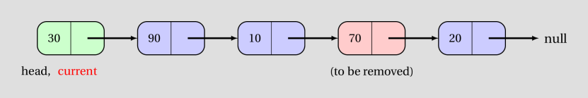
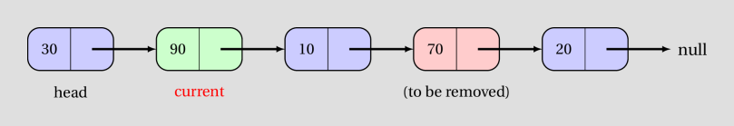
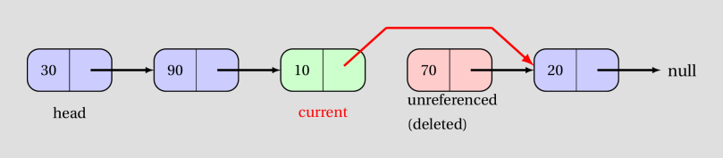
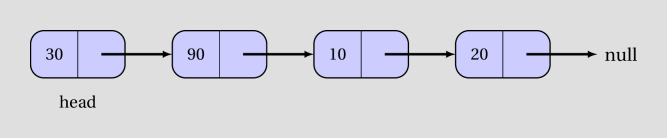
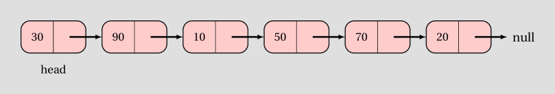

<details class="prereq" markdown="1"><summary>Assumed Knowledge</summary>

  * <a href="./recursion">Recursion</a>
  * <a href="./lists">Lists</a>
</details>

<details class="outcomes" markdown="1"><summary>Learning Outcomes</summary>

  * Understand the internal operation of recursively defined lists
  * Be able to create standard list operations for a recursivly defined list
  * Understand the time costs of various list operations
</details>

## Author: Gaurav Gupta

# Custom built linkedlist

Now that we have taken a look at the [Node](./Node.java) class, we can construct a class that has a single `Node` object as instance variable.

```java
public class MyLinkedList {
	public Node head;
}
```

As we saw in the last section, this node holds a reference to another node. That node could be `null` or could be a valid instance. A sample client:

```java
public class Client {
	public static void main(String[] args) {
		MyLinkedList list1 = new MyLinkedList();
		Node p = new Node(10, null);
		list1.head = p;

		MyLinkedList list2 = new MyLinkedList();
		Node q = new Node(40, null);
		Node r = new Node(20, q);
		list2.head = r;
	}
}
```

- `list1` has a single instance variable, `head`, that refers to `p`, which in turn, refers to `null`.
> list1.head -> p -> null

- `list2` has a single instance variable, `head`, that refers to `r`, which in turn refers to `q`, which in turn, refers to `null`.
> list2.head -> r -> q -> null

The idea is that if we start at `head`, we can visit every node in the chain until we hit `null`.

<!--<iframe width="560" height="315" src="https://www.youtube.com/embed/pYyZ__roUZk" frameborder="0" allow="autoplay; encrypted-media" allowfullscreen></iframe>
-->
<br>
&nbsp;
<br>

```java
public class MyLinkedList {
	public Node head;

	public void display() {
		Node current = head; //create temporary reference to update
		while(current != null) {
			System.out.println(current.data); //use current for ... whatever
			current = current.next; //move it to the next node
		}
	}
}
```

The same logic can be used to add up all the items in the list, as,

```java
//in class MyLinkedList
public int sum() {
	Node current = head; //create temporary reference to update
	int result = 0;
	while(current != null) {
		result = result + current.data;
		current = current.next; //move it to the next node
	}
	return result;
}
```

### Size of the list

We can add a method to determine size of the list, as,

```java
//in class MyLinkedList
public int size() {
	Node current = head; //create temporary reference to update
	int count = 0;
	while(current != null) {
		count = count + 1;
		current = current.next; //move it to the next node
	}
	return count;
}
```

### Checking if list is empty

If the list is empty, head is null

```java
public boolean isEmpty() {
	return head == null; //if head is null, return true, else return false
}
```

## Adding an item at the front

```java
public void addToFront(int item) {
	Node temp = new Node(item, head);
	head = temp;
}
```

Note that if the list is empty, `head` is null, and so the newly added node has `null` as next node, which is correct.

If the list is not empty, `temp` has the current head as the next node, and then `head` is updated to refer to the added node.

## Removing the first item in the list

We also want to return the item removed.

If head is null, nothing can be removed, so we return null.

If head is not null, we store the item in a variable, update `head` to refer to the node after the current `head` and return the item removed

```java
public Integer removeFirst() { //Integer so as to return null as error code
	if(head == null) {
		return null;
	}
	int result = head.data;
	head = head.next; //update head
	return result;
}
```

## Indexing items


# Homework

#### Task 1
Add an instance method to class `MyLinkedList` that returns `true` if the list is empty, `false` otherwise.

#### Task 2
Add an instance method to class `MyLinkedList` that returns the first item in the list, if any, `null` otherwise. Based on this (`null` is returned if list is empty), think about the return type of the method before anything else.

#### Task 3
Add an instance method to class `MyLinkedList` that returns the sum of all items in the list. Return 0 if the list is empty.

#### Task 4
Add an instance method to class `MyLinkedList` that returns the sum of all positive items in the list. Return 0 if the list is empty or none of the items are positive.

#### Task 5
Add an instance method to class `MyLinkedList` that returns `true` if all the items of the list are even numbers, `false` otherwise. Return `true` if the list is empty.

# Important methods in custom linkedlist

This section will assumes the following definition of `MyLinkedList` class;

```java
public class MyLinkedList {
	public Node head;

	public void addToFront(int item) {
		//create a node that has head as the next node
		Node node = new Node(item, head);

		//update head to new node
		head = node;
	}

	public int size() {
		Node current = head;
		while(current != null) {
			count++;
			current = current.next;
		}
		return count;
	}

	public boolean itemExistsAt(int idx) {
		return idx >= 0 && idx < size();
	}

	public String toString() {
		Node current = head;
		String result = "List: ";
		while(current != null) {
			result = result + current.data + " ";
			current = current.next;
		}
		return result+"\n";
	}
}
```
## Getting an item at a specific index (if any)

### Method header

```java
/**
 * @param idx: index of the node whose value should be returned
 * @return: data value in the node if node exists, null otherwise
 */
public Integer get(int idx)
```

Steps involved:

1. check if an item exists at the given index using `itemExistsAt(int)`
	1. if not, return `null`
	2. if it does, go to the item and return its value.

Now *"going"* to the item requires us to start at `head` and move forward using `next`, one at a time. How many times should we move forward by one?

Lets say, the list is `head -> 10 -> 70 -> 20 -> 90 -> null`.

idx = 0 => move 0 times
idx = 1 => move 1 time
idx = 2 => move 2 times
...

In general, we need to move forward `idx` times.

```java
Node current = head;
for(int i=0; i < idx; i++) {
	current = current.next;
}
```

When the loop terminates, `current` holds a reference to the `Node` object whose value needs to be returned.

```java
return current.data;
```

### Putting it together, get(int) is defined as:

```java
public Integer get(int idx) {
	if(itemExistsAt(idx) == false) {
		return null;
	}

	//guaranteed that item DOES exist at index idx
	Node current = head;
	for(int i=0; i < idx; i++) {
		current = current.next;
	}
	return current.data;
}
```
## Removing (and returning) an item at a specific index (if any)

### Method header

```java
/**
 * @param idx: index of the node which should be removed
 * @return: data value in the node if node existed and is now removed, null otherwise
 */
public Integer remove(int idx)
```

In the same manner as `get(int)`, we will first check if an item exists at the given index. If it doesn't, we return `null`.

```java
if(itemExistsAt(idx) == false) {
	return null;
}
```

If it exists, there are two sub-cases.

#### Case 1: removing item at index 0 (`head` is updated)

```java
if(idx == 0) {
	int itemRemoved = head.data;
	head = head.next;
	return itemRemoved;
}
```

#### Case 2: removing item at index 1 or beyond (`head` is not updated)


We need a reference to the node **BEFORE** the node to be removed. That is, the item at index `idx - 1`.

```java
Node current = head;
for(int i=0; i < idx - 1; i++) { //moved forward idx-1 times
	current = current.next;
}
```








Then we make a backup copy of the value of the node to be removed.

```java
Node nodeToRemove = current.next;
int itemRemoved = nodeToRemove.data;
}
```


Finally, we make the node before the node to be removed refer (using next) to the node **after** the node to be removed, and return the value of the node removed.

```java
current.next = nodeToRemove.next;
return itemRemoved;
```







### Putting it together, remove(int) is defined as:

```java
public Integer remove(int idx) {
	if(itemExistsAt(idx) == false) {
		return null;
	}

	if(idx == 0) {
		int itemRemoved = head.data;
		head = head.next;
		return itemRemoved;
	}

	Node current = head;
	for(int i=0; i < idx - 1; i++) { //moved forward idx-1 times
		current = current.next;
	}

	Node nodeToRemove = current.next;
	int itemRemoved = nodeToRemove.data;

	current.next = nodeToRemove.next;
	return itemRemoved;
}
```

## Inserting an item at a given index

### Method header

```java
/**
 * @param idx: index at which node should be inserted
 * @param value: data value of the node to be inserted
 * @return: true if node can be inserted at given index, false otherwise
 */
public boolean insert(int idx, int value)
```

<!--<iframe width="560" height="315" src="https://www.youtube.com/embed/pYyZ__roUZk" frameborder="0" allow="autoplay; encrypted-media" allowfullscreen></iframe>-->

In the same manner as `get(int)` and `remove(int)`, we will first check if the item can be inserted at the given index.

If the list currently contains 4 items (at indices 0 through 3), a new node can be inserted at index 0 (before the first item) through 4 (after the last item).

Thus, the following condition checks if the item **cannot** be inserted and the method can return `false`.

```java
if(idx < 0 || idx > size()) {
   return false;
}
```

Now there are two sub-cases.

#### Case 1: inserting item at index 0 (`head` is updated)

```java
Node node = new Node(value, null);
if(idx == 0) {
	node.next = head;
	head = node;
}
```

#### Case 2: inserting item at index 1 or beyond (`head` is not updated)

We get a reference to the item **before** where the item needs to be inserted.

```java
Node current = head;
for(int i=0; i < idx - 1; i++) { //moved forward idx-1 times
	current = current.next;
}
```

In the diagrams, we illustrate the process when inserting value 50 between 10 and 70.


Finally, we insert the new node after it.

```java
Node itemAfter = current.next; //itemAfter will be null if node added to end of list
current.next = node;
node.next = itemAfter; //node.next will be null if node added to end of list

return true;
```





### Putting it together, insert(int, int) is defined as:

```java
public boolean insert(int idx, int value) {
	if(idx < 0 || idx > size()) {
	   return false;
	}

	Node node = new Node(value, null);
	if(idx == 0) {
		node.next = head;
		head = node;
	}

	Node current = head;
	for(int i=0; i < idx - 1; i++) { //moved forward idx-1 times
		current = current.next;
	}

	Node itemAfter = current.next; //itemAfter will be null if node added to end of list
	current.next = node;
	node.next = itemAfter; //node.next will be null if node added to end of list

	return true;
}
```

# Homework - 3


#### Task 1 (advanced)

Add an instance method to class `MyLinkedList` that reverses the list represented by the calling object. If the state of the list before calling the method is `head -> 10 -> 70 -> 20 -> 90 -> null`, its state, after the method executes, should be `head -> 90 -> 20 -> 70 -> 10 -> null`.
