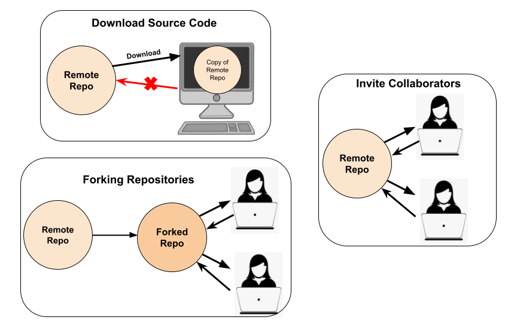
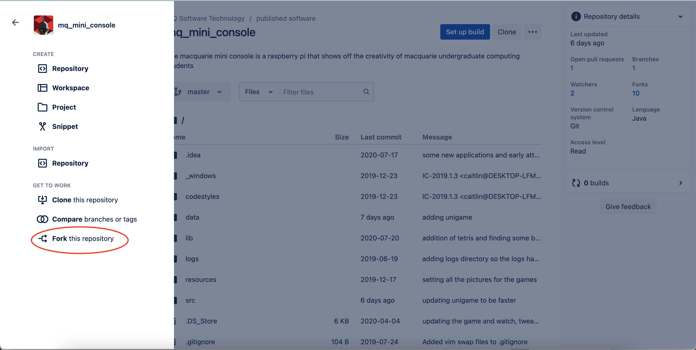
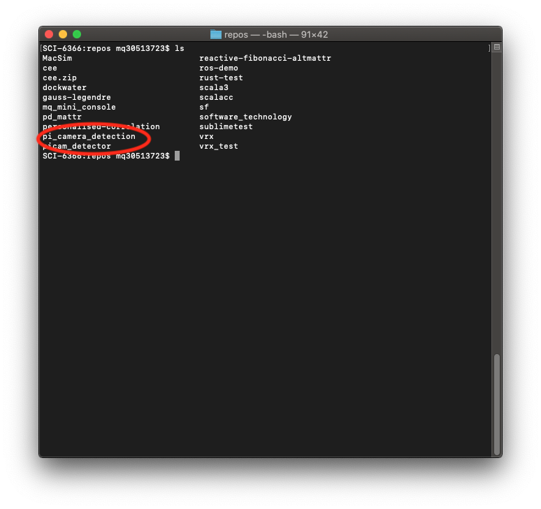
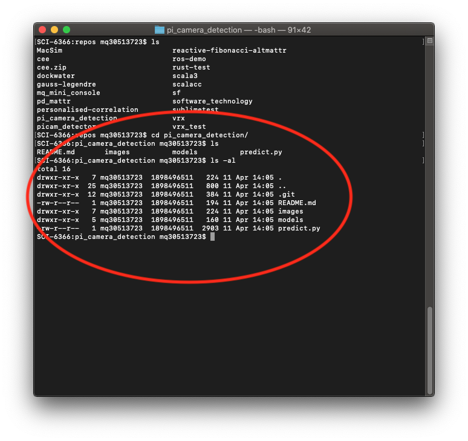

instructions for getting the code from bitbucket, as well as learning what is going on when you do that.  make sure to have them fork so that a pull request can be used in the later worksheet.

### Introduction

There are a lot of different methods to contribute code to a repository. Different methods are more appropriate than others depending on the scale, number of collaborators and security needs of a project.  
You can *Download Source Code*, *Invite Collaborators* or *Fork*:

* **Download Source Code**: Downloading the source code will remove its relationship to the repository, and will just give you the files to play around with on your own device.
* **Inviting Collaborators**: When the owner of the repository invites collaborators to a project, collaborators changes get pushed straight to the main repository on the creators account. You could introduce [Branches](https://www.atlassian.com/git/tutorials/using-branches#:~:text=In%20Git%2C%20branches%20are%20a,branch%20to%20encapsulate%20your%20changes.) so that collaborators can work on certain features without impacting the main branch (we won't be working with branches in this workshop)
<!--* **Cloning Repositories**: Cloning a repository creates a remote copy of all the source code in a repository on your device. You can clone repositories thatIt is no longer associated with the main repository, and is just a series of files. You would clone a repository if you want a copy of the repository without the version history.-->
* **Forking Repositories**: Forking is copying the repository from the author's account and making your own copy on your Bitbucket/Github account. That way, any changes you push only impact your own repository and not the main repository. You can fork any public repository that has enabled it and you are able to create a pull request to merge your work back to the main repository. The commit history is maintained.

The appropriateness of these methods depends on the project you are working on. Once you have access to a repository, you can `clone` it so that you can work on it on your local device.

### What is Cloning?

Cloning a repository creates a remote access point to view and alter the source code in your repository. A copy of the source code is downloaded (cloned) to your device that you can work on. Then, when you have completed a feature, you can push your changes back to the repository (but more on that later). Cloning allows you to work on a feature without impacting your repository - because the changes you make to the source code are only applied on your local device and only updates the repository when you tell it to (pushing).

### Before you get started ...
Before you get started, make sure you have completed the [Setup Worksheet](setup.html) as well as the following tasks:  

1. Made a [Bitbucket](https://bitbucket.org/) account
3. Installed Git (hopefully you also did this on Day 1. Ask the supervisors for help if you have not done this yet. Pi's have Git installed by default)
4. Told Git who you are  
  * From within the pi terminal..
  * Run `git config --global user.name "YOUR-BITBUCKET-USERNAME"`
  * Run `git config --global user.email "YOUR-BITBUCKET-EMAIL"`
  * Run `git config --list` to view your config details to confirm you have correctly set your name and email.
  * If you are working on a PI, run `git config --global core.editor nano` to set your default/prefered editing environment to Nano (you would have looked at that in the Day 1 workshop)
  **NOTE**: Make sure the username and email you enter is the same as the details you used to create your bitbucket account.
 
## Forking

Because many teams are going to be working on the SaT code, you will be creating a **Fork** of the project for your individual group to work on. When you have implemented something that works, you can submit a "Pull Request" to merge your changes with the main project repository (*more on that later*).

1. Nominate one group member's account to host the forked repository. You will only need to fork it once, and then everyone in your group can work on the same copy.
2. Head to the location of the SaT code on Bitbucket [https://bitbucket.org/altmattr/pi_camera_detection/src/master/](https://bitbucket.org/altmattr/pi_camera_detection/src/master/).
3. Select the create button ("+" symbol) on the left most side of the screen and then select the option "Fork this repository" and then follow the instructions that appear. Once you've done this, you should see a copy of the repository attached to your own account.

## Collaboration and Sharing
Now we have to ensure everyone in your group has access to the repository.

If you are the group member who hosts the repository you will need to:

1. Navigate to your repository page and select the "Invite" button in the top right of the page

2. Enter all your group members email addresses. Make sure you give them "write" privileges
 

If you are **not** the group member who hosts the repository you will need to:

1. Once the host of the repository has finished their instructions, check your email for an invitation to have "write" access to the repository and accept that invitation.

**Before moving on to the next step, make sure that everyone in your group has accepted their invitation, otherwise they will not be able to make changes to the repository.**

## Cloning and running the code

You should have cloned the main repository in yesterday's lesson. But **remember** - that copy is pointing to the main repository which you don't have write access to. So we need to have our clone point to the new `forked` repository you just set up.

1. Boot into terminal
2. Enter the following git command: `git clone <YOUR-FORKED-REPOSITORY-LINK>`.

 This will create a new directory with the cloned code inside it.

 

 You can get into this with 

 `cd pi_camera_detection`

 Another `ls` (or `ls -al` which i prefer) will show you that there is two directories and two text files.

{: .keypoint}
Whichever directory you are currently "in" is called your "working directory".  Many Linux commands rely on being in the right working directory to act the way you want. 

From within `pi_camera_detection` working directory, run

~~~~
python3 predict.py
~~~~

To run the program.  To stop the program you can:
  * wait for it to finish (unless you chose Camera input)
  * press `Ctrl-C` (i.e hold the control-key and hit "c").

To see the source code, you can use `nano predict.py`