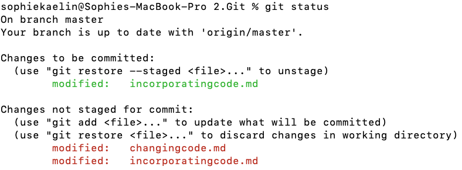
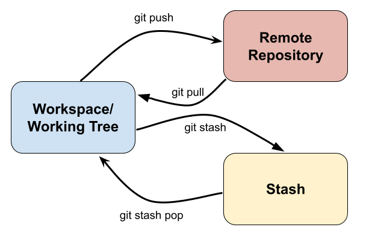
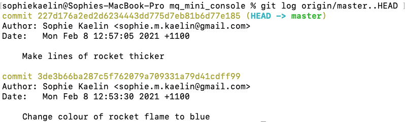
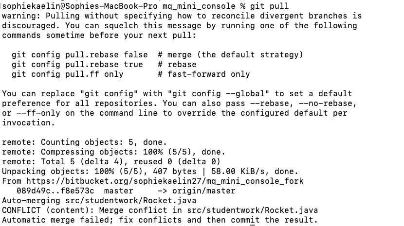
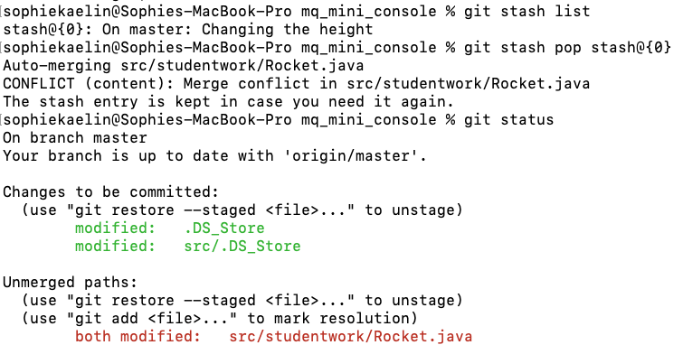

### Intro
There are various stages when updating code in a repository, and they are easy to mix up. Before you continue, it is important to understand some key terminology and the differences between these stages.

The four different stages are:  

* **The Workspace**: Where you update the files in Visual Studio Code or Nano (there are other options, but this is what we are using in the workshop). You are (most likely) used to just working in a workspace and saving files onto your device. Also referred to as your "working tree". The changes you make in this stage are referred to as `unstaged changes`
* **The Staging Index**: This is where you `add` changes that you are happy with, and are prepared to have incorporated in your repository. The changes you add to this stage are referred to as `staged changes`
* **The Local Repository**: When you have completed a feature, or completed a certain task, your next step is to `commit` those staged changes to your local repository. This is referring to the local copy of the repository you have on your device. A commit should have a meaningful message so that users can look back in their commit history and understand what each commit accomplished.
* **The Remote Repository**: When you want to move your local changes up to the repository, you `push` these changes to the Remote Repository. This stage can come with issues (called `merge conflicts`) if other users have made changes to the same section you have.

The arrows in the diagram show the commands you will use to move changes between the stages.

### Staged vs Unstaged
You should only stage changes when you are *really* happy with them, and think they are in a state where you could commit them to the repository. If you want to unstage changes, you can use the following command:  
`git restore --staged <FILE-NAME>`

If you want to see which files have staged or unstaged changes, use the `git status` command to view changes to your working tree. Files that appear in **red** are unstaged, files that appear in **green** are staged. A file can have both staged and unstaged changes if you staged the changes at one point, then continued working on the file.  

### Stashing

There may be times when you have some outstanding staged/unstaged changes you aren't ready to commit, but don't want to throw away. That is where `git stash` comes in handy. `git stash` will take the current state of your current uncommitted changes and save them in a temporary "stash" away from your working tree so that you can work on something different. This is a helpful command when  you are wanting to pull changes before committing your own.

Some helpful stashing commands are:  

* `git stash save "<ADD-A-NOTE>"` => stashes your current staged and unstaged changes. Write a note for yourself so you remember what is in the stash.
* `git stash push -p -m "<YOUR-STASH-DESCRIPTION>"` => allows you to choose which files to stash.
* `git stash list` => will show you a list of current stashes
* `git stash pop <STASH-NAME>` => brings your stashed changes back to your working tree/ staging index and removes them from the stash.
* `git stash drop <STASH-NAME>` => deletes a specified stash (use with caution)
* `git stash clear` => removes all stashes.

A stash name takes the form of : `stash@{<NUMBER>}`

### What is a Merge Conflict?

A merge conflict will arise when multiple people update the same file and git is unable to decide which update to keep when they conflict. An example of this is shown in the diagram above. What if one person deleted a function, and another person made updates that depended on that function? When all those changes are pushed to the remote repository, the changes will need to be merged. And when they can't be merged, a conflict arises.

Another (real life) example can be seen in video games. Say you made progress on a game and your data saved to the cloud. Then you switched to another console and made some progress on the previous save. When both those saves are made, the game server won't know which is the correct game save.

When you experience a merge conflict, it is a good idea to work with the other person whose changes have conflicted with yours, to ensure you both come up with a resolution that works for both your updates.

For more information on Merge conflicts, have a look at [THIS](https://www.youtube.com/watch?v=JtIX3HJKwfo) video.

### Finding something to change
It can be difficult to find an element of the program to change when you aren't sure what you're looking for. For this section, you are tasked with finding something in the source code to change. Some suggestions of things you can change include: [background colour](https://processing.org/reference/background_.html), [shape colour](https://processing.org/reference/fill_.html), [circle size](https://processing.org/reference/ellipse_.html), [rectangle size](https://processing.org/reference/rect_.html), [line width](https://processing.org/reference/strokeWeight_.html), [line colour](https://processing.org/reference/stroke_.html).

Review the notes from Day 1 on how to access/edit files through either *Visual Studio* or *Nano* (particularly how to compile and run the program). One filepath that might be worth investigating is `mq_mini_console/src/studentwork`.

**NOTE:** It is important that you check your change is successful before you continue/make a commit. So if your aim was to make a line thicker, make sure the line is ACTUALLY thicker. You only want to update your repository when you have made a positive change and not introduced any bugs.

The following video shows an example of how to find, make and commit a change

## Committing
Great! If you've gotten to this section that hopefully means you were able to make a small change to one of the games. If you are happy with that change, we are going to look at moving that change to the *Staging Index* and then committing it to your *Local Repository*.

Commiting is the stage when you are ready to merge staged changes into your local repository. This section will walk you through how to commit the small change you made in the mini console.

1. Open a terminal window and navigate to the location of your local clone
2. Run `git status` to view the files you've changed in the workspace.  

3. If you'd like to view the changes you made to that file, run `git diff <FILE-NAME>`. The file should appear with some (+) and (-) symbols depending on whether you removed or added that element to the file. It is a good way of checking your file is in the right condition to stage and/or commit.  

4. Stage your changes - move them from your workspace to the staging index. There are two ways of doing this:  
  * *If you want to move all the files to the staging index run* `git add .`
  * *If you only want to move one file to the staging index run* `git add <FILE-NAME>`

5. Run `git status` again to check all files you wanted to stage have been staged (staged changes are green)
6. Run `git commit -m "<ADD-YOUR-MESSAGE>"` to move your staged changes to your local repository as a `commit`. Make sure your commit message is meaningful and concise so you can look back and understand what the change was. By convention, commit messages are written as tasks such as "*Update the README.md file*" or "*Complete new character features*".  

7. Run `git status` and you should see your staged changes section is clear (all staged changes were included in the commit).  

8. Run `git log` and the top commit should be your most recent one. The `origin/master, origin/HEAD` label represents what commit the **remote** repository recognises at the most recent commit. The `HEAD -> master` label represents what commit the **local** repository recognises as the most recent commit. This screenshot is accurate, because we have not yet pushed changes from the local to the remote repository.  

You can run the `git add` as many times as you want to one commit. You can also run `git commit` as many times as you like before pushing, it will just create lots of separate commits.

**NOTE:** If you have made a lot of commits and want to view a log of JUST those commits you have made and not pushed, run `git log origin/master..HEAD`

## Pushing
Now that you've committed a change, you will have to push that change back to the remote repository that everyone can see on Bitbucket. This can come with complications if other users have commited since the last time you pulled (this will be looked at in a later section **Conflicts**). To avoid this for now, make sure each team is working on different files, or coordinate with other members how both of your code should combine.

1. Run `git log`. In this particular case, you should see that your head node is pointing to your most recent commit, but origin may be pointing a little later. Origin refers to what the remote repository thinks is the HEAD node. Once you push your commits (if there are no merge conflicts), the remote repository should recognise the HEAD as your most recent commit.  
  
**NOTE:** press `q` to stop viewing more commits

2. Run `git push` to push all of your commits on your local repository to the remote repository.  
  

3. Run `git log` and the origin should match up with the head.  
  

**NOTE:** As mentioned above, this might have introduced some *Merge Conflicts*. If that is the case, jump down to the **Conflicts** section and have a read over that to see if you can resolve the merge conflict. This can get quite messy, so don't hesitate to call over one of the supervisors to help guide you through it.

## Pulling

As introduced in the first diagram, there are two ways of getting the current code from the remote repository: `git fetch` and `git pull`. To emphasise the difference:  

* **Fetch**: Only retrieves the most recent changes applied to the remote repository, and doesn't apply them. These changes are only applied when you run the `git update` command.
* **Pull**: Retrieves AND applies the code all in one.

You will just be **pulling** changes. This (like pushing) can introduce some conflicts.

### General Merge Instructions
Below are some generic instructions on how to merge your commits with the remote repository when you are pulling:

1. `git pull`. If there is a merge conflict, a similar error will appear  

  
2. If you are using a Pi, open the conflicted file in nano. Otherwise, open it in Visual Studio
  
  
3. If you search through the file you will see lines like this:  
`<<<<<<< HEAD`  
`=======`  
`>>>>>>> <COMMIT-HASH>`  
Each of these shows the conflicts/differences between the commits which need to be resolved. You will need to merge these sections by hand, and then remove the lines in the list above once you've come up with a successful merge.  
 
 
4. Once you've done this, treat the change as a normal commit:  
`git add <FILE-NAME> && git commit -m "<COMMIT-MESSAGE>"`  

There are three main scenarios for when you are pulling from the remote repository. Follow the scenario that best suits your situation (hopefully you will be in position **1**):

1. You have no current staged changes, unstaged changes or commits on your local repository.  
  * `git pull` (ignore the warnings)
2. You have some committed changes on your local repository  
  * You may encounter a merge conflict.
  * `git pull`. If there is a merge conflict, continue with the instructions above for dealing with merge conflicts
3. You have some staged or unstaged changes on your local repository  
  * You will need to stash those changes and then merge it with the new HEAD
  * Run `git stash save "<STASH-MESSAGE>"` to hide your current workspace
  * Run `git pull` to fetch and update your workspace with new changes
  * Run `git stash pop <STASH-HASH>` to see if you can merge without a conflict, if there's a conflict a similar error will appear:  
  
  * Go about a regular merge conflict, and pop the stash before commiting.

## Conflicts
We have mentioned conflicts throughout this workshop, and perhaps you have already encountered some of your own. Some conflicts are pretty straight forward to resolve, while others are more unique. Because each case is unique, if you encounter a strange looking conflict alert one of the supervisors and they will help you out.

### Good habits for avoiding conflicts
There are some habits that are good to form early in order to avoid nasty conflicts:  

* **Pull Regularly**: If you don't work on an active group project for a day or few, there will likely have been many commits made by other group members. It is a good idea to pull regularly to ensure you are working on the most recent version, and the conflicts you encounter aren't as severe.
* **Pull before Commiting**: Before making a commit, you should pull the most recent version of the project and deal with any merge conflicts before you continue.
* **Communicate**: If you have many group members working on a project, make sure you are all aware of what each of you are working on. That way, if two of you are working on the same feature you are aware there is potential for conflict when you merge your code together. That way you can work through them together to ensure the end code works for both of your introduced changes.

## Extra Notes
### Removing Changes

Depending on the situation, there are various ways you can remove changes or updates you've made. Here are some sample situations:

* You have unstaged changes **AND/OR** You have staged changes:  
`git reset --hard`
* You have staged changes you want to move back to being unstaged:  
`git restore --staged <FILE-NAME>`
* You want to work from a different stage in your commit history, but not lose the later commits:  
  `git checkout <COMMIT-HASH>` to move to that commit.  
  `git checkout master` once you want to move back to the latest commit.  
  * *Not recommended! Only use this if it is completely necessary. You may run into some merge conflicts later on that will be difficult to recover from*
  <!--TODO: Check this is right and explain commit hash in commits-->
* You want to remove a commit (move back in history):  
	* *Make sure you are* **certain** *when you are doing this. This is not something you should do regularly*
	* *If you are removing the last commit use the following command:*  
	`git reset HEAD^`
	* *If you are removing a commit in the middle of your history things will get complicated and dangerous... [THIS](https://www.clock.co.uk/insight/deleting-a-git-commit) article should help but it introduces topics not covered in this workshop. If you are stuck in this situation and are unsure what to do, ask one of the supervisors for help*
* You have some changes you want to keep, others you don't (this one is a little trickier and involves stashing):  
`git stash push -p -m "<YOUR-STASH-DESCRIPTION>"`
  * This lets you choose files/changes you want to keep
  * use the `Y` and `N` keys to choose to stash a change (`YES`) or not to stash a change (`NO`).
  * Once you are done, you can remove all changes with a `git restore` and `git restore --staged` variation. Then you can pop your stash back onto your workspace.

For more on resetting, have a look at [THIS](https://www.atlassian.com/git/tutorials/undoing-changes/git-reset) resource.

***[Next -> Getting Your Work Incorporated](/hacking/incorporatingcode.html)***

