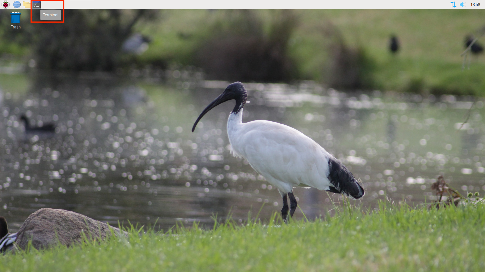
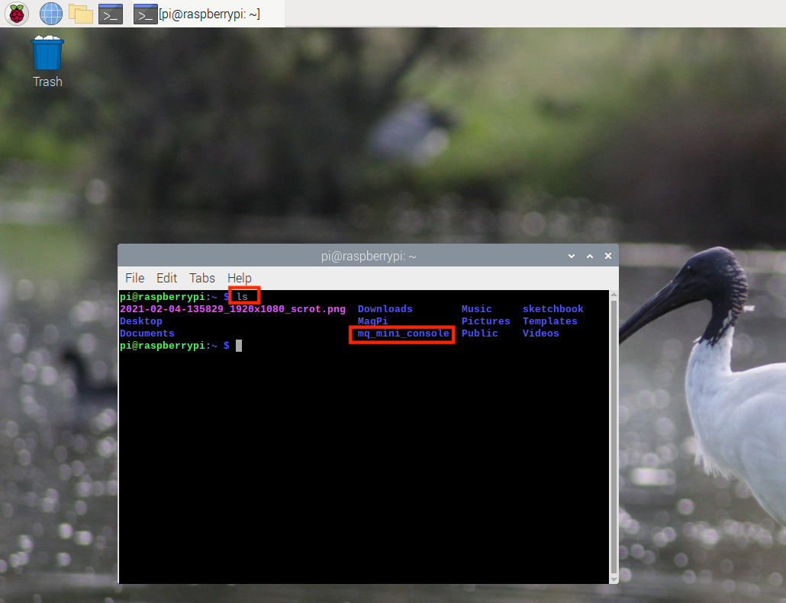
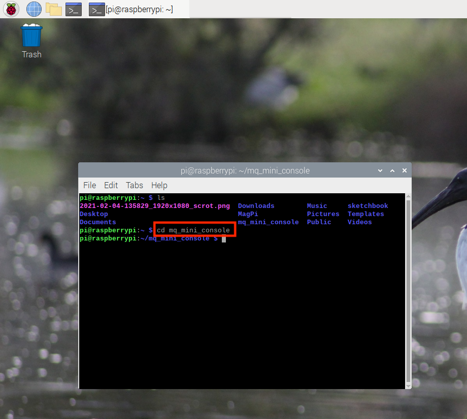
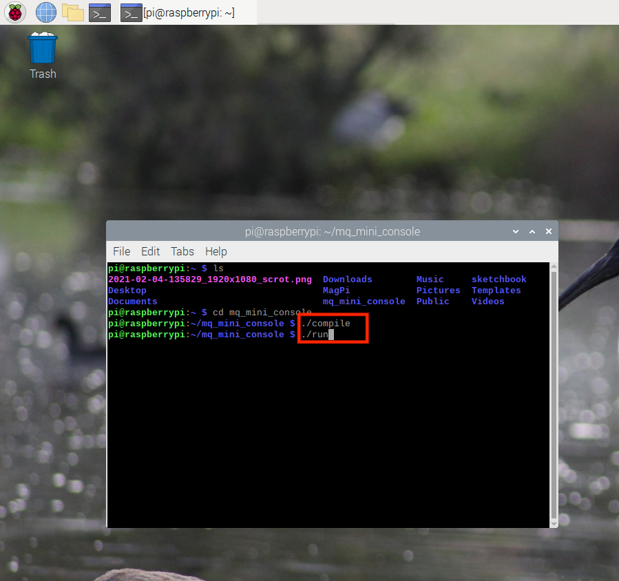

The "macquarie mini console" is a Raspberry Pi image setup for loading directly into a mini-console application. The application showcases games made by Macquarie University Students in CS1/computing 101. The Java application can be run on any computer for easy experimentation.

# Background to Raspberry Pi

Raspberry Pi is a small sized computer that can essentailly perform the same tasks as our computers at home. The device can be plugged into a monitor and controlled with a keyboard and mouse to be used as a fully functioning computer. It is low-cost, modular, and high performing, originally developed for teaching purposes for computer science students but growing into much more.

	

Learn more about Raspberry Pi at these links below:
<ol>
	<li><a href="https://en.wikipedia.org/wiki/Raspberry_Pi">https://en.wikipedia.org/wiki/Raspberry_Pi</a></li>
    <li><a href="https://thepihut.com/blogs/raspberry-pi-tutorials/the-raspberry-pi-tutorial-beginners-guide">https://thepihut.com/blogs/raspberry-pi-tutorials/the-raspberry-pi-tutorial-beginners-guide</a></li>
    <li><a href="https://www.edureka.co/blog/raspberry-pi-tutorial/">https://www.edureka.co/blog/raspberry-pi-tutorial/</a></li>
</ol>

# Setting up the Raspberry Pi for Macquarie Mini Console

Our Raspberry Pi will use a SD card as the operating system, in which we will upload the macquarie mini console to the card. The SD card normally uses an operating system call 'Raspbian', which is designed specifically for Raspberry Pi's. In this case, we want to run our mini console instead, so we have to download, or 'flash', our operating system onto the Raspberry Pi's SD card. Follow the steps below to set up the mini console onto our Raspberry Pi.

## Flashing the Pi Image to the SD card

These steps should already be completed for you, but it is still helpful to understand what this process is and how it is completed.

To complete these steps, you will need a computer with an SD card reader to install the image onto the card. 

<ol>
	<li>Insert the SD card with the SD card reader into your laptop or desktop computer</li>
	<li><a href="http://files.mattr.net.au/mqm.img.zip">Download our custom pi image.</a> This will download a zip of the raspberry pi image in the downloads folder. </li>
    <li><a href="https://www.raspberrypi.org/documentation/installation/installing-images/">Write the image to the SD card</a></li>
</ol>

The SD card can now be used in our Raspberry pi. Remove the SD card adapter from your computer, then remove the SD card from the adapter to get ready to boot up.

# Using Raspberry Pi

To use Raspberry Pi, we need a monitor to view what we are doing, as well as a keyboard and mouse to control it. Follow the steps below to connect and boot up the Raspberry Pi. Make sure you have read the links at the top of the page and understand what Raspberry Pi is and how it works before completing these steps. 

<ol>
	<li>Insert the SD card into the SD card slot.</li>
	<li>Connect a monitor to the HDMI port. Make sure the monitor is connected to a wall socket and is powered on. The Raspberry Pi is still off, so you won’t see anything yet.</li>
    <li>Connect a mouse and keyboard to the USB ports.</li>
    <li>If you want to connect to the Internet via Ethernet instead of WiFi, you should also plug in an Ethernet cable. The Raspberry Pi we have provided will allow to connect to Internet wirelessly</li>
    <li>Connect the power supply to a wall socket and plug in the micro USB cable. A red LED will light up on the Raspberry Pi, and on the monitor you will see the Raspberry Pi booting up. In a few moments you will see the mini console.</li>
</ol>

The mini console will automatically run when the Raspberry Pi is started. To exit the games, press the 'esc' button. 

Try doing other things with the Rasperry Pi as well, such as going on the internet! Make sure you are connected to the internet via an ethernet cord. If you have a Raspberry Pi 3 or 4, you can connect to wifi wirelessly. <a href="https://projects.raspberrypi.org/en">Here</a> are some resources to show all the other projects you could do with a Raspberry Pi.

## Restarting the mini console

If you want to restart the mini console again, we will use an application called Terminal. Terminal allows us to access Command Line, which will process commands for us. Don't worry about what Terminal is or how to use it, we will learn more about it in the next lesson. Open a new terminal window by pressing the terminal button in the top left corner of the screen.

	

 

Click anywhere in the terminal window and type `ls` exactly as it is written here, then press enter. This will give you a list of files and directories that the Raspberry Pi holds. In this list, you will find a directory that is named 'mq_mini_console'.

	

 

Now we want to navigate to this file. Type `cd mq_mini_console` and press enter. 

	

 

The only way we have to run the console is via the console and from within this directory. There is a "script" in this directory that we can execute on the terminal.  Type `./run` and wait for the mini console to appear on the screen again.

	

 

You may have noticed we use Terminal a lot within this project. If everything on this page is complete, go to the 'Terminal Basics' link in the navigation menu to continue with the workshop's day 1 tasks and learn more about terminal. 
 