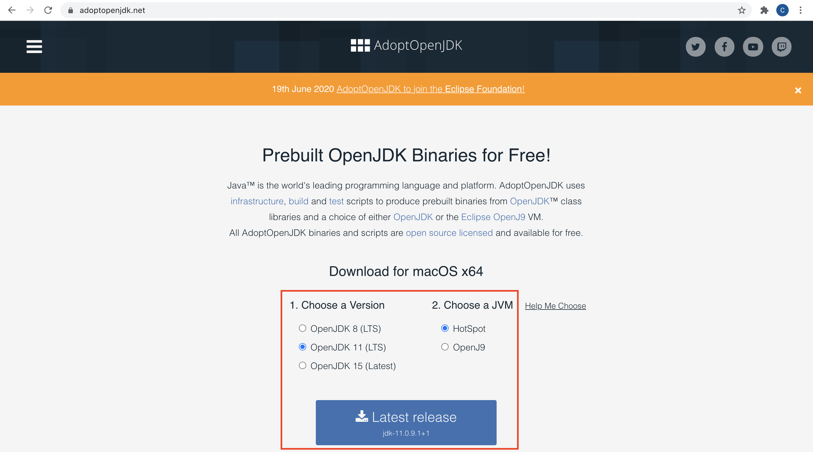
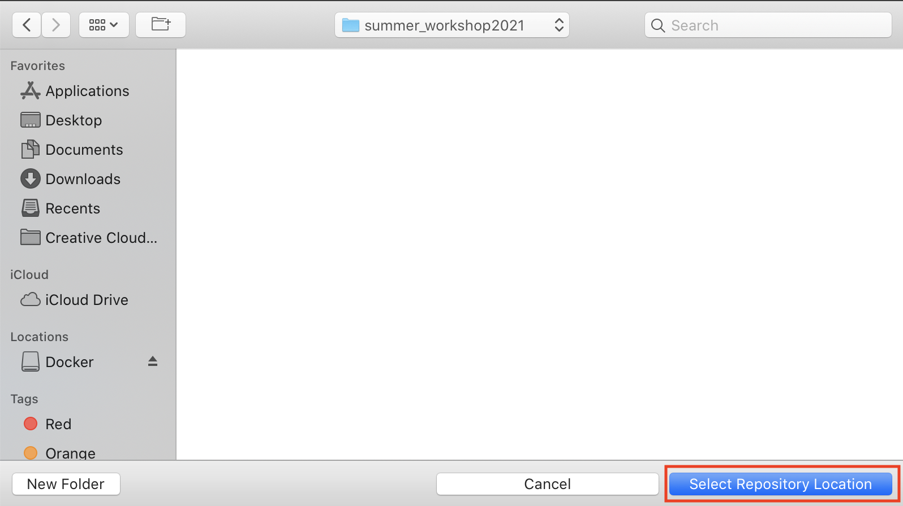

The "macquarie mini console" is an application that showcases games made by Macquarie University Students in CS1/computing 101. The Java application can be run on any computer for easy experimentation. This tutorial will show you how to access and run the macquarie mini console and its code on your personal computer at home.

# Steps to access Macquarie Mini Console

## Install Java

JDK8 (Java Development Kit 8) can be downloaded at <a href="https://adoptopenjdk.net/">this</a> link. Select the options shown below and press the big blue download button. This may take some time to download onto your computer.

	

 

Once this is finished, open the downloaded file and follow directions given. 

## Install Visual Studio Code

VSCode (Visual Studio Code) is a code editor that will allow us to view and modify the code. It also has command line and git functionalities, which we will learn how to use later. VSCode can be downloaded using <a href="https://code.visualstudio.com/download">this</a> link. Select your operating system and follow the directions given. Once this is done, open VSCode as a new window and go on to the next step.

## Install Git

Git is a 'version control system' that we use to track our modifications to code and store our code in a 'repository'. It is often used among teams of coders to share their code with the group and work together on the same project. Imagine you are working on an essay with a group. You may all have your own versions of the essay saved locally on your computer, but what do you do when you want to see others people work and show your own work as you advance through the essay? We may use tools like Google Drive to help us with this. Git is basically Google Drive, but for code. It allows us to make changes to a code project and see what changes others are making as we advance through a project. Don't worry too much if this does not make sense, we will learn more about Git in day 2 of the workshop.

To install git, open a new 'Terminal' window. Terminal allows us to access Command Line, which will process commands for us. Don't worry about what Terminal is or how to use it, we will learn more about it in the next lesson. Go to your applications folder and find the "Terminal" application, then open it.

Click on the Terminal window and type `git - -version` exactly how it is written here. Note there should be no space between the two dashes when you type it. If it shows a version, go to the next step. Otherwise, follow the directions below:

Install on macOS

If a version of Git is not already installed, follow the directions given in Terminal to install git. If that does not work, follow this directions on <a href="https://git-scm.com/download/mac">this</a> link. Use the option that says binary installer, and click the download button when redirected to the webpage.

Install on Windows

Go to <a href="https://git-scm.com/download/win">this</a> link and the download process should start automatically

Install on Linux

If you’re on Fedora (or any closely-related RPM-based distribution, such as RHEL or CentOS), you can use dnf. In the Terminal window, type `sudo apt install git-all` and press enter.

For more information on installing Git, check out <a href="https://git-scm.com/book/en/v2/Getting-Started-Installing-Git">this</a> link.

## Download the application

Now we are ready to download the Macquarie Mini Console application to our local computers. To do this, we must clone a repository. A repository is essentially what hosts code, or a location for our code. We can clone this code onto our local computers so that we may view and modify the code. Don't worry too much if you do not understand, we will learn more about this in day 2 of the workshop.

Navigate to <a href="https://bitbucket.org/mqcomputingdept/mq_mini_console/src/master/">this</a> link and click on the clone button.

	

 

Copy the highlighted link.

	

 

Navigate to where you opened a new window for VSCode. Click on 'clone repository' under the Start title and copy the link into the textbox that pops up. 

	

 

Select a location for the repository. This can be anywhere on your computer that you choose. It is suggested to create a new folder in Documents or Desktop for easy access. Once you have chosen a location, click on "Select Local Repository"

	

 

A pop up box will appear telling you it is cloning the repository. When it is finished, click on "Open"

	

 

You will now be able to view the source code for the Macquarie Mini Console. 

## Running the Code

If you are working on a Windows computer, follow the directions in the dropdown before moving on to the next steps below.

Changes for Windows Users

If you are on windows, you will need to tell VSCode to use the "git bash" shell.  [Follow these stack overflow instructions to get git-bash as your terminal shell](https://stackoverflow.com/questions/42606837/how-do-i-use-bash-on-windows-from-the-visual-studio-code-integrated-terminal)

Eventually, we will update the scripts to work on all computers, but for now we have to make the changes manually. Open the file called compile and change line 6 to the follow code: 
`javac -cp lib/core.jar\;lib/sound.jar\;lib/controlP5.jar\;lib/jsyn-20171016.jar\;lib/gluegen-rt-natives-macosx-universal.jar\;lib/jogl-all-natives-macosx-universal.jar @sources.txt`
Then open the file called run and change line 5 to the following code: 
`java -Xmx1024m -Xms1024m -cp ./src/\;lib/core.jar\;lib/sound.jar\;lib/controlp5.jar\;lib/jsyn-20171016.jar\;lib/gluegen-rt-natives-macosx-universal.jar\;lib/jogl-all-natives-macosx-universal.jar $main`

Make sure to save both of these files and continue to the next section.

To run the application, we will need to compile and run our code. Go to the menu bar and click on "Terminal", then "New Terminal". First, our code needs to be compiled. Click in the terminal, type `./run` and press enter. A new screen will appear running the mini console. Navigate between the games using the up and down arrow keys. To play a game, click the enter button. To leave a game and return to the home screen, click the esc button. To exit the application, click the esc button again. 

	

 

As you probably noticed, we use terminal again to run the code as we did when we wanted to install Git. While our computers have a terminal application, VSCode also has it's own terminal installed within itself that we can use. If everything on this page is complete, go to the 'Terminal Basics' link in the navigation menu to continue with the workshop's day 1 tasks and learn more about terminal. 