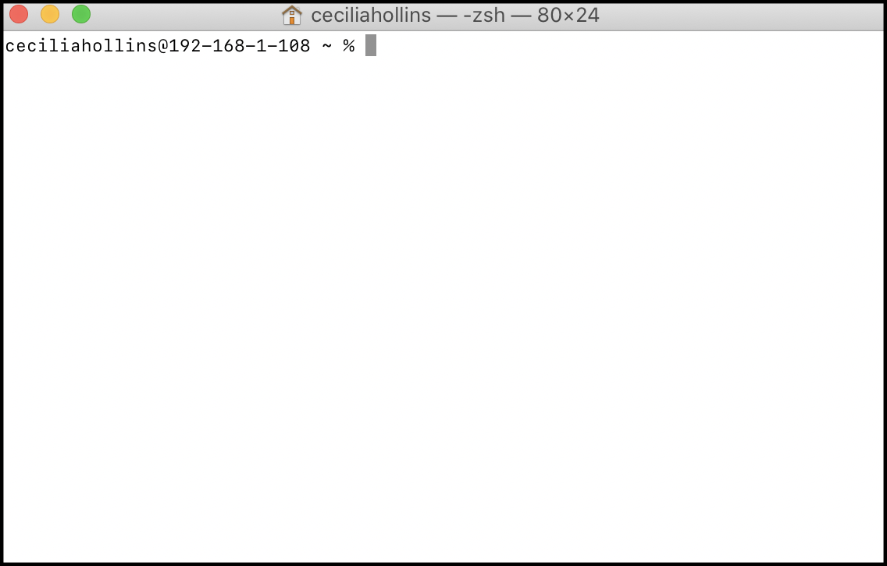
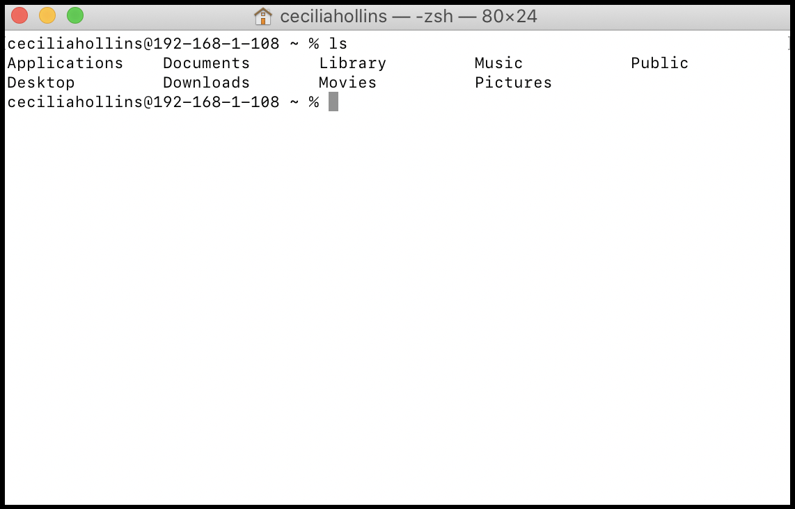
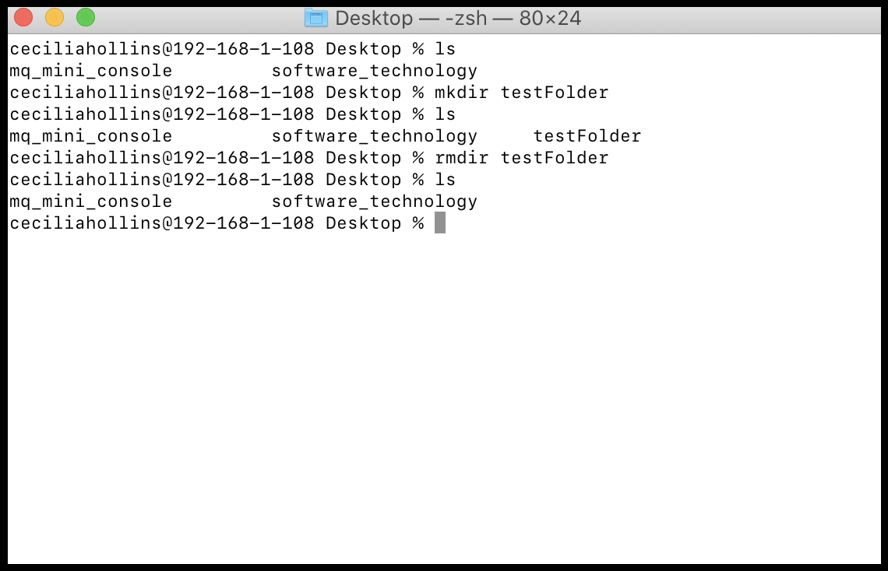
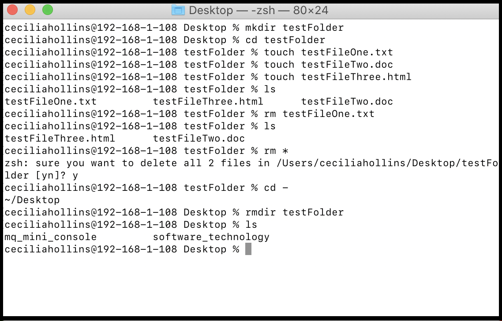
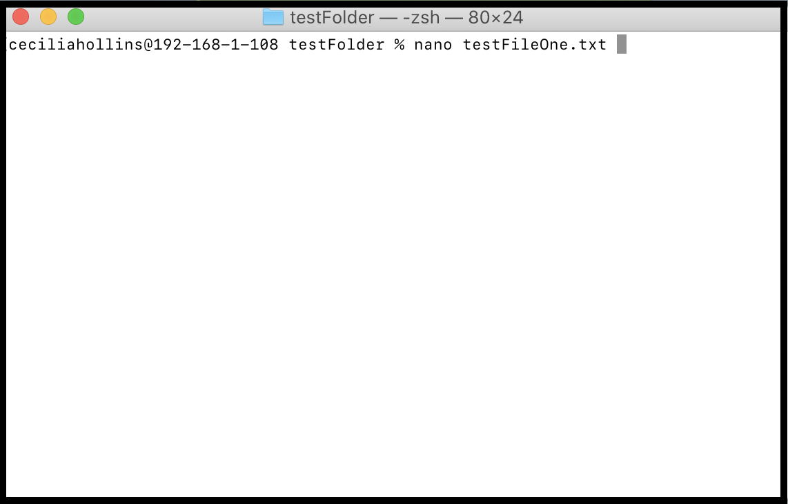
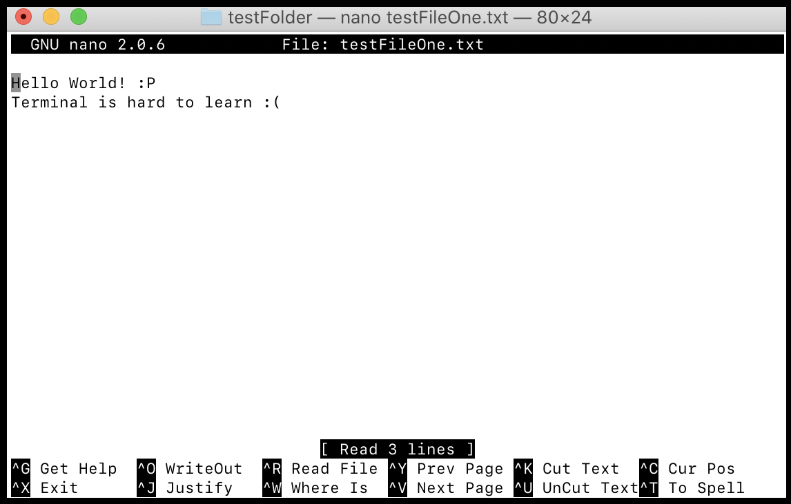
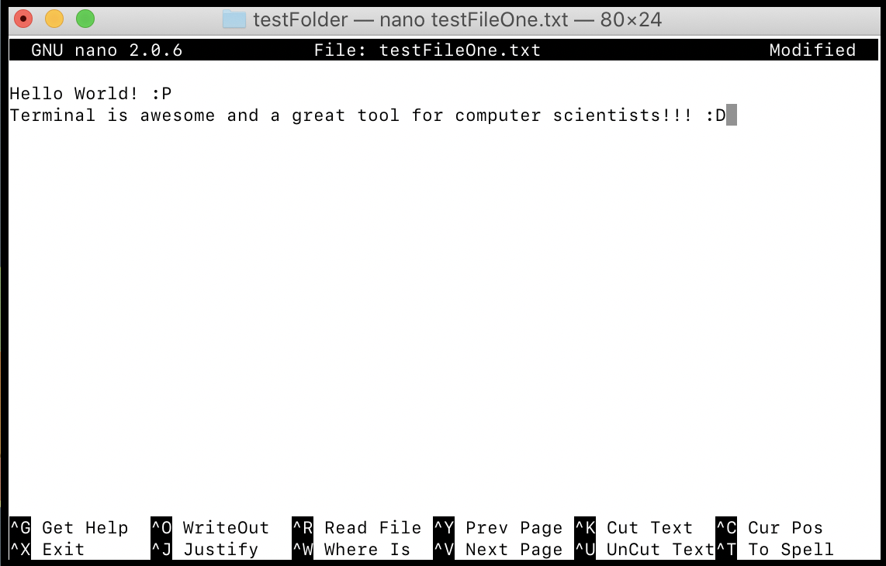

You may have briefly looked into using terminal while setting up the mini console, but now we are going to dive in deeper. Terminal is a way for users to type instructions to the computer for immediate execution. It looks very intimidating at first, but it is not as bad as it seems. Here is a link to help you understand the basics of terminal. Don't worry if it does not make sense right away, try to just understand the basics.

<ul>
	<li><a href="https://learntocodewith.me/getting-started/topics/command-line/">https://learntocodewith.me/getting-started/topics/command-line/</a></li>
</ul>

Note: If you ever see the term 'command line', it essentially means the same thing as terminal. 

# Beginning to use Terminal

To use Terminal, we use an app called 'Terminal'. To open a new terminal, go to your applications folder and look for 'Terminal' on macOS and Linux, or "Windows Terminal' on Windows. It will look something like this when you open it.

	

 

Let's begin with some basic commands to learn about Terminal.

## List all Files

In your terminal, try typing `ls` for 'list' to see all the files in our home folder.

	

 

tilde (~) represents the home directory. Since the terminal above shows tilde in the directory location, it means we are in our home directory.

## Navigate into a Folder

You probably recognize some folders shown in this home folder. Lets navigate into a folder to inspect it further. To navigate into a folder we write `cd Desktop`. 

Once we are navigated into the folder, we can perform `ls` again to see the folders that live within the Desktop folder.

	

 

We are now in the Desktop directory and we can see two files on the Desktop. 

To navigate deep into a directory quickly, we could do `cd ~`. Try these out in your terminal.

When specifying which file we are navigating to, we can start typing out the location and press 'tab' for the computer to finish typing for us if it knows which location we are talking about. For example, if I type `cd Doc` and press 'tab', terminal will understand we mean 'Documents', and finish the command for us. 

## Printing the Current Working Directory

If we want to see the current path we have navigated to from our home folder, we can use the command `pwd` for 'print work directory'. 

	

 

## Creating or Removing Folders

To create a new folder in a directory, use `rmdir {folderName}` for 'remove directory'. Removing a folder can only be done if the folder is empty, otherwise the files inside the folder need to be removed first. 

	

 

## Creating or Removing Files

To create a new file in a directory, use `rm *`.

	

 

See if you understand what is happening above and compare with the answer. 

Answer

<ol>
    <li>A new directory named 'testFolder' is created in the Desktop directory</li>
    <li>The directory is changed to navigate into testFolder directory</li>
    <li>A new .txt file is created called 'testFileOne'</li>
    <li>A new .doc file is created called 'testFileTwo'</li>
    <li>A new .html file is created called 'testFileThree'</li>
    <li>testFileOne.txt is removed</li>
    <li>The current files in the testFolder directories are listed</li>
    <li>All the files in the testFolder directory are removed</li>
    <li>Terminal asks if the user is sure about this action, and 'y' is typed to confirm</li>
    <li>The directory is changed to one step outside the current testFolder directory into the Desktop directory</li>
    <li>The current files in the Desktop directories are listed</li>
</ol>

If the terminal gets too busy and you want to clear the past commands executed, use the shortcut ctrl + k.

## Command Manual

If we do not remember want a specific command does, we can use `man ls` to see this. Press q to exit from the manual.

	

 

# Using Nano to View and Edit Files

While we have lots of text editting resources to view and edit code files such as VSCode, Processing, or Eclipse, we can also view and edit files within terminal if these resources are not available. 

## Install Nano Text Editor

Some operating systems, such as macOS or Linux, may already have Nano installed. Check if it is already installed using the command `nano --version`. If there is an output that shows a version number, skip this section. 

If nano is not already installed, use the command `yum install nano` instead.

## Using Nano

To open a file in the terminal, navigate to the files directory and use the command `nano {fileName}`. 

	

 

Once 'enter' is pressed, it will open the contents of the file. Below we can see the contents of testFileOne.txt along with some actions at the bottom of the screen.

	

 

To edit the content, we navigate with our arrow keys and edit as normal. Try exploring some of the actions below on your computer. For example, ctrl + O saves our current progress. Once we are finished, we can use ctrl + X to save and exit the file. Nano will as if we are sure, then ask us if we want to rename the file. To keep the file name the same, just press 'enter'.

	

 

If we go back and open our new file, we will see the modified version that we editted with nano. Try some of this one your own!

	

 

# Executing a Script

A script is a file that hold pre-written commands for the terminal. Instead of having to remember how to execute a command, we can run that script to execute the command for us. To do this, we use `./{fileName}` where the file is has a .sh extension. A .sh extension means it is a script file. Lets look at an example.

Here we can see a folder that has 4 files, one of which is a script file, called listAllFiles.sh that holds the command `ls`. This is a very simple command that we could execute ourself, but the command may be something much more complex later on. 

	

 

If we go back to our terminal and navigate into the testFolder directory, we can run the listAllFiles command by typing `./listAllFiles.sh` and seeing the result. 

	

 

We may use this command with our mq mini console to compile and run our code.

Try creating a folder and a script file, then use nano to add a command into the file. Then try running the script file using the command we just learned. You may get the error permission denied. This is because every script file has certain permission, being read, write, and execute. We will need to tell this file that it has permission to do all three things by the owner (you). to do this, type `chmod a+x {scriptName}` which stands for change the permission to make this script executable. Then if you attempt the script file it will execute. 

# Practice!

The best thing that you can do to understand and memorize these commands is to do them on your personal computer. Follow along with the notes on your own terminal, then see if you can go further and use terminal without the help of the notes! The more you practice, the faster and easier it will be to use these commands. 

# Need more help?

Check out <a href="https://medium.com/@grace.m.nolan/terminal-for-beginners-e492ba10902a">this</a> link if you need some extra help :)
