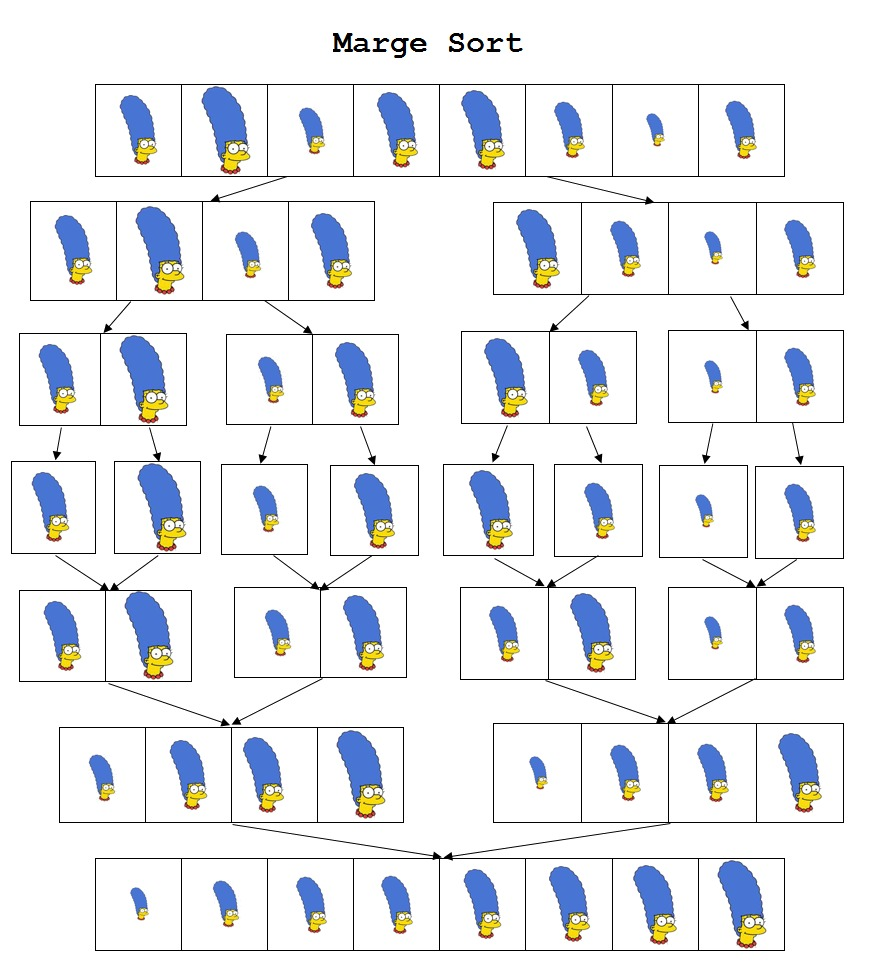
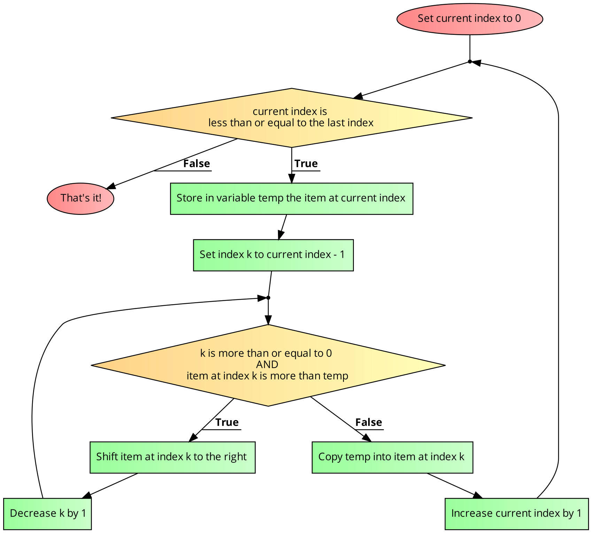
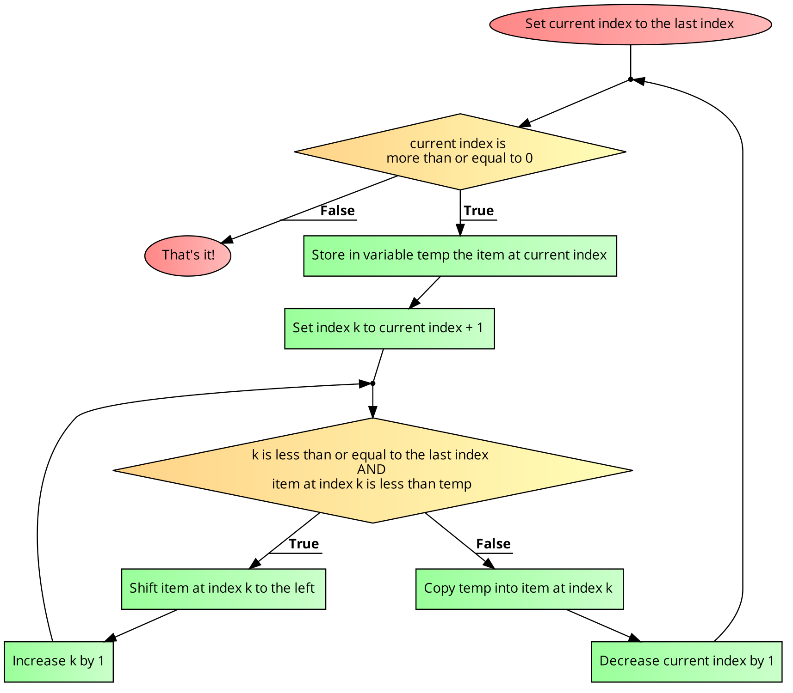
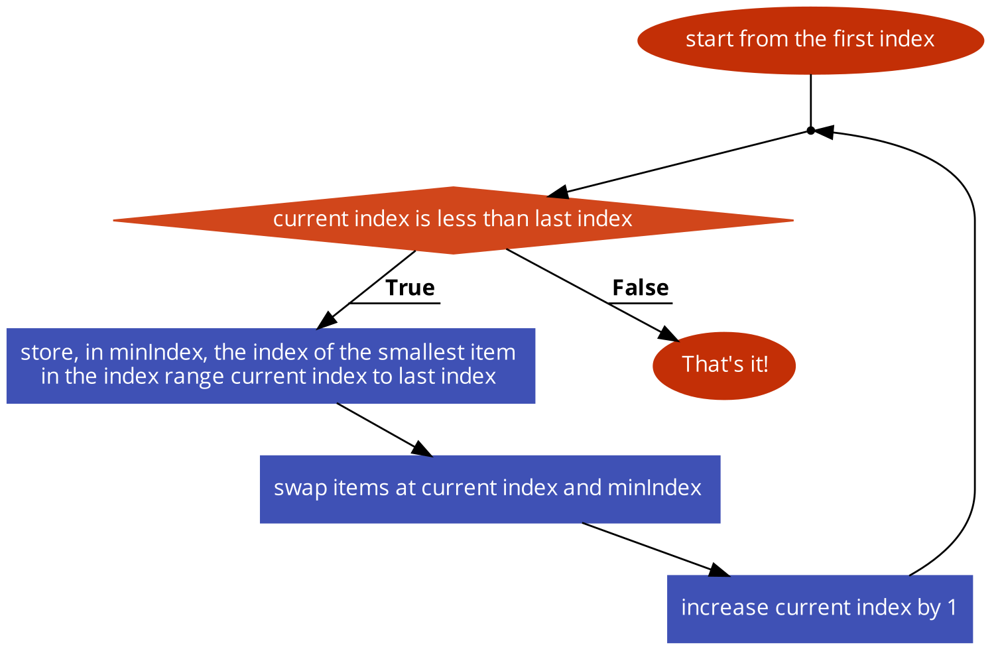
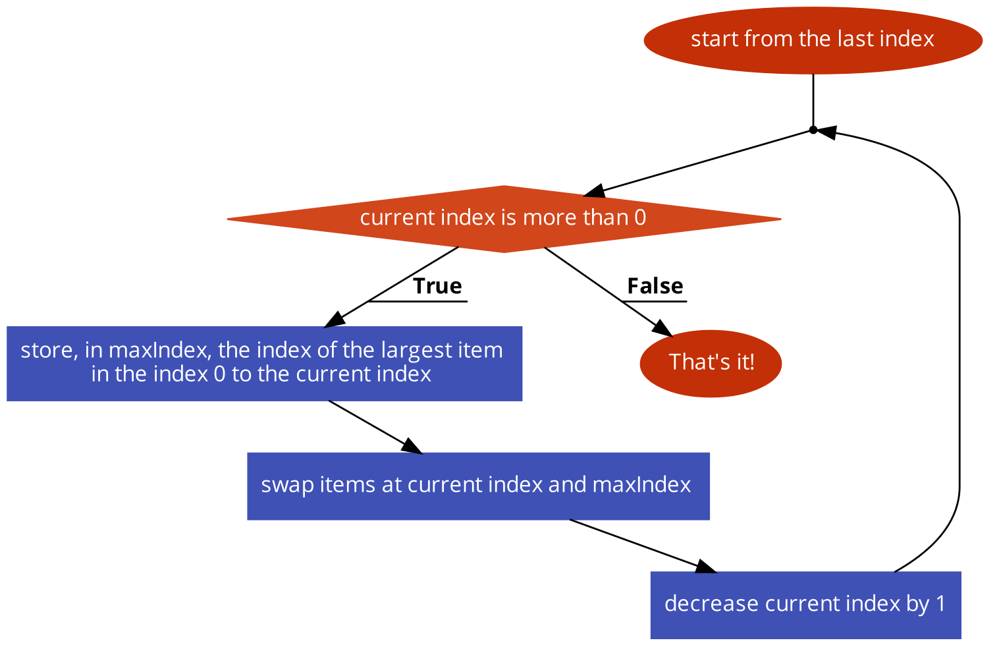

Assumed Knowledge

  * <a href="functions">Functions</a>
  * <a href="compositedata">Composite Data (Arrays)</a>
  * <a href="classesarrayofobjects">Classes</a>
  * <a href="lists">ArrayLists</a>

Learning Outcomes

  * Understand why data needs to be sorted
  * Understand how data can be sorted

## Author: Gaurav Gupta

## Why perform sorting?

Sorting is a fundamental operation that,

1. improves the efficiency of several tasks, and, 
2. makes several other non-trivial tasks, well, trivial.

### Example 1: Finding the k-highest item in a collection

For an unsorted collection, you have to go through each item of the collection in order to get the first highest value, then again for second highest, etc.

For a sorted collection, the highest value will either be the first value or the last value. The <i>k</i>-highest is at the <i>k</i>th position. Thus, it reduces to a single-operation task.

### Example 2: Finding the number of unique items in a collection

Consider the array `{10,70,20,20,20,90,10,90,20,70}`. The four unique items are 10, 70, 20 and 90.

For an unsorted collection, you can choose to see if the item is first of its kind, and only if so, increase a counter.

For an sorted collection, every time an item is not the same as the next item, you can increase the counter (that is initialized to 1) by 1. Zero is returned for empty and `null` collections.

The second approach is signficantly easier than the first.

Bottomline - It makes things MUCH easier!

### Cost of sorting

Of course, we haven't considered the cost involved in sorting a collection. If the collection changes frequently, we need to maintain the sorting order. This can be done either by,

1. adding the item that has to be added at the appropriate place (Which more or less requires one iteration through the collection) - pretty good!
2. adding the item at the end and sorting the collection again - not so good.

What one must remember is that sorting is not free and has a cost associated with it.

### Approaches to sorting

If I ask you to sort the collection, what would be your approach? Think about that for a few minutes and try to represent it as a [flowchart](https://www.code2flow.com).

> {40, 70, 20, 90, 30, 80, 20}

One approach can be to find the smallest item and make sure it's at the right place. That's 20, and belongs at the first position (where 40 sits). 

#### Sub-option 1

While putting it in its right place, we can either shift (one to the right) items before it and then place it at that location, so the collection becomes:

> {20, 40, 70, 90, 30, 80, 20}

After this we are guaranteed that the first item is correct and continue with the rest of the collection, completely ignoring the first value.

#### Sub-option 2

Another option to put 20 in the right place is to simply swap it with whatever is there. Here, the collection becomes:

> {20, 70, 40 90, 30, 80, 20}

Just like the first sub-option, we can totally forget about the first item once this is done, and carry on with the same process starting at the second item.

## Full trace using "shifting" approach

Sorted part and unsorted part put in their own *compartments*.

> | 40, 70, 20, 90, 30, 80, 20
> 
> 40 | 70, 20, 90, 30, 80, 20
> 
> 40, 70 | 20, 90, 30, 80, 20
> 
> 20, 40, 70, | 90, 30, 80, 20
> 
> 20, 40, 70, 90, | 30, 80, 20
> 
> 20, 30, 40, 70, 90, | 80, 20
> 
> 20, 30, 40, 70, 80, 90, | 20
> 
> 20, 20, 30, 40, 70, 80, 90 |
> 

## Full trace using "swapping" approach

Sorted part and unsorted part put in their own *compartments*.

> | 40, 70, 20, 90, 30, 80, 20
>
> 20, | 70, 40, 90, 30, 80, 20
>
> 20, 20, | 40, 90, 30, 80, 70
>
> 20, 20, 30, | 90, 40, 80, 70
>
> 20, 20, 30, 40, | 90, 80, 70
>
> 20, 20, 30, 40, 70, | 80, 90
>
> 20, 20, 30, 40, 70, 80, | 90 
>
> 20, 20, 30, 40, 70, 80, 90 | 
> 

## Bring it in!

Now that we've had an intuitive idea of what needs to be done, let's formalize our understanding.

- The shifting approach is what is known as *insertion sort*.
- The swapping approach is what is known as *selection sort*.

## Insertion Sort

Note that we can have variations of the same algorithm. For instance, the following version of insertion sort sorts in ascending order, starting the sorting process from right to left.

## Selection Sort

Note that we can have variations of the same algorithm. For instance, the following version of selection sort sorts in ascending order, starting the sorting process from right to left.

Yes another version of selection sort sorts in descending order, starting the sorting process from right to left.

