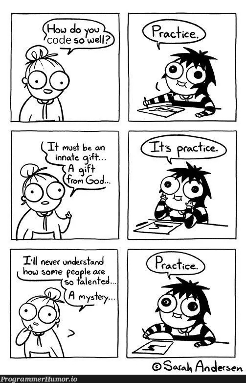

<details class="prereq" markdown="1"><summary>Assumed Knowledge</summary>

  * [Primitive Operations](./primitive_operations)
  * [Variables](./variables)
  * [Conditions](./conditions)
  * [Loops](./loops)
  * [Functions](./functions)
  * [Scope](./scope)
  * [Arrays](./arrays)
  * [Arrays and Functions](./arrays_and_functions)
  * [Reference Semantics](./reference_semantics)
</details>

<details class="outcomes" markdown="1"><summary>Learning Outcomes</summary>

  * Be able to compile and run basic Java programs
  * Understand the correspondance between Processing and Java
  * Know the phases of compiling and running Java code.

</details>

{: .keypoint}
Coding, like cooking or swimming or soccer, is all about practice.



## Author: Gaurav Gupta

# Graduation

We have cut our teeth with Processing, but now it is time to graduate to the same tools that professional developers use.  Processing was a simplified version of two tools we are going to embrace:

  * [Java](https://www.oracle.com/au/java/): One of the [most popular programming language on the planet](https://www.tiobe.com/tiobe-index/).  Processing is a simplified subset of Java that simplified our first steps.
  * IDE
  	* [Visual Studio Code](https://code.visualstudio.com/), or,
  	* [Eclipse](https://www.eclipse.org/), or,
  	* [IntelliJ](https://www.jetbrains.com/idea/)

<iframe width="560" height="315" src="https://www.youtube.com/embed/VAd5qs46z8c" title="YouTube video player" frameborder="0" allow="accelerometer; autoplay; clipboard-write; encrypted-media; gyroscope; picture-in-picture; web-share" allowfullscreen></iframe>

# How do programs run in Java (compared to Processing)

[Remind yourself how processing ran](./transition_to_processing) programs if you need to refresh your memory.

In Java, you must perform _two_ steps yourself to get your program to run:

  1. `javac`: Compiles the source code (.java) into bytecode (.class).
  2. `java`: Execute the bytecode.


# What does a Java Program look like?

All Java programs have the following structure,

~~~~~java
public class HelloWorld { 
  public static void main(String[] args){
    // CODE GOES HERE
  }
}
~~~~~

The name of the file containing this code MUST be `HelloWorld.java` (not `helloWorld.java` or `Hello.java` or `MarcoPolo.java`).

The golden rule is: The name of the file must be exactly the same as the name of the `public class` it contains (we'll see soon that a file can contain several classes, but only one `public class`). 

This is an important rule relevant to all assignment submissions. Unless the file is named correctly, it will NOT be marked by automarker, given it will not compile!


# Software to install and first program

Install Java SE/ JDK and Visual Studio Code. Go to the Computing Drop-in Centre (4RPD G02) with any technical issues and one of the staff will troubleshoot for you.

## Installing Java and Visual Studio Code on Windows

<iframe width="560" height="315" src="https://www.youtube.com/embed/XhshWGx-Rp8?si=_nmNO0qCdd8nPmos" title="YouTube video player" frameborder="0" allow="accelerometer; autoplay; clipboard-write; encrypted-media; gyroscope; picture-in-picture; web-share" referrerpolicy="strict-origin-when-cross-origin" allowfullscreen></iframe>

## Installing Java and Visual Studio Code on Mac

<iframe width="560" height="315" src="https://www.youtube.com/embed/i3oxlGHWKaQ?si=99qr9YjNYxPAWifI" title="YouTube video player" frameborder="0" allow="accelerometer; autoplay; clipboard-write; encrypted-media; gyroscope; picture-in-picture; web-share" referrerpolicy="strict-origin-when-cross-origin" allowfullscreen></iframe>

# Behind the scenes: Compiling and running java programs from command prompt or terminal

After installing Java SDK, you can write a code in a basic text editor (like notepad, atom, sublime) and then compile and run Java programs from command prompt or terminal.

A java source file `HelloWorld.java` is compiled as

~~~bash
javac HelloWorld.java
~~~

Once it is compiled, there will be java class file generated with name `HelloWorld.class`. What you execute is this class file, as,

~~~bash
java HelloWorld
~~~

This is a good skill and the benefits of doing this over using an IDE like Eclipse include,

1. reducing reliance on auto-complete done by Eclipse.

2. not relying on Eclipse to tell you each time there is a syntactical error.

3. program will not compile, and therefore the class file will not be generated to execute if there is a syntactical error.

4. Helps with pen and paper design.

Let's say, following are the contents of `HelloWorld.java`

```java
public class HelloWorld {
	public static void main(String[] args) {
		System.out.println(5+);
	}
}
```

When you compile the program, you'll get the following message,

~~~
I-2:intro gauravgupta$ javac HelloWorld.java
HelloWorld.java:3: error: illegal start of expression
System.out.println(5+);
^
1 error
I-2:intro gauravgupta$
~~~
{: .bash}

You can see that it points to the line number \(3\) with syntactical errors so you can correct them. In this case, we change the `5+` to `5+3`, and our program compiles, and executes, successfully.

```java
public class HelloWorld {
	public static void main(String[] args) {
		System.out.println(5+3);
	}
}
```

## First java program

Once you have installed Java SE, you are ready to write and run Java programs. First we'll learn how to write and run a java program from command prompt.

Open Notepad or TextEdit and type the following code in it.

```java
public class MyFirstProgram {
	public static void main(String[] args) {
		System.out.println("Hello world!");
	}
}
```

Save the file as `MyFirstProgram.java` \(remember, it's case sensitive!\).

Open command prompt \(or terminal on Mac\), go to the folder in which `MyFirstProgram.java` exists, and type the following:

~~~
javac MyFirstProgram.java
~~~
{: .bash}

> This is the *compilation* step.

If everything went ok, it would execute this command and generate a new file named `MyFirstProgram.class` in the same directory as `MyFirstProgram.java`. This is the *classfile* or *bytecode*. It's this file that actually executes. Once it's generated, you can even delete the source file \(`MyFirstProgram.java`\) provided you don't need to make any further changes\).

You run the classfile using the `java` command.

~~~
java MyFirstProgram
~~~
{: .bash}

> This is the *execution* step.

If there are no run-time errors, you will get the following output on the console.

~~~output
Hello world!
~~~

<iframe width="560" height="315" src="https://www.youtube.com/embed/VAd5qs46z8c" title="YouTube video player" frameborder="0" allow="accelerometer; autoplay; clipboard-write; encrypted-media; gyroscope; picture-in-picture; web-share" allowfullscreen></iframe>

<iframe width="560" height="315" src="https://www.youtube.com/embed/Atxj7fwu5Uk" frameborder="0" allow="autoplay; encrypted-media" allowfullscreen></iframe>


<div class="task" markdown="1">
Write a java program that initializes two variables, `distance`, `time`, and give
them values of your choice. Calculate the speed and display on the console.

Compile and run the java program.

<details class="solution" markdown="1"><summary>solution</summary>
<script src="https://gist.github.com/gaurav1780/905f1681f5c75e60a7a4f3715355e14f.js"></script>
</details>
</div>

<div class="task" markdown="1">
What's wrong with the following code?

```java
public class Worker {
public static void main(String[] args) {
}

System.out.println("How do you do?");
}
```
<details class="solution" markdown="1"><summary>solution</summary>
Display statement exists outside the `main` method.
Corrected version:

```java
public class Worker {
	public static void main(String[] args) {
		System.out.println("How do you do?");
	}
}
```
</details>
</div>


<div class="task" markdown="1">
What's wrong with the following code?

```java
public static void main(String[] args) {
	public class Worker {
		System.out.println("All right!");
}
```
<details class="solution" markdown="1"><summary>solution</summary>
`main` should be inside the `class`, not the other way round.
Corrected version:

```java
public class Worker {
	public static void main(String[] args) {
		System.out.println("All right!");
	}
}
```
</details>
</div>

<div class="task" markdown="1">
What's wrong with the following code?

```java
public class Worker {
	public static void main(String[] args) {
	System.out.println("Wassup!")
}
}
```
<details class="solution" markdown="1"><summary>solution</summary>
Missing semi-colon at the end of line 3.
Corrected version:

```java
public class Worker {
	public static void main(String[] args) {
		System.out.println("Wassup!");
	}
}
```
</details>
</div>


## First java program in Eclipse

<iframe width="560" height="315" src="https://www.youtube.com/embed/8DcIQcmwuSE" frameborder="0" allow="autoplay; encrypted-media" allowfullscreen></iframe>

## Adding more functions to a java program

In Processing, you added extra functions at the bottom of the file, or in other tabs.  Where should they go in Java?  Everything in Java needs to be inside a class, so you have to put it inbetween the first and last curly-braces, but keep them separate from the `main` function:

```java
public class Client {
  public static void main(String[] args){
    // something
  }

  // OTHER FUNCTIONS GO IN HERE

}
```

You will notice that the `main` function is labelled `static` by Java. Your program will not run if you remove this keyword. A function being `static` means that the only data it operates on (if any) are the parameters passed.

Equivalent versions of the same function in `Processing` and `Java` are provided below -

| Processing                                                                                      | Java |
|-------------------------------------------------------------------------------------------------|------|
| <script src="https://gist.github.com/gaurav1780/b3653c5a7bc5b8918bae111279542573.js"></script> |    <script src="https://gist.github.com/gaurav1780/b9c62caf13fa64d008ee6770525158af.js"></script> |


The `public` keyword is for consistency and will be used for all functions unless explicitly specified to be `private` \(again, more about this in week 2 and 3\).

<iframe width="560" height="315" src="https://www.youtube.com/embed/XS48hrWdm4Y" frameborder="0" allow="autoplay; encrypted-media" allowfullscreen></iframe>

# Warm Up

Warning: make sure you are comfortable using functions before you move on to these examples.  [Refresh your memory](./functions.html) if you need to.


## Problem 1: Calculating the total of all items of an integer array

This is an `accumulation` algorithm. We go through each item of the array, and add it to a variable that stores the total.

<script src="https://gist.github.com/gaurav1780/990f005dee2573083528b3d0e6283a3f.js"></script>

Once we know how to do this, we can apply this to other problems such as,

<div class="task" markdown="1">
Define a method that when passed an array, returns the sum of all even numbers in the array
<details class="solution" markdown="1"><summary>solution</summary> <script src="https://gist.github.com/gaurav1780/b1abbb1a3bab1ef55c1c0cf4815482b9.js"></script>
</details>
</div>

<div class="task" markdown="1">
Define a method that when passed an integer array, returns the sum of all negative numbers in the first half of the array. For example, if array is `{-6, -8, -1, -2, 9}`, return `-14`, and if array is `{-6, -5, -8, -12, -1, 9}`, return `-19`.
<details class="solution" markdown="1"><summary>solution</summary>
<script src="https://gist.github.com/gaurav1780/671b713a16b53872f45a36c1659464ea.js"></script>
</details>
</div>	

## Problem 2: Write code that determines if a given number is prime.

What is a prime number?_A number more than 1 that is divisible only by 1 and itself._

~~~
Is 37 a prime number?
Is 37 divisible by 2? No. So we carry on
...
Is 37 divisible by 36? No. This means 37 is not divisible by
any integer besides 1 and 37.
Thus, 37 is a prime number.
~~~
{: .output}

~~~
Is 77 a prime number?
Is 77 divisible by 2? No. So we carry on
...
Is 77 divisible by 7? Yes. This means 77 is divisible by
another integer besides 1 and 77.
Therefore, it's not a prime number.
~~~
{: .output}

**NOTE:** You can see that this is a kind of `violation` algorithm, where we continuously look for a violation (existence non-trivial divisor) to the problem in context (primality). As soon as a violation is encountered, our algorithm can exit with `failure (false)` status. Only if **no** violations are found, can the algorithm exit with `success (true)`status. The algorithm is,

~~~
INPUT: Integer n
PROCESS:
if n is less than 2
begin condition
  OUTPUT false (integers less than 2 are not primes)
end condition

for integer candidate from 2 to n-1
begin loop
  if n is divisible by candidate
  begin condition
    OUTPUT false (as a non-trivial divisor was found)
  end condition
end loop
~~~
{: .output}

The equivalent Java code would be,

<script src="https://gist.github.com/gaurav1780/dfe61c931d2b637931ffcd4a4d25f765.js"></script>

Note: we really need to check only until square root of `n` instead of `n-1`.

The way we can call this function from another function (say `main`) is as follows,

<script src="https://gist.github.com/gaurav1780/2f84e7676a8fc2009b9c7df8b3bad1a6.js"></script>

## Problem 3: Determining if a String contains any space

As opposed to the prime checking example, this is a `validation` algorithm, where we look for a validation, and as soon as one is found, we can return `true`. If there is no validation found, then, at the end, we can return `false`.

<script src="https://gist.github.com/gaurav1780/a70018542384418de6724f5c5b9acd45.js"></script>


# Some practice functions

<iframe width="560" height="315" src="https://www.youtube.com/embed/_Yw65zyjRnw" title="YouTube video player" frameborder="0" allow="accelerometer; autoplay; clipboard-write; encrypted-media; gyroscope; picture-in-picture; web-share" allowfullscreen></iframe>
