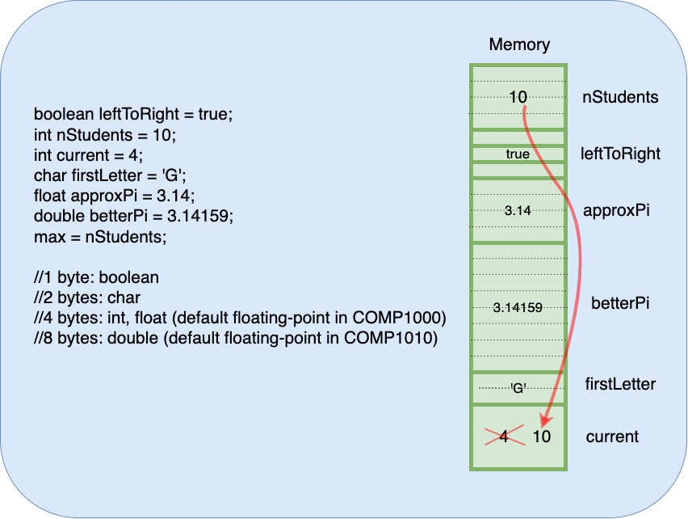
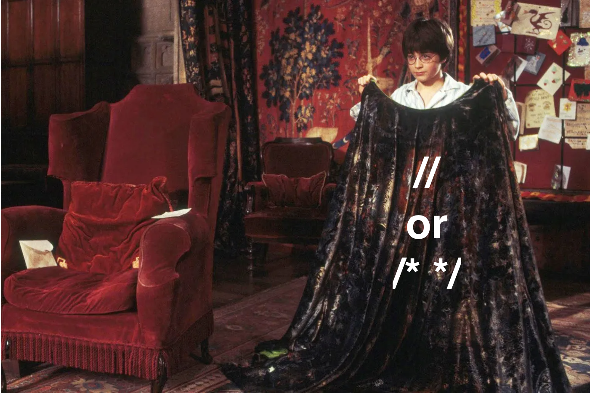

<details class="prereq" markdown="1"><summary>Assumed Knowledge</summary>

  * [Primitive Operations](./primitive_operations)
  * [Algorithms](./algorithms)
</details>

<details class="outcomes" markdown="1"><summary>Learning Outcomes</summary>

  * Understand what a variable is
  * Understand how variables are written in processing
  * Write code that requires variables
  * Understand how variables support animation
  * Understand how variables correspond to named memory slots

</details>

{: .keypoint}
Variables are a slot of memory in the computer with a name.

{: .readings}
Chapters 3 and 4 of [Learning Processing](https://learningprocessing.com) by Danel Shiffman.

<iframe width="560" height="315" src="https://www.youtube.com/embed/ibW4oA7-n8I" frameborder="0" allow="accelerometer; autoplay; encrypted-media; gyroscope; picture-in-picture" allowfullscreen></iframe>

<iframe width="560" height="315" src="https://www.youtube.com/embed/UvSjtiW-RH8" frameborder="0" allow="accelerometer; autoplay; encrypted-media; gyroscope; picture-in-picture" allowfullscreen></iframe>

<iframe width="560" height="315" src="https://www.youtube.com/embed/B-ycSR3ntik?list=PLRqwX-V7Uu6aFNOgoIMSbSYOkKNTo89uf" frameborder="0" allow="accelerometer; autoplay; encrypted-media; gyroscope; picture-in-picture" allowfullscreen></iframe>

<iframe width="560" height="315" src="https://www.youtube.com/embed/rZ36BzXFT6Q?list=PLRqwX-V7Uu6aFNOgoIMSbSYOkKNTo89uf" frameborder="0" allow="accelerometer; autoplay; encrypted-media; gyroscope; picture-in-picture" allowfullscreen></iframe>

<iframe width="560" height="315" src="https://www.youtube.com/embed/50Rzvxvi8D0?list=PLRqwX-V7Uu6aFNOgoIMSbSYOkKNTo89uf" frameborder="0" allow="accelerometer; autoplay; encrypted-media; gyroscope; picture-in-picture" allowfullscreen></iframe>

## Data types

In (typed) programming languages, values are stored in variables. Each variable has a data type that determines how the contents of that variable are interpreted.

The most common data types in Processing are:

- `int`: to store something that will definitely be a whole number or an integer. Such as,
	- number of vehicles
	- lives left
	- stage of the game
- `float`: to store numerical values that are not guaranteed to be integers, but can have a decimal component. Such as,
	- speed
	- time taken
	- account balance
	- diameter (there's more to it than meets the eye)
- `boolean`: values that have only two states (Yes/No, Up/Down, Dead/Alive, Left/Right, ...). These values are stored as,
	- `true`, representing *validity*.
	- `false`, representing *invalidity*. 
- `char`: characters that are represented as single symbols. These are enclosed in single quote. For example, 
	- `'a'`, 
	- `'&'`, 
	- `'6'` (as opposed to `6`), 
	- `' '` (space), 

When it comes to numerical values, we suggest you store in `float` unless absolutely sure that the value will definitely be a whole number. 

<iframe width="560" height="315" src="https://www.youtube.com/embed/S7KirMglymE" title="YouTube video player" frameborder="0" allow="accelerometer; autoplay; clipboard-write; encrypted-media; gyroscope; picture-in-picture; web-share" allowfullscreen></iframe>

## Declaring a variable

A variable is declared as,

```
<type> <variableName>;
```

Examples,

```processing
int x;
float y;
boolean flag;
char ch;
```

Before you use a variable, you need to assign it a value. You can do it during declaration (also called *initialization*), or later. 

<iframe width="560" height="315" src="https://www.youtube.com/embed/R6cy1onKjGE" title="YouTube video player" frameborder="0" allow="accelerometer; autoplay; clipboard-write; encrypted-media; gyroscope; picture-in-picture; web-share" allowfullscreen></iframe>

Examples,

```processing
int x = 1729;
float y = 3.14;
boolean flag = true;
char ch = '*';
int val;
//...assign later, but before first use
val = 6174; //remember, dont declare again
```

## Variable assignment is a 2-step process!

<iframe width="560" height="315" src="https://www.youtube.com/embed/hUtgqIMKnLo" title="YouTube video player" frameborder="0" allow="accelerometer; autoplay; clipboard-write; encrypted-media; gyroscope; picture-in-picture; web-share" allowfullscreen></iframe>

## int, float and char relationship

Take an analogy where dogs are a special type of animal. If Fluffy is a dog, Fluffy is definitely an animal too. However, if Sparky is an animal, it's not necessary that Sparky is a dog. Sparky can be a cat, cow, snake, or any other animal type.

Just like that, `int` is a special type of `float`. If `x` is an `int`, x can be copied into a `float`. But if `y` is a float, `y` cannot be copied into an `x`.

Another way of looking at it is that copying an `int` value into a `float` variable would just mean that it's interpreted as a floating-point value. 17 will be interpreted as 17.0, -8 will be interpreted as -8.0.

However, if we *try and copy* a `float` (floating-point value) into an `int`, we *might* loose the decimal component. Trying to copy 17.29 into an `int`, if permitted, would cause loss of the `17.29` part which can have dire consequences in the program. Due to this possibility, `float` values CANNOT be copied into `int`.

Rule:

- `int` to `float`: 👍
- `float` to `int`: 👎

Similarly, `char` is a further subset of `int`, and applying the same rule:

- `char` to `int`: 👍
- `int` to `char`: 👎

If you remember the hierarchy, the rules are easy to follow.

Some programmers find the following analogy useful too: 

- `float` -> animals
- `int` -> dogs
- `char` -> poodle

All poodles are dogs and all dogs are animals.
But all animals are not dogs and all dogs are not poodles.

NOTE: You can still copy a `float` into an `int` by explicitly dropping the precision, or an `int` into a `char`. This is known as *casting* and will be covered soon.

## Expressions or Statements

Every part of a program can be clasified as a _statement_ or an _expression_ and it is useful to do so.

A _statement_ is a section of code that _does something_.  For example, it might update a memory location, or draw something to the screen

An _expression_ is a section of code that _has a value_.  For example `2` has the value 2 (obviously) while `3+5` evaluates to 8.  A more complex example is,

~~~~~
int x;
x = 5;
~~~~~

`x` is also an expression, it's value is 5.

### Rules

  * Values are expressions
  * Variables are expressions
  * Declarations (such as `int x`) are statements
  * Assignments (such as `x = 5`) are statements

Notice that the assignment statement is made up of two expressions connected with an `=` symbol?

## Some examples of declarations (and initializations)

### Valid

```processing
//declarations
int a;
float b;
char c;
boolean d;

//declarations + initializations
int rego = 1729;
float bill = 67.14;
char initial = 'G';
boolean alive = true;
float balance = 6714; //can hold an int in a float
int first = 'a'; //holds the integer value corresponding to 'a' (97)
```

### Invalid

```processing
//declarations + initializations
int rego = 17.29; //cannot store a float in int (without casting)
float bill = true; //canot store a boolean in a float
char initial = 97; //cannot store an int in a char (without casting)
boolean alive = 10; //type mismatch
```

## How memory works

Before we can fully grasp this, we need to update our understanding of how a Processing program runs.  In [an earlier topic](./transition_to_processing) we saw program execution as a conversation between user, compiler, processing and computer.  This model still holds but we need to add to it.  When _processing_ is doing its thing, it has access to a bank of memory and it might put things in there or read things out of there.

From here on in, we will tend to leave out the conversation because it is the same every time, but we will often look to the memory bank to see what is going on in our program.

## Variables in memory

The following diagrams illustrates how each variable is stored in the memory and also what happens when you copy a variable (source) into another (destination). It's the value the source variable holds is copied into the destination variable, so that now both variables hold the value held by the source.

Note that different variables need different number of bytes in the memory.

Memory assigned to variables does not need to be in the same order as the variable assignment operation. Where will a variable be stored depends on Operating System.



## Grid structure

We visualise this memory bank as a grid of buckets (we will also call a bucket a "slot in memory").  Each bucket may hold a value.  A program with no variables, will have a memory that looks like a grid of empty holes

<svg xmlns="http://www.w3.org/2000/svg" height="200" width="400" version="1.1" viewBox="0 0 105.83333 52.916666">
 <g transform="translate(0 -244.1)">
  <rect height="37.04" width="35.72" stroke="#000" y="249.4" x="3.969" stroke-width=".2495" fill="none"/>
  <g stroke="#000" fill="none">
   <g stroke-width="0.26px">
    <path d="m7.937 249.4v37.04"/>
    <path d="m11.91 249.4v37.04"/>
    <path d="m15.88 249.4v37.04"/>
    <path d="m19.84 249.4v37.04"/>
    <path d="m23.81 249.4v37.04"/>
    <path d="m27.78 249.4v37.04"/>
    <path d="m31.75 249.4v37.04"/>
    <path d="m35.72 249.4v37.04"/>
   </g>
   <g stroke-width=".2646px">
    <path d="m3.969 253.3h35.72"/>
    <path d="m3.969 257.3h35.72"/>
    <path d="m3.969 262.6h35.72"/>
    <path d="m3.969 266.6h35.72"/>
    <path d="m3.969 270.5h35.72"/>
    <path d="m3.969 274.5h35.72"/>
    <path d="m3.969 278.5h35.72"/>
    <path d="m3.969 282.4h35.72"/>
   </g>
  </g>
 </g>
</svg>

Whereas a program that is using two slots to hold the values 1 and 15 will look like

<svg xmlns="http://www.w3.org/2000/svg" height="200" width="400" version="1.1" viewBox="0 0 105.83333 52.916666">
 <g transform="translate(0 -244.1)">
  <rect height="37.04" width="35.72" stroke="#000" y="249.4" x="3.969" stroke-width=".2495" fill="none"/>
  <g stroke="#000" fill="none">
   <g stroke-width="0.26px">
    <path d="m7.937 249.4v37.04"/>
    <path d="m11.91 249.4v37.04"/>
    <path d="m15.88 249.4v37.04"/>
    <path d="m19.84 249.4v37.04"/>
    <path d="m23.81 249.4v37.04"/>
    <path d="m27.78 249.4v37.04"/>
    <path d="m31.75 249.4v37.04"/>
    <path d="m35.72 249.4v37.04"/>
   </g>
   <g stroke-width=".2646px">
    <path d="m3.969 253.3h35.72"/>
    <path d="m3.969 257.3h35.72"/>
    <path d="m3.969 262.6h35.72"/>
    <path d="m3.969 266.6h35.72"/>
    <path d="m3.969 270.5h35.72"/>
    <path d="m3.969 274.5h35.72"/>
    <path d="m3.969 278.5h35.72"/>
    <path d="m3.969 282.4h35.72"/>
   </g>
  </g>
  <text style="word-spacing:0px;letter-spacing:0px" xml:space="preserve" font-size="2.606px" line-height="1.25" y="252.33713" x="4.2684984" font-family="sans-serif" fill="#000000"><tspan y="252.33713" x="4.2684984" stroke-width=".06515">15</tspan></text>
  <text style="word-spacing:0px;letter-spacing:0px" xml:space="preserve" font-size="2.606px" line-height="1.25" y="256.35089" x="4.3520851" font-family="sans-serif" fill="#000000"><tspan y="256.35089" x="4.3520851" stroke-width=".06515">1</tspan></text>
 </g>
</svg>

Or those same values might end up in other memory slots (buckets)

<svg xmlns="http://www.w3.org/2000/svg" height="200" width="400" version="1.1" viewBox="0 0 105.83333 52.916666">
 <g transform="translate(0 -244.1)">
  <rect height="37.04" width="35.72" stroke="#000" y="249.4" x="3.969" stroke-width=".2495" fill="none"/>
  <g stroke="#000" fill="none">
   <g stroke-width="0.26px">
    <path d="m7.937 249.4v37.04"/>
    <path d="m11.91 249.4v37.04"/>
    <path d="m15.88 249.4v37.04"/>
    <path d="m19.84 249.4v37.04"/>
    <path d="m23.81 249.4v37.04"/>
    <path d="m27.78 249.4v37.04"/>
    <path d="m31.75 249.4v37.04"/>
    <path d="m35.72 249.4v37.04"/>
   </g>
   <g stroke-width=".2646px">
    <path d="m3.969 253.3h35.72"/>
    <path d="m3.969 257.3h35.72"/>
    <path d="m3.969 262.6h35.72"/>
    <path d="m3.969 266.6h35.72"/>
    <path d="m3.969 270.5h35.72"/>
    <path d="m3.969 274.5h35.72"/>
    <path d="m3.969 278.5h35.72"/>
    <path d="m3.969 282.4h35.72"/>
   </g>
  </g>
  <text style="word-spacing:0px;letter-spacing:0px" xml:space="preserve" font-size="2.606px" line-height="1.25" y="252.33713" x="4.2684984" font-family="sans-serif" fill="#000000"><tspan y="252.33713" x="12.2684984" stroke-width=".06515">15</tspan></text>
  <text style="word-spacing:0px;letter-spacing:0px" xml:space="preserve" font-size="2.606px" line-height="1.25" y="256.35089" x="4.3520851" font-family="sans-serif" fill="#000000"><tspan y="265.35089" x="4.3520851" stroke-width=".06515">1</tspan></text>
 </g>
</svg>
But memory slots don't just fill themselves, they only get a value if we put one in there.  The way to put values in memory slots is to name a slot, then fill it, and that is what we do with variables.

~~~~~
int x;
x = 5;
~~~~~

is processing code to _pick a new slot and name it "x"_ (`int x`) and _put 5 in that slot_ (`x = 5`).  The end result is memory that looks like this

<svg xmlns="http://www.w3.org/2000/svg" height="200" width="400" version="1.1" viewBox="0 0 105.83333 52.916666">
 <defs>
  <marker id="Arrow2Mend" refY="0.0" refX="0.0" orient="auto" overflow="visible">
   <path stroke-linejoin="round" d="m8.719 4.034l-10.93-4.018 10.93-4.018c-1.746 2.372-1.736 5.618 0 8.036z" fill-rule="evenodd" transform="scale(.6) rotate(180) translate(0)" stroke="#000" stroke-width=".625"/>
  </marker>
 </defs>
 <g transform="translate(0 -244.1)">
  <rect height="37.04" width="35.72" stroke="#000" y="249.4" x="3.969" stroke-width=".2495" fill="none"/>
  <text style="word-spacing:0px;letter-spacing:0px" xml:space="preserve" font-size="5.58px" line-height="1.25" y="253.92084" x="59.796474" font-family="sans-serif" fill="#000000"><tspan y="253.92084" x="59.796474" stroke-width=".2646">x</tspan></text>
  <g stroke="#000" fill="none">
   <path marker-end="url(#Arrow2Mend)" d="m58.21 250.7-49.9 0.4" stroke-width=".2761"/>
   <g stroke-width="0.26px">
    <path d="m7.937 249.4v37.04"/>
    <path d="m11.91 249.4v37.04"/>
    <path d="m15.88 249.4v37.04"/>
    <path d="m19.84 249.4v37.04"/>
    <path d="m23.81 249.4v37.04"/>
    <path d="m27.78 249.4v37.04"/>
    <path d="m31.75 249.4v37.04"/>
    <path d="m35.72 249.4v37.04"/>
   </g>
   <g stroke-width=".2646px">
    <path d="m3.969 253.3h35.72"/>
    <path d="m3.969 257.3h35.72"/>
    <path d="m3.969 262.6h35.72"/>
    <path d="m3.969 266.6h35.72"/>
    <path d="m3.969 270.5h35.72"/>
    <path d="m3.969 274.5h35.72"/>
    <path d="m3.969 278.5h35.72"/>
    <path d="m3.969 282.4h35.72"/>
   </g>
  </g>
  <text style="word-spacing:0px;letter-spacing:0px" xml:space="preserve" font-size="2.606px" line-height="1.25" y="252.33713" x="4.2684984" font-family="sans-serif" fill="#000000"><tspan y="252.33713" x="4.2684984" stroke-width=".06515">5</tspan></text>
 </g>
</svg>

Alternately, the same code might make the following situation - we don't know the exact memory location that will be used, but _we do know_ it will be called `x`.
<svg xmlns="http://www.w3.org/2000/svg" height="200" width="400" version="1.1" viewBox="0 0 105.83333 52.916666">
 <defs>
  <marker id="Arrow2Mend" refY="0.0" refX="0.0" orient="auto" overflow="visible">
   <path stroke-linejoin="round" d="m8.719 4.034l-10.93-4.018 10.93-4.018c-1.746 2.372-1.736 5.618 0 8.036z" fill-rule="evenodd" transform="scale(.6) rotate(180) translate(0)" stroke="#000" stroke-width=".625"/>
  </marker>
 </defs>
 <g transform="translate(0 -244.1)">
  <rect height="37.04" width="35.72" stroke="#000" y="249.4" x="3.969" stroke-width=".2495" fill="none"/>
  <text style="word-spacing:0px;letter-spacing:0px" xml:space="preserve" font-size="5.58px" line-height="1.25" y="253.92084" x="59.796474" font-family="sans-serif" fill="#000000"><tspan y="253.92084" x="59.796474" stroke-width=".2646">x</tspan></text>
  <g stroke="#000" fill="none">
   <path marker-end="url(#Arrow2Mend)" d="m58.21 250.7-39.9 12.4" stroke-width=".2761"/>
   <g stroke-width="0.26px">
    <path d="m7.937 249.4v37.04"/>
    <path d="m11.91 249.4v37.04"/>
    <path d="m15.88 249.4v37.04"/>
    <path d="m19.84 249.4v37.04"/>
    <path d="m23.81 249.4v37.04"/>
    <path d="m27.78 249.4v37.04"/>
    <path d="m31.75 249.4v37.04"/>
    <path d="m35.72 249.4v37.04"/>
   </g>
   <g stroke-width=".2646px">
    <path d="m3.969 253.3h35.72"/>
    <path d="m3.969 257.3h35.72"/>
    <path d="m3.969 262.6h35.72"/>
    <path d="m3.969 266.6h35.72"/>
    <path d="m3.969 270.5h35.72"/>
    <path d="m3.969 274.5h35.72"/>
    <path d="m3.969 278.5h35.72"/>
    <path d="m3.969 282.4h35.72"/>
   </g>
  </g>
  <text style="word-spacing:0px;letter-spacing:0px" xml:space="preserve" font-size="2.606px" line-height="1.25" y="252.33713" x="4.2684984" font-family="sans-serif" fill="#000000"><tspan y="265.33713" x="12.2684984" stroke-width=".06515">5</tspan></text>
 </g>
</svg>

<iframe width="560" height="315" src="https://www.youtube.com/embed/5FSPd60GttU" frameborder="0" allow="accelerometer; autoplay; encrypted-media; gyroscope; picture-in-picture" allowfullscreen></iframe>

<div class="task" markdown="1">
Draw what the computer memory will look like after the following code has run

~~~~~
int y;
int x;

y = 10;
x = y + 5;
~~~~~
<details><summary>Solution</summary>
  <svg xmlns="http://www.w3.org/2000/svg" height="200" width="400" version="1.1" viewBox="0 0 105.83333 52.916666">
 <defs>
  <marker id="Arrow2Mend" refY="0.0" refX="0.0" orient="auto" overflow="visible">
   <path stroke-linejoin="round" d="m8.719 4.034l-10.93-4.018 10.93-4.018c-1.746 2.372-1.736 5.618 0 8.036z" fill-rule="evenodd" transform="scale(.6) rotate(180) translate(0)" stroke="#000" stroke-width=".625"/>
  </marker>
 </defs>
 <g transform="translate(0 -244.1)">
  <rect height="37.04" width="35.72" stroke="#000" y="249.4" x="3.969" stroke-width=".2495" fill="none"/>
  <text style="word-spacing:0px;letter-spacing:0px" xml:space="preserve" font-size="5.58px" line-height="1.25" y="253.92084" x="59.796474" font-family="sans-serif" fill="#000000"><tspan y="253.92084" x="59.796474" stroke-width=".2646">x</tspan></text>
  <text style="word-spacing:0px;letter-spacing:0px" xml:space="preserve" font-size="5.58px" line-height="1.25" y="261.315" x="59.732178" font-family="sans-serif" fill="#000000"><tspan y="261.315" x="59.732178" stroke-width=".2646">y</tspan></text>
  <g stroke="#000" fill="none">
   <path marker-end="url(#Arrow2Mend)" d="m58.21 250.7-49.9 0.4" stroke-width=".2761"/>
   <g stroke-width="0.26px">
    <path d="m7.937 249.4v37.04"/>
    <path d="m11.91 249.4v37.04"/>
    <path d="m15.88 249.4v37.04"/>
    <path d="m19.84 249.4v37.04"/>
    <path d="m23.81 249.4v37.04"/>
    <path d="m27.78 249.4v37.04"/>
    <path d="m31.75 249.4v37.04"/>
    <path d="m35.72 249.4v37.04"/>
   </g>
   <g stroke-width=".2646px">
    <path d="m3.969 253.3h35.72"/>
    <path d="m3.969 257.3h35.72"/>
    <path d="m3.969 262.6h35.72"/>
    <path d="m3.969 266.6h35.72"/>
    <path d="m3.969 270.5h35.72"/>
    <path d="m3.969 274.5h35.72"/>
    <path d="m3.969 278.5h35.72"/>
    <path d="m3.969 282.4h35.72"/>
    <path marker-end="url(#Arrow2Mend)" d="m58.21 260-48.95-4"/>
   </g>
  </g>
  <text style="word-spacing:0px;letter-spacing:0px" xml:space="preserve" font-size="2.606px" line-height="1.25" y="252.33713" x="4.2684984" font-family="sans-serif" fill="#000000"><tspan y="252.33713" x="4.2684984" stroke-width=".06515">15</tspan></text>
  <text style="word-spacing:0px;letter-spacing:0px" xml:space="preserve" font-size="2.606px" line-height="1.25" y="256.35089" x="4.3520851" font-family="sans-serif" fill="#000000"><tspan y="256.35089" x="4.3520851" stroke-width=".06515">10</tspan></text>
 </g>
</svg>
</details>
</div>

<div class="task" markdown="1">
Draw what the computer memory will loop like after the following code has run

~~~~~
int x;
x = 5;
int y;
y = 25;

x = y;
y = x;
~~~~~

Was the result what you expected?
<details><summary>Solution</summary>
  <svg xmlns="http://www.w3.org/2000/svg" height="200" width="400" version="1.1" viewBox="0 0 105.83333 52.916666">
 <defs>
  <marker id="Arrow2Mend" refY="0.0" refX="0.0" orient="auto" overflow="visible">
   <path stroke-linejoin="round" d="m8.719 4.034l-10.93-4.018 10.93-4.018c-1.746 2.372-1.736 5.618 0 8.036z" fill-rule="evenodd" transform="scale(.6) rotate(180) translate(0)" stroke="#000" stroke-width=".625"/>
  </marker>
 </defs>
 <g transform="translate(0 -244.1)">
  <rect height="37.04" width="35.72" stroke="#000" y="249.4" x="3.969" stroke-width=".2495" fill="none"/>
  <text style="word-spacing:0px;letter-spacing:0px" xml:space="preserve" font-size="5.58px" line-height="1.25" y="253.92084" x="59.796474" font-family="sans-serif" fill="#000000"><tspan y="253.92084" x="59.796474" stroke-width=".2646">x</tspan></text>
  <text style="word-spacing:0px;letter-spacing:0px" xml:space="preserve" font-size="5.58px" line-height="1.25" y="261.315" x="59.732178" font-family="sans-serif" fill="#000000"><tspan y="261.315" x="59.732178" stroke-width=".2646">y</tspan></text>
  <g stroke="#000" fill="none">
   <path marker-end="url(#Arrow2Mend)" d="m58.21 250.7-49.9 0.4" stroke-width=".2761"/>
   <g stroke-width="0.26px">
    <path d="m7.937 249.4v37.04"/>
    <path d="m11.91 249.4v37.04"/>
    <path d="m15.88 249.4v37.04"/>
    <path d="m19.84 249.4v37.04"/>
    <path d="m23.81 249.4v37.04"/>
    <path d="m27.78 249.4v37.04"/>
    <path d="m31.75 249.4v37.04"/>
    <path d="m35.72 249.4v37.04"/>
   </g>
   <g stroke-width=".2646px">
    <path d="m3.969 253.3h35.72"/>
    <path d="m3.969 257.3h35.72"/>
    <path d="m3.969 262.6h35.72"/>
    <path d="m3.969 266.6h35.72"/>
    <path d="m3.969 270.5h35.72"/>
    <path d="m3.969 274.5h35.72"/>
    <path d="m3.969 278.5h35.72"/>
    <path d="m3.969 282.4h35.72"/>
    <path marker-end="url(#Arrow2Mend)" d="m58.21 260-48.95-4"/>
   </g>
  </g>
  <text style="word-spacing:0px;letter-spacing:0px" xml:space="preserve" font-size="2.606px" line-height="1.25" y="252.33713" x="4.2684984" font-family="sans-serif" fill="#000000"><tspan y="252.33713" x="4.2684984" stroke-width=".06515">25</tspan></text>
  <text style="word-spacing:0px;letter-spacing:0px" xml:space="preserve" font-size="2.606px" line-height="1.25" y="256.35089" x="4.3520851" font-family="sans-serif" fill="#000000"><tspan y="256.35089" x="4.3520851" stroke-width=".06515">25</tspan></text>
 </g>
</svg>


<p>You might have expected one of the memory slots to hold `5` but if you trace the code, that can't ever happen.</p>
</details></div>

<div class="task" markdown="1">
What is the output of the following processing snippet?

```
int x = 4;
int y = x;
x = 7;
println(y);
```
<details markdown="1"><summary>Solution</summary>
The answer is `4`.  Some people will think the answer is `7` reasoning that after line 2 `x` and `y` are linked but variables don't work that way.  The value in slot `x` is copied to slot `y` in line 2 (i.e. `4`) but that is the only link between them
</details>
</div>

<div class="task" markdown="1"><a name="animated_blue_circle"></a>
Write a processing program that moves a blue circle from the top of the screen to the bottom of the screen over time.  If you have forgotten how to put a blue circle on the screen, you should review this [previous exercise](./primitive_operations.html#blue_circle).
<details class="solution" markdown="1"><summary>solution</summary>
The problem description does not directly relate to variables, so we need to "re-interpret" it to put it into "code-speak".  Another way to consider the problem statement (as a Processing programmer) is "write a program where a blue circle is drawn on the screen and every time it is drawn it moves downwards a little.""


Compared to the solution to the [previous exercise](./primitive_operations.html#blue_circle), we need to:

  * Introduce the `setup` and `draw` functions.  You can't have animated programs without them.
  * Stop using a set-value for the y-position of the circle and introduce a variable for this `yPos` instead.
  * Start that variable at 0 when the program starts.  `setup` is run once when the program starts, so that is the right place to put it.
  * Clear the background everytime the sketch is drawn so that old circles go away.
  * Change the value of the variable each time the sketch is drawn so it is set to a new value ready for the next screen drawing.

~~~~~
int yPos;

void setup(){
  yPos = 0;
}

void draw(){
  background(255);
  noStroke();
  fill(92, 136, 218);
  circle(width/2, yPos, 20);
  yPos++;
}
~~~~~
</details></div>


## Some more details of randomness

In processing, we can get a random floating-point number between 0 and `n` (including 0 but **excluding** `n`) using,

```processing
float r = random(n);
```

If we cast the result to an integer, that integer will be between 0 and `n` (including 0 but **excluding** `n`)

```processing
int z = (int)r;
```

Example:

```processing
float amount = random(2.5); //could be 0.0000 to 2.49999
int dollars = (int)amount; 
//dollars could be 0 or 1 or 2, 2 with lower probability
```

Similarly, we can get a random floating-point number between `low` and `high` (including `low` but **excluding** `high`) using,

```processing
float r = random(low, high);
```

If we cast the result to an integer, that integer will be between `low` and `high` (including `low` but **excluding** `high`)

```processing
int z = (int)r;
```

Example:

```processing
float amount = random(2.5, 4.8); //could be 2.5 to 4.79999
int dollars = (int)amount; 
//dollars could be 2 or 3 or 4, 2 with the lowest probability,
//4 with higher, and 3 with highest
```

```processing
float r = random(1, 7); //could be 1.0 to 6.99999 but not 7
int diceRoll = (int)r; 
//diceRoll can be 1,2,3,4,5,6 all with (almost) the same probability
```

## Global and local variables

We will cover more on this topic under "Scope" but a preliminary explanation is provided here.

### Local variables

Local variables are declared inside a function (like `setup()` or `draw()` and as soon as that iteration of function terminates, the variable is deleted from the memory.

```
void setup() {
	size(500, 200);
}

void draw() {
	int x = (int)random(width);
	int y = (int)random(height);
	circle(x, y, 20);
}
```

During each iteration of `draw()`, variables `x` and `y` are declared, initialized, and used, and soon as that iteration finishes, the variables are deleted, only for the whole cycle to repeat in the next iteration. Local variables are generally used for fleeting values, only needed temporarily.	

### Global variables

Global variables are declared, typically, at the top of the program, **before** any function definition (such as `setup` or `draw`). Typically, a variable is declared as *global* if we need it for the entire program, and we need to keep track of its state. In the case of processing, across several iterations of `draw()`, and perhaps also in other functions.

These variables, if uninitialized, will be assigned the default value of their data type, by `setup`. Global variables can be accessed inside any function and only one shared copy of a global variable exists. If one section of your code modifies the variable, it is modified for all other parts of the program.

```processing
int x = 1729;

void setup() {
	print("x inside setup: "+x);
}

void draw() {
	print("x inside draw: "+x);
	exit(); //exit after first iteration
}
```

Both print statements will display the same value (1729).

```processing
int x = 1729;

void setup() {
	print("x inside setup: "+x);
	x = x + 1;
}

void draw() {
	print("x inside draw: "+x);
	exit(); //exit after first iteration
}
```

Now, the values output in the statement inside setup will be 1729 while the one in the statement inside draw will be 1730.


```processing
int x = 1729;

void setup() {
	print("x inside setup: "+x);
	x = x + 1;
}

void draw() {
	print("x inside draw: "+x);
	x = x + 1;
}
```

This time the first output (inside setup) will be 1729, while the draw, in the absence of `exit()` and the increment statement will product outputs of 1730, 1731, 1732, ...

*Advanced: Do you think the values will increase indefinitely?*

## So, declare globally or locally?

The decision on whether a variable should be declared globally or locally depends on whether you need to,

1. Update its value inside `draw()` and retain the updated value from one iteration of `draw()` to the next, or,
2. Use the same variable (as in share it) across multiple functions like `setup()` and `draw()`. Typically, the value is assigned in `setup()` and used in `draw()`.

As a guideline, if either of the above two are true, the variable should be declared globally. There might be more scenarios in which a variable might warrant global declaration.

On the other hand, a variable should be declared locally if its value is needed only during execution of that specific function's current instance. If the variable is no longer required once the function's current instance terminates, then it is a good candidate to be declared locally. Examples are temporary variables, used to improve readability.

For example, while calculating the length of a line between points `(x1, y1)` and `(x2, y2)`, we'll do something like:

```processing
float diffX = (x2 - x1);
float diffY = (y2 - y1);
float D = diffX * diffX + diffY * diffY;
float length = sqrt(D);
```

Thus, variables `diffX, diffY, D` should be declared locally. The variable `length` if not required across functions, should also be declared locally, otherwise globally.


### Late initialization of global variables

Sometimes you don't have sufficient information to assign a value to a global variable when you declare it. 

For example, I would then like to draw a circle of diameter 50 centred at the centre of a display window, and then move the circle in random direction along each axis. 

#### Version 1 (buggy)

```processing
//BUGGY!
int x = width/2;
int y = height/2;

void setup() {
	size(200, 500);
	background(255);
}

void draw() {
	circle(x, y, 50);
	x = x + (int)random(-1, 2);
	y = y + (int)random(-1, 2);
}
```

You will notice the circle first appears centred at the top-left corner. That is because the default values of `width` and `height` variables are 0.

#### Version 2 (buggy)

```processing
//BUGGY!

void setup() {
	size(200, 500);
	int x = width/2;
	int y = height/2;
	background(255);
}

void draw() {
	circle(x, y, 50);
	x = x + (int)random(-1, 2);
	y = y + (int)random(-1, 2);
}
```

This version will not compile at all, because the variables `x` and `y` are declared (see the keyword `int`?) inside `setup()`, so they cannot be used outside that function.

What we CAN do is to declare them globally but initialize after we have the required information.

#### Version 3

```processing
int x, y; //global declaration

void setup() {
	size(200, 500);

	//local initialization
	
	x = width/2; 
	y = height/2;
	background(255);
}

void draw() {
	circle(x, y, 50);
	x = x + (int)random(-1, 2);
	y = y + (int)random(-1, 2);
}
```


<div class="task" markdown="1"><a name="timed_animated_blue_circle"></a>
_Advanced:_ Write a processing program that moves a blue circle from the top of the window to the bottom of the window in exactly 200 frames of time, no matter what the size of the window is.  If you have forgotten how to put animate blue circle on the screen, you should review this [previous exercise](./variables#animated_blue_circle).
<details class="solution" markdown="1"><summary>solution</summary>
Here we need to use one variable (the `height` variable) to determine the value in another variable.  Another way to consider the problem statement (as a Processing programmer) is "write a program where a blue circle is drawn on the screen and every time it is drawn it moves downwards a little.  The amount it moves downward each time is 1/200th of the height of the window."

Compared to the solution to the [previous exercise](./variables.html#animated_blue_circle), we need to start using a variable to control the speed of the circle.  That variable must be a `float` because we will be dividing the size of the screen by 200 and we have no idea what the size of the screen might be.  This means we also need to move to a `float` for the position on the screen.  NB: `circle` will happily accept an `int` or a `float`, so we have no further changes to make there.

~~~~~
float yPos;
float yspeed;

void setup(){
  size(800,800);
  yPos = 0;
  yspeed = height/200;
}

void draw(){
  background(255);
  noStroke();
  fill(92, 136, 218);
  circle(width/2, yPos, 20);
  yPos = yPos + speed;
}
~~~~~

Experiment with this program by changing what is in line 5 and checking the animation still takes the same amount of time.

**Hold-on!** It's not working????  This solution is actually wrong thanks to a subtlety of how `int`s and `float`s are divided.  See what happens when the height of the window goes below 200 (say 100)?  The circle does not move.  If we "think backwards from the problem to what must be happening" we see that `yspeed` must be getting set to `0`, but how?  Well `100/200` is 0.5 in `float` arithmetic, but it is `0` in `int` arithmetic.  So processing must be using `int` arithmetic. But why?  `height` is an `int`, and, because procesing uses the _left-most_ number to decide which type of arithmetic to use, `int`/`float` is done in `int` arithmetic, so we have to convert `height` to a `float` _first_. <aside>"tricky" rules like `int`/`float` being different from `float`/`int` are called _edge cases_ and are frequent sources of bugs.  You can't remember all the edge cases, so you often need to work backwards and think what "must be" true to find them</aside>

~~~~~
float yPos;
float yspeed;

void setup(){
  size(800,800);
  yPos = 0;
  float h = (float)height;
  yspeed = h/200;
}

void draw(){
  background(255);
  noStroke();
  fill(92, 136, 218);
  circle(width/2, yPos, 20);
  yPos = yPos + yspeed;
}
~~~~~

Experiment with _this_ program.  It works this time!
</details></div>

<iframe width="560" height="315" src="https://www.youtube.com/embed/57M73QzpPpQ" title="YouTube video player" frameborder="0" allow="accelerometer; autoplay; clipboard-write; encrypted-media; gyroscope; picture-in-picture; web-share" allowfullscreen></iframe>

## Commenting

Anything you type after `//` and before a new line is not a part of the compiled code.

Similarly, anything you type between `/*` and `*/` is not a part of the compiled code.

Extra whitespaces and newlines are also ignored during compilation.

The following program,

```processing
size(300, 200); //300 pixels wide and 200 pixels high

int x = 150;
int y = 100;

float xSpeed = random(5); //anything from 0.0 to 4.99999 (excludes 5)

/*
We calculate ySpeed proportional to xSpeed 
so that the ball exits the screen exactly
at the bottom right corner
*/
float ySpeed = xSpeed * (height - y) / (width - x);
```

is compiled to,

```processing
size(300, 200); 
int x = 150;
int y = 100;
float xSpeed = random(5); 
float ySpeed = xSpeed * (height - y) / (width - x);
```

&nbsp;

<div>
<center></center>
</div>

# Furthering your understanding

<iframe width="560" height="315" src="https://www.youtube.com/embed/uEbiuMOu2TM" frameborder="0" allow="accelerometer; autoplay; encrypted-media; gyroscope; picture-in-picture" allowfullscreen></iframe>
